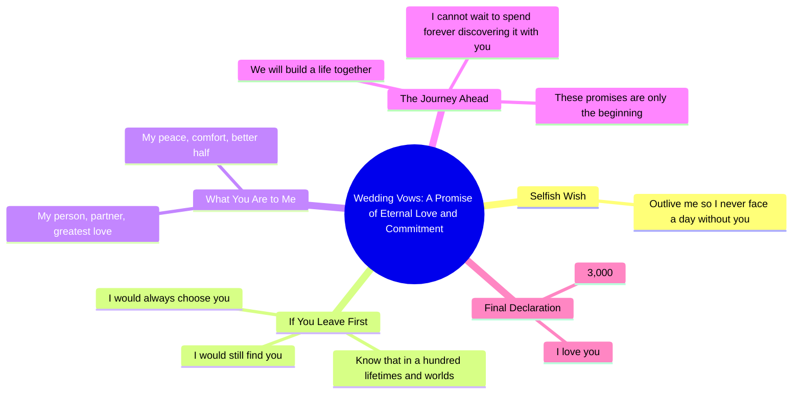

# Sharing My Wedding Vows and Crying Through Them

> 🌐 **Read this in:** [English](../../en/2026-05/tiktok-transcript-i-realized-i-never-shared-my-wedding-vows-and-i-am-the-bigge-5de6.md) · **中文**

> **Creator:** [@emmarovigalmanza](https://www.tiktok.com/@emmarovigalmanza) · **Views:** 8.9M · **Posted:** 2026-05-27 · **Niche:** other
>
> **TL;DR:** The hook subverts expectations by framing a selfless plea as a selfish wish, instantly grabbing attention.

[Watch original video →](https://www.tiktok.com/@emmarovigalmanza/video/7643848185848401182?is_from_webapp=1&sender_device=pc&web_id=7632039376462595606https://www.tiktok.com/@amandafilms__/video/7327396934660918574?is_from_webapp=1&sender_device=pc&web_id=7632039376462595606)

## Why This Went Viral

## 钩子（前3秒）
- **逐字开场白：**"最后，我对这段婚姻唯一的自私愿望很简单。活得比我久，这样我永远不必面对没有你的每一分每一秒。"
- **钩子模式：** **反差**（自私的愿望 vs. 无私的爱）+ **情感脆弱**（请求对方长寿）
- **为何能让人停下滑动：**"自私"一词立即引发好奇，因为它与预期中无私的婚礼誓词基调相悖。这种赤裸而脆弱的恳求（"活得比我久"）显得亲密而罕见——观众会停下来听完这个非传统的承诺。

## 情感节奏
- **节拍1 – 好奇/兴趣：**"自私的愿望"颠覆预期，让观众侧耳倾听。
- **节拍2 – 紧张/心痛：**"活得比我久，这样我永远不必面对没有你的每一分每一秒"——引入对失去的恐惧。
- **节拍3 – 悬念/意象：**"如果那一刻来临，你比我先离开这个世界"——为转折铺垫期待。
- **节拍4 – 高潮（共鸣与释然）：**"在一百次生命中……我仍会找到你"——转折从悲伤转向永恒的奉献，释放紧张。
- **节拍5 – 温暖/解决：**"你是我的那个人……我更好的另一半"——接地气、亲密的称呼引发情感共鸣。
- **节拍6 – 回报（怀旧）：**"我爱你。三千年。"——"三千年"的呼应（来自《玩具总动员》/流行文化）作为惊喜的情感重击落地。

## 关键词密度
| 词语/短语 | 频率 | 算法覆盖 vs. 情感吸引力 |
|-----------|------|--------------------------|
| **你** / **你的** | 8 | **情感吸引力** — 直接的第二人称营造亲密感，让观众感觉被直接对话 |
| **生命** / **世界** / **现实** | 3 | **算法覆盖** — 宏大、普世的词汇触发"灵魂伴侣"和"爱"的搜索查询 |
| **自私** | 2 | **情感吸引力** — 颠覆性词汇激发好奇心和分享（人们喜欢"出人意料的婚礼誓词"内容） |
| **活得比我久** / **离开这个世界** | 2 | **算法覆盖** — 切入流行的"悲伤"和"死亡"内容循环，互动率高 |
| **永远** | 1 | **情感吸引力** — 经典爱情词汇，象征承诺 |
| **三千年** | 1 | **病毒式触发** — 流行文化引用（《玩具总动员》）推动分享和评论（"听到三千年我哭了"） |

## 为何能广泛传播
1. **颠覆婚礼誓词预期** — "自私的愿望"这一转折使其从千篇一律的誓词中脱颖而出。观众将其分享为"我听过最美的誓词"。
2. **普世恐惧 + 解决** — 害怕失去伴侣（台词："面对没有你的每一分每一秒"）是人类最原始的情感。而解决方式（"在一百次生命中……我仍会找到你"）提供了情感宣泄，使其在恋爱/浪漫社区中极具分享性。
3. **流行文化彩蛋** — "三千年"直接呼应《玩具总动员》（巴斯光年的"飞向无限，超越无限"——三千年是该系列粉丝喜爱的数字）。这触发怀旧情绪，引发"听到三千年我泪崩了"的评论，并实现跨平台病毒式传播（TikTok、Instagram Reels、Pinterest）。
4. **完美适配短视频节奏** — 节奏构建紧张（恐惧）→ 转折（永恒的爱）→ 回报（三千年）。每句台词简短有力，专为30-60秒视频设计，保持高留存率。
5. **情感镜像** — 直接称呼（"你"）让观众想象自己的伴侣。这触发个人分享（"@你的那个人"）并推动"我希望有人这样对我说"的评论。

## 你可以借鉴什么
1. **以颠覆性词汇开头** — 用一个与预期基调矛盾的词开头（例如，爱情誓词中的"自私"，感恩帖中的"恨"）。这能立即引发好奇，阻止滑动。
2. **用流行文化呼应作为高潮** — 在结尾处抛出一个具体的、怀旧的引用（如"三千年"）。这能奖励忠实粉丝，并推动发现彩蛋的人评论和分享。
3. **在60秒内构建恐惧到释然的弧线** — 以普世的恐惧（失去、拒绝、孤独）开场，然后转向解决（永恒的爱、希望、确定）。这种情感过山车能保持高留存率，让视频感觉"完整"——完美适合分享。

## Mind Map

## Full Transcript (Generated by [拆解你自己的 TikTok](https://toktranscript.com/?utm_source=github&utm_medium=breakdown&utm_campaign=tool_attribution))

> 📝 Transcripts on this page are auto-generated and show the first 60%. Want to transcribe any TikTok in 30 seconds and get the full version? [Try TokTranscript free →](https://toktranscript.com/?utm_source=github&utm_medium=breakdown&utm_campaign=transcript_cta)

Lastly, my one selfish wish in this marriage is simple. Outlive me so I never have to face a minute or a day without you. But if the time comes and you leave this world before me, know this. In a hundred lifetimes, in a hundred worlds and in every version of reality, I would still find you. And I would always choose you. You are my person, m

*[Read the full transcript on TokTranscript →](https://toktranscript.com/plaza/tiktok-transcript-i-realized-i-never-shared-my-wedding-vows-and-i-am-the-bigge-5de6?utm_source=github&utm_medium=breakdown&utm_campaign=transcript_full)*

## Browse More

- All [other](../../by-niche/zh-CN/other.md) breakdowns
- All [Selfish wish twist](../../by-pattern/zh-CN/hook-selfish-wish-twist.md) examples

## Video Info

| | |
|---|---|
| Creator | [@emmarovigalmanza](https://www.tiktok.com/@emmarovigalmanza) |
| Original video | [https://www.tiktok.com/@emmarovigalmanza/video/7643848185848401182?is_from_webapp=1&sender_device=pc&web_id=7632039376462595606https://www.tiktok.com/@amandafilms__/video/7327396934660918574?is_from_webapp=1&sender_device=pc&web_id=7632039376462595606](https://www.tiktok.com/@emmarovigalmanza/video/7643848185848401182?is_from_webapp=1&sender_device=pc&web_id=7632039376462595606https://www.tiktok.com/@amandafilms__/video/7327396934660918574?is_from_webapp=1&sender_device=pc&web_id=7632039376462595606) |
| Original title | i realized I never shared my wedding vows and I am the biggest cry ba... |
| Views | 8.9M (8900000) |
| Posted | 2026-05-27 |
| Duration | 0s |
| Niche | `other` |
| Hook pattern | `Selfish wish twist` |
| Original language | `en` (this page translated by AI) |
| Available languages | en, zh-CN |
| Generated | 2026-05-28 by [TokTranscript](https://toktranscript.com/) |

---

*This breakdown is for educational analysis under fair use. Original video © [@emmarovigalmanza](https://www.tiktok.com/@emmarovigalmanza). All transcripts are auto-generated and may contain errors.*

*Want to analyze your own TikToks like this? [我们用的转录工具 →](https://toktranscript.com/viral-breakdown?utm_source=github&utm_medium=breakdown&utm_campaign=footer_cta)*