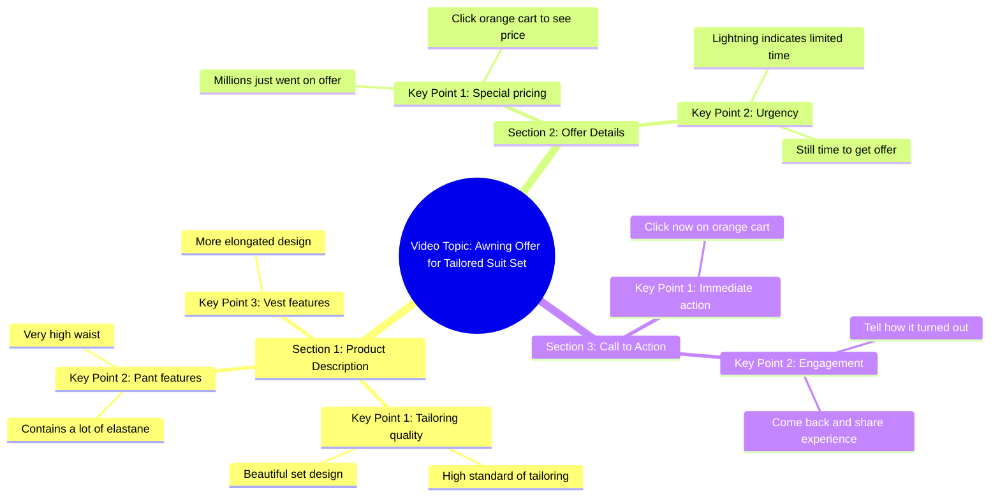

# Look de milhões ✨✨ #conjuntofeminino #alfaiataria #elegante 

> 🌐 **Read this in:** [English](../../en/2026-05/tiktok-transcript-look-de-milh-es-conjuntofeminino-alfaiataria-elegante-177d.md) · **中文**

> **Creator:** [@fabifigueiro_](https://www.tiktok.com/@fabifigueiro_) · **Views:** 2.4M · **Posted:** 2026-05-22 · **Niche:** other
>
> **TL;DR:** Creates immediate intrigue by promising something unbelievable.

[Watch original video →](https://www.tiktok.com/@fabifigueiro_/video/7593764719668792596?is_from_webapp=1&sender_device=pc&web_id=7569766293202830868)

## Why This Went Viral

## 钩子（前3秒）
- **原话开场：** "你绝对不敢相信。这个款式，数百万件刚刚上架特价。"
- **钩子模式：** 大胆断言 + 稀缺机会（"数百万件刚刚上架特价"）
- **为何能留住用户：** "你绝对不敢相信"这句话瞬间激发好奇心，而"数百万件刚刚上架"则营造紧迫感和专属感——观众会觉得自己可能错过一个难得的机会。

## 情绪节奏
- **节拍1 – 好奇心：** "你绝对不敢相信"——观众好奇到底是什么让人难以置信。
- **节拍2 – 稀缺感：** "数百万件刚刚上架特价"——紧张感上升；有价值的东西正在消失。
- **节拍3 – 欣赏：** "漂亮的西装套装……高标准"——正面强化，视觉愉悦。
- **节拍4 – 紧迫感飙升：** "现在点击……橙色购物车"——直接行动号召，施加行动压力。
- **节拍5 – 社会认同：** "闪电会告诉你它是否不够好"——暗示第三方验证。
- **节拍6 – 奖励/收尾：** "回来告诉我效果如何"——邀请互动并承诺未来回报。
- **高潮：** "闪电会告诉你它是否不够好"——信任被转移到一个外部、快速评判者的时刻。

## 关键词密度
- **"特价"**（3次）——驱动算法覆盖（电商相关关键词）和情感吸引力（稀缺感）
- **"数百万"**（2次）——算法覆盖（高价值、易传播的数字）+ 情感吸引力（专属感）
- **"漂亮"**（2次）——情感吸引力（视觉渴望）
- **"裤子"**（2次）——产品特定词，提升搜索性
- **"点击"/"购物车"**（2次）——直接行动触发，算法信号表明转化意图
- **"闪电"**（2次）——品牌名称，建立信任和好奇心
- **"跑"**（1次）——紧迫感词汇，情感触发
- **"不敢相信"**（1次）——好奇心钩子，驱动留存

## 为何能传播
1. **紧迫感无摩擦：** "现在点击……跑，还有时间"——制造错失恐惧症，但保持行动号召简单（一键加入购物车）。观众快速行动，提升完成率。
2. **通过隐喻实现社会认同：** "闪电会告诉你它是否不够好"——将品牌拟人化为一个快速、诚实的评判者。这减少怀疑，增加可分享性（人们会引用这句话）。
3. **互动循环：** "回来告诉我效果如何"——直接邀请评论，向算法发出信号，推动视频进一步传播。
4. **视觉具体性：** "裤子非常高腰，马甲更修长"——描绘清晰的视觉画面，让产品感觉真实且值得探究。
5. **对话式怀疑：** "我也不相信"——创作者与观众的怀疑态度保持一致，建立真实感，降低抵触情绪。

## 你可以借鉴的点
1. **以怀疑+稀缺组合开场：** 用"你绝对不敢相信"开头，紧接着一个限时声明。这能瞬间抓住好奇心和错失恐惧症。
2. **在脚本中嵌入"信任代理"：** 使用类似"[品牌/人物]会告诉你它是否不好"的短语——将信任转移给外部权威，并增加一个令人难忘、可引用的句子。
3. **以直接互动提示结尾：** 邀请观众反馈（"回来告诉我效果如何"）。这能驱动评论，算法上提升覆盖范围——并创建一个社区反馈循环。

## Mind Map

## Full Transcript (Generated by [TokTranscript 转录工具](https://toktranscript.com/?utm_source=github&utm_medium=breakdown&utm_campaign=tool_attribution))

> 📝 Transcripts on this page are auto-generated and show the first 60%. Want to transcribe any TikTok in 30 seconds and get the full version? [Try TokTranscript free →](https://toktranscript.com/?utm_source=github&utm_medium=breakdown&utm_campaign=transcript_cta)

You will not believe. This look here in the millions just went on awind offer. I'm not believing either, okay? It is a beautiful set of tailoring with a high standard, his pants are very high, with a lot of elatane and the vest is more elongated. Okay, so, oh, click now here on the orange cart so you can see how much he is

*[Read the full transcript on TokTranscript →](https://toktranscript.com/plaza/tiktok-transcript-look-de-milh-es-conjuntofeminino-alfaiataria-elegante-177d?utm_source=github&utm_medium=breakdown&utm_campaign=transcript_full)*

## Browse More

- All [other](../../by-niche/zh-CN/other.md) breakdowns
- All [unknown](../../by-pattern/zh-CN/hook-unknown.md) examples

## Video Info

| | |
|---|---|
| Creator | [@fabifigueiro_](https://www.tiktok.com/@fabifigueiro_) |
| Original video | [https://www.tiktok.com/@fabifigueiro_/video/7593764719668792596?is_from_webapp=1&sender_device=pc&web_id=7569766293202830868](https://www.tiktok.com/@fabifigueiro_/video/7593764719668792596?is_from_webapp=1&sender_device=pc&web_id=7569766293202830868) |
| Views | 2.4M (2400000) |
| Posted | 2026-05-22 |
| Duration | 0s |
| Niche | `other` |
| Hook pattern | `unknown` |
| Original language | `en` (this page translated by AI) |
| Available languages | en, zh-CN |
| Generated | 2026-05-24 by [TokTranscript](https://toktranscript.com/) |

---

*This breakdown is for educational analysis under fair use. Original video © [@fabifigueiro_](https://www.tiktok.com/@fabifigueiro_). All transcripts are auto-generated and may contain errors.*

*Want to analyze your own TikToks like this? [我们用的转录工具 →](https://toktranscript.com/viral-breakdown?utm_source=github&utm_medium=breakdown&utm_campaign=footer_cta)*