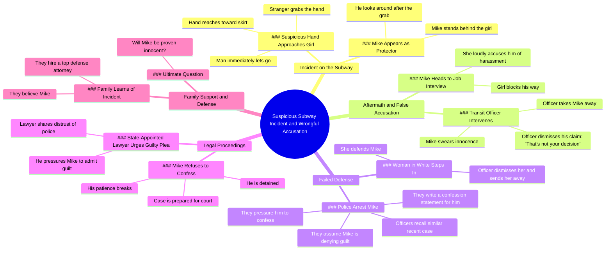

# Subway Hero Stops Harasser Before Job Interview

> 🌐 **Read this in:** [English](../../en/2026-05/tiktok-transcript-movie-foryou-usa-tik-tok-a7d3.md) · **中文**

> **Creator:** [@tmagnk](https://www.tiktok.com/@tmagnk) · **Views:** 1.4M · **Posted:** 2026-05-22 · **Niche:** entertainment
>
> **TL;DR:** Creates instant suspense with a vivid, alarming visual.

[Watch original video →](https://vt.tiktok.com/ZSxf6JBYR/)

## Why This Went Viral

## 钩子（前3秒）
- **逐字开场：**“在拥挤的地铁上，一只可疑的手缓缓伸向一名女孩的裙子。”
- **钩子模式：**场景 + 悬念（即时视觉威胁）
- **为何能阻止滑动：**营造即时道德紧张感——观众被迫观看以确认袭击是否发生，触发保护/正义本能。

## 情感节奏
1. **好奇**——“可疑的手”设下威胁
2. **紧张**——手伸向目标；抓住动作发生；观众预期袭击
3. **困惑/释然**——“他突然抓住陌生人”——受害者变成施暴者？反转。
4. **不公**——迈克被诬告、逮捕、被权威人物驳回
5. **挫败**——警官、律师、警察都施压让迈克认罪
6. **希望**——家人聘请顶级辩护律师
7. **悬念**——“迈克最终能否被证明无罪？”——未解决的情感高峰

**高潮时刻：**“这不是你说了算”——警官打断迈克的真相，固化不公。

## 关键词密度
| 词语/短语 | 出现频率（约） | 驱动因素 |
|---|---|---|
| 迈克 | 8次以上 | 主角锚点——算法身份追踪 |
| 警官/警察/律师/案件 | 7次以上 | 权威人物——触发“系统失灵”搜索集群 |
| 认罪/有罪/否认 | 5次以上 | 核心法律剧——情感拉力（清白 vs. 腐败） |
| 骚扰/指控 | 4次以上 | 高参与度社会话题——通过争议扩大算法覆盖 |
| 清白/证明 | 3次以上 | 解决钩子——驱动评论辩论 |

**算法覆盖驱动因素：**“骚扰”、“警察”、“案件”、“认罪”——高搜索量关键词。
**情感拉力驱动因素：**“迈克”、“清白”、“否认”——创造认同感和正义愤怒。

## 为何能传播
1. **不公引发愤怒分享**——“他们甚至为他写好认罪声明”让观众想警告他人、分享不公。
2. **诬告恐惧具有普遍性**——“迈克发誓从未碰她，但警官打断他”触及男女深层焦虑，驱动评论和分享。
3. **权威背叛激发参与**——“警官打发她走”展示系统失灵，引发辩论（警察 vs. 受害者 vs. 被告）。
4. **悬念迫使完播**——“迈克最终能否被证明无罪？”留下未解决的故事，驱动观众评论猜测、@好友跟进。
5. **道德模糊引发分裂反应**——开场“可疑的手”让观众最初站在女孩一边，然后反转——这种认知失调极具分享性。

## 可借鉴之处
1. **以错误假设开场**——用道德紧张场景欺骗观众初始判断，然后反转。创造“等等，什么？”时刻，迫使重看。
2. **堆叠失败的权威人物**——展示3种以上不同权威类型（交通警官、警察、律师）都犯同样错误。每次重复放大情感挫败感和分享性。
3. **以未解答的问题结尾**——不解决故事。用直接问题（“迈克最终能否被证明无罪？”）迫使评论、收藏和后续请求。

## Mind Map

## Full Transcript (Generated by [TikTok 转录工具](https://toktranscript.com/?utm_source=github&utm_medium=breakdown&utm_campaign=tool_attribution))

> 📝 Transcripts on this page are auto-generated and show the first 60%. Want to transcribe any TikTok in 30 seconds and get the full version? [Try TokTranscript free →](https://toktranscript.com/?utm_source=github&utm_medium=breakdown&utm_campaign=transcript_cta)

In a crowded subway, a suspicious hand slowly reaches toward a girl's skirt. He suddenly grabs the stranger, but the man immediately lets go. When he looks around, he only sees Mike standing behind her. After getting off the train, Mike heads to a job interview, but the girl blocks his way. She loudly accuses him of harassment, and a transit officer takes Mike away. Mike swears he never touched her, but the officer shuts him down. That's not your decision. Suddenly, a woman in white steps in to defend Mike, but the officer dismisses her and sends her away. Soon after, police arrive and arrest Mike. Having recently handled a similar case, the officers are convinced Mike, just like the previous suspect, is simply denying guilt. Wanting to clos

*[Read the full transcript on TokTranscript →](https://toktranscript.com/plaza/tiktok-transcript-movie-foryou-usa-tik-tok-a7d3?utm_source=github&utm_medium=breakdown&utm_campaign=transcript_full)*

## Browse More

- All [entertainment](../../by-niche/zh-CN/entertainment.md) breakdowns
- All [Immediate tension](../../by-pattern/zh-CN/hook-immediate-tension.md) examples

## Video Info

| | |
|---|---|
| Creator | [@tmagnk](https://www.tiktok.com/@tmagnk) |
| Original video | [https://vt.tiktok.com/ZSxf6JBYR/](https://vt.tiktok.com/ZSxf6JBYR/) |
| Original title | #movie#foryou#usa🇺🇸 #tik_tok |
| Views | 1.4M (1400000) |
| Posted | 2026-05-22 |
| Duration | 0s |
| Niche | `entertainment` |
| Hook pattern | `Immediate tension` |
| Original language | `en` (this page translated by AI) |
| Available languages | en, zh-CN |
| Generated | 2026-05-25 by [TokTranscript](https://toktranscript.com/) |

---

*This breakdown is for educational analysis under fair use. Original video © [@tmagnk](https://www.tiktok.com/@tmagnk). All transcripts are auto-generated and may contain errors.*

*Want to analyze your own TikToks like this? [TokTranscript →](https://toktranscript.com/viral-breakdown?utm_source=github&utm_medium=breakdown&utm_campaign=footer_cta)*