# Modern Consciousness Catastrophe Explained

> 🌐 **Read this in:** [English](../../en/2026-05/tiktok-transcript-note-this-video-will-lag-if-you-catch-it-early-you-can-downl-5a47.md) · **中文**

> **Creator:** [@cypher.j](https://www.tiktok.com/@cypher.j) · **Views:** 2.7M · **Posted:** 2026-05-31 · **Niche:** other
>
> **TL;DR:** Opens with a high-stakes claim about a hidden catastrophe inside the mind, demanding immediate attention.

[Watch original video →](https://vm.tiktok.com/ZNRWEojhp/)

## Why This Went Viral

## 钩子（前3秒）
- **逐字开场白：**“这是一个更深层的思考，所以我需要你集中注意力一会儿。”
- **钩子模式：**大胆断言 + 直接指令（“集中注意力”）
- **为何能阻止滑动：**说话者预先将内容框定为需要努力理解（“更深层的思考”），这暗示了智识上的排他性。“集中注意力”这个指令建立了一种契约——观众感到被选中、是精英。它还激发了好奇心：*什么灾难？为什么我需要“集中注意力”？*

## 情感节奏
1. **好奇心**（0:00–0:10）——“最大的灾难之一……已经发生了。”
2. **紧张感**（0:10–0:30）——“人类中很大一部分人不再直接体验生活了。他们在监控生活。”
3. **认同感 / 共鸣**（0:30–1:00）——关于假期、爱情、人际关系的例子——观众看到了自己。
4. **升级**（1:00–2:00）——历史框架：部落 → 王国 → 电视 → 智能手机 → “灾难变得彻底。”
5. **互动转折**（2:00–2:30）——“我希望你环顾一下房间……”——直接参与打破了被动观看的魔咒。
6. **绝望 / 沉重感**（2:30–3:30）——“感知上已筋疲力尽。”观察者侵入了祈祷、休息、爱情。
7. **高潮**（3:30–4:00）——“你上一次体验某件事而不将其转化为自我投射是什么时候？”
8. **解决 / 呼吁**（4:00–结尾）——“真正的战斗现在在于学习如何再次存在，而不立即将存在转化为感知。”

**高潮时刻：** 直接提问：*“你上一次体验某件事而不将其转化为自我投射是什么时候？”* ——迫使自我面对。

## 关键词密度
| 关键词 / 短语 | 出现次数（约） | 驱动因素 |
|------------------|----------------|----------|
| 观察者 / 虚假观察者 | 15次以上 | **算法触达**（独特、可搜索的概念）+ **情感吸引力**（创造了一个反派） |
| 渲染 / 正在渲染 | 10次以上 | **情感吸引力**（新颖、生动的动词） |
| 监控 / 正在监控 | 8次 | **情感吸引力**（临床、冰冷——与“体验”形成对比） |
| 表演 / 正在表演 | 8次 | **算法触达**（热门话题：表演文化） |
| 直接体验 / 直接地 | 7次 | **情感吸引力**（渴望、失落） |
| 观众 | 6次 | **算法触达**（创作者经济热词） |
| 灾难 | 3次 | **情感吸引力**（高风险框架） |
| 感知 | 5次 | **情感吸引力**（抽象、哲学性） |

**为何这些词有效：** “观察者”是一个自创术语——独特、可品牌化、可搜索。“渲染”出人意料、视觉化、令人难忘。“监控”和“表演”是高参与度的心理触发点。

## 为何能传播
1. **伪装成启示的普遍认同**——“人们去度假，却从未真正抵达……”——几乎每个观众都感受过这一点。视频为一种无名的焦虑命名。人们分享它，是为了说：*“这正是我一直以来的感受。”*
2. **互动时刻打破被动**——“我希望你环顾一下房间……”——观众停止滑动，遵循指令，并*实时*体验这个概念。这创造了一个令人难忘、可分享的“顿悟”时刻。
3. **逐步升级的历史框架建立权威**——“这并非始于社交媒体……”——通过将观察者追溯至部落、法律、文字、电视，说话者避免了听起来像肤浅的即时评论。这赢得了信任，并使视频感觉“深刻”——一种值得分享的地位信号。
4. **高潮问题本身就是一个病毒式钩子**——“你上一次体验某件事而不将其转化为自我投射是什么时候？”——这句话可引用、可发推文，并能引发自我反思。它成为标题、评论、思想实验。
5. **情感疲惫是一个巨大且未被充分满足的细分领域**——“感知上已筋疲力尽”为数百万人有却无法言说的感受命名。视频为一种现代病态提供了语言。人们分享它，是为了向他人解释*自己*。

## 你可以借鉴之处
1. **“自创术语”策略**——创造一个单一、易记的短语来概括你的论点（此处：“虚假观察者”）。反复使用它。它成为一个心理把手，观众可以抓住并分享。
2. **互动中断**——在视频中间，直接指示观众做一些身体/心理上的动作（环顾四周、感受你的脸、注意一个想法）。这重置了注意力，加深了参与度，并创造了一个他们会记住的个人体验。
3. **升级结构**——从一个相关的现代例子开始（假期、爱情），然后从历史角度拉远（部落 → 王国 → 电视 → 手机），接着从个人角度拉近（你的祈祷、你的脸、你最后一次直接体验）。这赋予了视频重量、广度和亲密感——一种罕见的组合，令人感觉深刻。

## Mind Map

```mermaid
mindmap
  root((The Catastrophe of the False Observer in Human Consciousness))
    The Core Problem: Loss of Direct Experience
      ## Massive percentage of humanity no longer experiences life directly
      ## People have become monitors of their own existence
      ## The mechanism is so normalized it's called 'personality'
      Examples of Monitoring Behavior
        #### Vacations: Documenting experience instead of arriving
        #### Relationships: Tracking response times, tone shifts, eye contact
        #### Love: Interpreting feelings instead of feeling them
        #### General: Rendering oneself for perception
      The Replacement of Reality
        #### Representation slowly replaces reality
        #### The false observer is born
        #### Self becomes symbolic rather than direct
    Historical Development of the Observer
      ## Did not begin with social media
      ## Social media industrialized it
      ## Built over thousands of years
      Pre-Modern Stages
        #### Small tribes: Observer activated temporarily
        #### Civilization scaling: Reputation, status, role stability matter
        #### Kingdoms: Law, writing, religion, empire
        #### Identity becomes symbolic and legible
      Modern Acceleration
        #### Mass society: Cities full of strangers evaluating constantly
        #### Television: Comparing to engineered appearances
        #### Internet and smartphone: Externalized observer in pocket
        #### Approval numerical, identity searchable, performance continuous
    The Mechanism: The False Observer
      ## A second layer monitoring the self
      ## Evaluates understanding, appearance, resonance, agreement
      ## Appears before moments finish happening
      Effects on Human Experience
        #### Perceptual exhaustion beyond work exhaustion
        #### Constant rendering and managing of appearance
        #### Nervous system not designed for permanent audience conditions
        #### Observer follows into bed, relationships, grief, art, sex, solitude, rest, 
      The Observer in Sacred Spaces
        #### Prayer becomes performance sincerity, holiness
        #### Stillness feels like disappearance
        #### Phone reached for when reality slows down
        #### Silence threatens the rendered self
    Social and Political Consequences
      ## Observer-dependent populations destabilize truth
      ## Appearances matter more than direct assessment
      Political Distortions
        #### Politics becomes perception management
        #### Institutions become render systems
        #### Public figures become symbolic products
        #### Visibility confused with virtue
        #### Images feel true regardless of reality
        #### Populations trapped in mutual render fields
      Relationship Damage
        #### Love requires presence, not performance
        #### Intimacy turns into surveillance
        #### Partner becomes psychological audience
        #### Spontaneous presence collapses
        #### Play, stillness, naturalness collapse
        #### Both people perform relational coherence
    The Ultimate Catastrophe
      ## False observer imitates genuine experiences
      ## Simulated people replace real people
      ## Direct experience is killed
      The Observer's Intolerance
        #### Cannot tolerate immediacy
        #### Needs archive, narrative, render stability
        #### Replaces participation with management
      Psychological Death Before Physical Death
        #### Spontaneous self collapses from disuse
        #### Wonder, play, silence, presence weaken
        #### Lukewarm consciousness results
        #### People achieve dreams but feel absent
        #### Love but fall emotionally far away
        #### Document moments but rarely live inside them
    The Scaling Threat
      ## Observer is still scaling
      ## Phone is prototype, not end point
      Infrastructural Observer
        #### Algorithms learn what captures attention
        #### Platforms learn what stabilizes identity
        #### Systems learn what keeps people rendering
        #### Observer becoming planetary
      The End Point
        #### Populations stop asking 'what is true?'
        #### They ask 'what survives perception?'
        #### Civilization watches itself living forever
        #### Increasingly visible but increasingly absent
    The Call to Action
      ## Find the last time you experienced without converting to reflection
      ## No audience, no archive, no narration, no self-management
      ## Pure encounter before interpretation
      The Real Fight
        #### Learn to exist without converting to perception
        #### Love without monetizing
        #### Create without optimizing
        #### Sit alone with no audience, no rendering, no performance, no monitoring
        #### Silence feels terrifying because existence without being watched is unknown
```

## Full Transcript (Generated by [TokTranscript](https://toktranscript.com/?utm_source=github&utm_medium=breakdown&utm_campaign=tool_attribution))

> 📝 Transcripts on this page are auto-generated and show the first 60%. Want to transcribe any TikTok in 30 seconds and get the full version? [Try TokTranscript free →](https://toktranscript.com/?utm_source=github&utm_medium=breakdown&utm_campaign=transcript_cta)

This is a deeper take, so I'm gonna need you to lock in for a second. But one of the biggest catastrophes in modern human history has already happened, and it happened inside human consciousness itself. I want you to understand what I'm saying. A massive percentage of humanity no longer experiences life directly anymore. They monitor it. Human beings are slowly losing their ability to simply exist without converting themselves into an object being watched. And the terrifying part is that the mechanism has become so normal, people started calling it a personality. You can see it everywhere now. People go on vacation and never fully arrived because half the experience is spent documenting the fact that they're having an experience. People fall in love and immediately begin tracking response times, tone shifts, eye contact, symbolic gestures. Who pulled away first, who seem more. Who seem more invested. Because now people don't feel anymore. They interpret themselves feeling. They monitor themselves feeling. They render themselves feeling. And once a human being starts experiencing themselves primarily through perception, the representation slowly replaces reality. And this did not begin with social media. I don't want you to think about that. Social media industrialized this. Human civilization has been slowly constructing the false observer for thousands of years. The. The moment that civilization scaled beyond small tribes, the observer began forming. Because now reputation mattered Status mattered. Role stability mattered. The village needed to know who you were. Then kingdoms arrived, right? Then law, then writing, then religion, then empire. Now identity could survive beyond direct memory. The self became symbolic. And human beings stop merely existing at that point. They became legible. Right? They became legible. The mass society arrived. Cities full of strangers, millions of people who don't know you, don't love you, don't remember you, and still evaluate you constantly. Then television happened. And for the first time in history, the average person began comparing themselves to someone who is not in their community, but a professionally engineered appearance. And then the internet showed up. And then the smartphone. And this is exactly where the catastrophe became total. Because the phone accomplished something that no other invention previously had and externalized the observer itself. now Audience lives in your pocket. Approval became numerical, identity became searchable. Memory became permanent, and performance became continuous. And the observer, it stopped turning off. But actually, I'm gonna show you it right now. I wanna wait for a second because I don't want you to get past this part too far. I want you to catch it directly right now. Not philosophically, not conceptually. Directly. I want you to look around the room you're in. Just look around. Notice how fast something appears. A second layer, a watcher. Not the part of you seeing the room, the part of you monitoring you seeing the room. The thing evaluating whether you understand this correctly, whether you look stupid listening to this, whether This resonates whether you agree, whether this sounds profound, whether you should share later, and whether you're the kind of person who could understand this, or who even would understand this. That voice, that layer, that is it. That is the false observer. And it does something horrifying. It appeared before that moment even finished happening. And this is why modern people are exhausted in a way the older language can never explain. Because you're not just work exhausted, you're perceptually exhausted. Perceptually exhausted. People are rendering themselves constantly. They're managing how they appear, how they're interpreted, how they're. How they're archived, how they compare, how they signal, how they exist symbolically. And the nervous system was never designed to be a permanent. To be in permanent audience conditions. Human beings evolved in environments where the observer was active, was activated temporarily, right in danger and ritual and courtship and status conflict. And then it deactivated. Now it follows people everywhere into bed, into relationships, into grief, into art, and sex and solitude, and rest and sleep, even into prayer. Some of you are no longer fully praying. When you pray, part of you is watching yourself pray while you're doing it, evaluating whether they sound sincere enough or holy enough, removed enough or changed enough. That's how deep the observer goes. Eventually, the audience enters the sacred places that were supposed to free people from audiences entirely. And this is exactly why. This is exactly why people can't rest anymore. Because stillness feels like disappearance. If no one is perceiving you and you're not actively rendering yourself, the observer starts panicking. This is exactly why people reach for the phone the moment reality slows down. Because silence threatens the rendered self. Now, i'mma show you something worse. I'mma show you something far worse from this. Right? I want you to feel your own face for a second. But not physically, right? Even though I just did that. Not physically. Socially. Notice how many people are still attached to your face. Your family, your ex, your friends, your coworkers, your followers and strangers and people you haven't spoken to in years. Notice how much of your behaviour is still being shaped unconsciously by. By unconsciously rendered movement toward invisible audiences that are not even physically present anymore. Some of you were still performing for rooms that left 10 years ago. It. It happens. And it scales upward to politics, too. Because once. Once populations become observer dependent, truth itself destabilizes. Because appearances matter more than direct assessment. And politics becomes. Becomes perception. Management and institutions become render systems, and public figures become symbolic products. Entire size, entire societies begin confusing visibility with virtue. And we see it in the modern day all the time. If enough people repeat back the same image to each other, the image starts to feel true regardless of reality. And modern political discourse feels insane. Because people are no longer primarily encountering conditions. They're Encountering representations of conditions. And then representations of representations. And the narratives competing against other narratives. Entire populations trapped inside mutual render fields. And then. Then relationships suffer the worst. Because love requires presence. Right not performance, just presence. But the false observer turns intimacy into surveillance. People stop loving each other directly. Now they monitor whether they love correctly*, whether they love correctly, whether they appear lovable, whether they're losing value, whether they're enough, whether the relationship looks secure. The partner starts being encountered directly and becomes a psychological audience. And this is why modern relationships feel exhausting, even when both people genuinely care. Because the observer enters the room. And once the observer enters love, spontaneous presence It starts collapsing. Play collapses. Stillness collapses. Naturalness collapses. Both people begin performing relational coherence for each other instead of fully inhabiting each other. And then, the most horrifying part about all of this, the fa

*[Read the full transcript on TokTranscript →](https://toktranscript.com/plaza/tiktok-transcript-note-this-video-will-lag-if-you-catch-it-early-you-can-downl-5a47?utm_source=github&utm_medium=breakdown&utm_campaign=transcript_full)*

## Browse More

- All [other](../../by-niche/zh-CN/other.md) breakdowns
- All [Urgent philosophical revelation](../../by-pattern/zh-CN/hook-urgent-philosophical-revelation.md) examples

## Video Info

| | |
|---|---|
| Creator | [@cypher.j](https://www.tiktok.com/@cypher.j) |
| Original video | [https://vm.tiktok.com/ZNRWEojhp/](https://vm.tiktok.com/ZNRWEojhp/) |
| Original title | note: This video will lag if you catch it early. You can download it ... |
| Views | 2.7M (2700000) |
| Posted | 2026-05-31 |
| Duration | 0s |
| Niche | `other` |
| Hook pattern | `Urgent philosophical revelation` |
| Original language | `en` (this page translated by AI) |
| Available languages | en, zh-CN |
| Generated | 2026-06-02 by [TokTranscript](https://toktranscript.com/) |

---

*This breakdown is for educational analysis under fair use. Original video © [@cypher.j](https://www.tiktok.com/@cypher.j). All transcripts are auto-generated and may contain errors.*

*Want to analyze your own TikToks like this? [TokTranscript →](https://toktranscript.com/viral-breakdown?utm_source=github&utm_medium=breakdown&utm_campaign=footer_cta)*