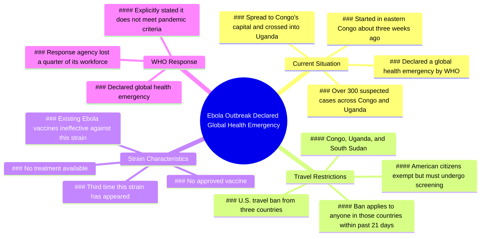

# Ebola Outbreak Declared Global Health Emergency, US Bans...

> 🌐 **Read this in:** [English](../../en/2026-05/tiktok-transcript-one-thing-after-another-504d.md) · **中文**

> **Creator:** [@niickjackson](https://www.tiktok.com/@niickjackson) · **Views:** 3.0M · **Posted:** 2026-05-25 · **Niche:** other
>
> **TL;DR:** Immediately establishes timeliness and severity, prompting viewers to stay for critical updates.

[Watch original video →](https://www.tiktok.com/t/ZTBFcDp9S/)

## Why This Went Viral

## 钩子（前3秒）
- **逐字开场白：** "正在发生的埃博拉疫情刚刚被宣布为全球卫生紧急事件，而截至今天，美国已禁止来自三个不同国家的旅行者入境。"
- **钩子模式：** **紧急新闻 + 数字 + 对比**（宣布紧急状态 vs. 无疫苗/无治疗）
- **为何能阻止滑动：** 它以现在时态、高风险的全球健康危机开场（"正在发生"、"刚刚被宣布"），紧接着是一个具体、可操作的后果（"禁止旅行"）。观众会感受到一种需要立即关注的紧迫威胁。

## 情绪节奏
1. **紧迫/恐惧（0-3秒）：** "全球卫生紧急事件"、"禁止旅行"——直接威胁
2. **警觉/焦虑（3-8秒）：** "超过300例疑似病例"、"无获批疫苗"、"无针对此毒株的治疗方法"——危险升级
3. **震惊/难以置信（8-12秒）：** "这只是该毒株第三次出现"、"现有埃博拉疫苗甚至不起作用"——颠覆了人们假定的安全感
4. **紧张（12-20秒）：** 新闻片段引入官方声明、地理扩散、旅行禁令细节——对威胁的事实强化
5. **绝望/认命（20-26秒）：** "无治疗"、"无疫苗"、"失去了四分之一的工作人员"——绝望的顶点
6. **讽刺性释放（26秒）：** "所以，我们还好吗？"——黑色幽默转折，缓解紧张并引发互动

**高潮时刻：** "现有埃博拉疫苗甚至不起作用"这句话——这是恐惧转化为无助感的情绪峰值。

## 关键词密度
| 关键词/短语 | 出现频率 | 驱动因素 |
|-------------|----------|----------|
| "埃博拉" | 5 | 算法（热门健康话题）+ 情绪（恐惧） |
| "无疫苗"/"无治疗" | 3 | 情绪（无助感）+ 算法（争议性） |
| "全球卫生紧急事件" | 3 | 算法（WHO官方认定，新闻价值） |
| "禁止旅行"/"禁止" | 3 | 情绪（个人影响）+ 算法（美国政策） |
| "毒株" | 3 | 情绪（具体性、新颖性） |
| "刚果"/"乌干达"/"南苏丹" | 5 | 算法（地理新闻，可搜索性） |
| "正在发生"/"截至今天" | 3 | 情绪（紧迫性、时效性） |

**算法驱动因素：** "埃博拉"、"全球卫生紧急事件"、"禁止旅行"、国家名称——这些是高搜索量、新闻周期内的关键词，能触发推荐系统。

**情绪吸引力：** "无疫苗"、"无治疗"、"不起作用"——这些制造恐惧和无助感，推动分享和评论。

## 为何能传播
1. **对未知的恐惧 + 个人相关性**——旅行禁令（"禁止进入美国"）让一场遥远的疫情对美国观众而言感觉像个人威胁。这使全球危机本地化。
2. **矛盾驱动的互动**——"被宣布为全球卫生紧急事件……但表示不符合大流行标准"——这一矛盾促使观众评论"等等，什么？"或争论，从而提升算法信号。
3. **黑色幽默作为分享触发器**——最后一句"所以，我们还好吗？"带有讽刺意味且易于共鸣。观众将其作为"一切安好"的梗图反应分享，使视频传播到原始受众之外。
4. **信息缺口创造搜索意图**——"无获批疫苗和无针对此毒株的治疗方法"让观众感到不满足。他们搜索更新、评论要求更多信息，或分享以警告他人——所有这些都扩大了传播范围。
5. **新闻片段整合建立可信度**——切入真实新闻广播（包含WHO官方声明）使视频显得权威，减少怀疑，增加基于信任的分享。

## 你可以借鉴的
1. **以"现在"的时间戳 + 具体后果开场**——始终以"截至今天"或"刚刚发生"开头，并立即说明这对观众意味着什么（例如，"禁止旅行"、"价格刚刚翻倍"）。这能创造紧迫感和个人利害关系。
2. **在中间使用一个"转折"，颠覆常见假设**——在建立威胁之后，加入一句像"但这是没人谈论的事情"或"而且疫苗甚至不起作用"的话。这能让观众继续观看并激发评论。
3. **以讽刺、低能量的点睛之笔结尾**——在制造高度紧张之后，用一个面无表情的问题（"所以，我们还好吗？"）或一句俏皮话来削弱它。这使视频像梗图一样易于分享，并缓解情绪压力，让观众更愿意互动。

## Mind Map

## Full Transcript (Generated by [TokTranscript](https://toktranscript.com/?utm_source=github&utm_medium=breakdown&utm_campaign=tool_attribution))

> 📝 Transcripts on this page are auto-generated and show the first 60%. Want to transcribe any TikTok in 30 seconds and get the full version? [Try TokTranscript free →](https://toktranscript.com/?utm_source=github&utm_medium=breakdown&utm_campaign=transcript_cta)

The Ebola outbreak that is happening right now just got declared a global health emergency and as of today the United States has now banned travel from three different countries. There are over 300 total suspected cases across Congo and Uganda right now and there is no approved vaccine and no treatment for this strain at all. They're saying that this is actually only the third time that this strain has ever even shown up and the existing Ebola vaccines don't even work. Tonight, outbreaks of the deadly Ebola virus in two African countries have prompted the World Health Organization to declare a global health emergency. It started in eastern Congo about three weeks ago, and since then, it has spread to Congo's capital and crossed the border to Uganda. As of today, anybody

*[Read the full transcript on TokTranscript →](https://toktranscript.com/plaza/tiktok-transcript-one-thing-after-another-504d?utm_source=github&utm_medium=breakdown&utm_campaign=transcript_full)*

## Browse More

- All [other](../../by-niche/zh-CN/other.md) breakdowns
- All [Urgent News Alert](../../by-pattern/zh-CN/hook-urgent-news-alert.md) examples

## Video Info

| | |
|---|---|
| Creator | [@niickjackson](https://www.tiktok.com/@niickjackson) |
| Original video | [https://www.tiktok.com/t/ZTBFcDp9S/](https://www.tiktok.com/t/ZTBFcDp9S/) |
| Original title | ONE THING AFTER ANOTHER |
| Views | 3.0M (3000000) |
| Posted | 2026-05-25 |
| Duration | 0s |
| Niche | `other` |
| Hook pattern | `Urgent News Alert` |
| Original language | `en` (this page translated by AI) |
| Available languages | en, zh-CN |
| Generated | 2026-05-26 by [TokTranscript](https://toktranscript.com/) |

---

*This breakdown is for educational analysis under fair use. Original video © [@niickjackson](https://www.tiktok.com/@niickjackson). All transcripts are auto-generated and may contain errors.*

*Want to analyze your own TikToks like this? [我们用的转录工具 →](https://toktranscript.com/viral-breakdown?utm_source=github&utm_medium=breakdown&utm_campaign=footer_cta)*