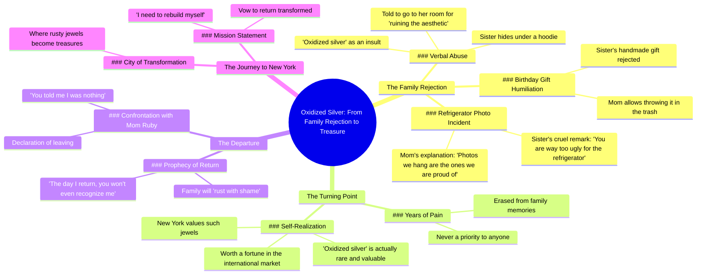

# Part 2 | The Oxidized sliver and the ruby story Part 1   #fruitstory ...

> 🌐 **Read this in:** [English](../../en/2026-05/tiktok-transcript-part-2-the-oxidized-sliver-and-the-ruby-story-part-1-fruitst-375f.md) · **中文**

> **Creator:** [@night.clock3](https://www.tiktok.com/@night.clock3) · **Views:** 3.6M · **Posted:** 2026-05-22 · **Niche:** other
>
> **TL;DR:** The hook immediately establishes a painful family dynamic through a simple question and a cruel answer.

[Watch original video →](https://vt.tiktok.com/ZSxf8nd9h/)

## Why This Went Viral

## 钩子（前3秒）
- **逐字开场白：**“妈，为什么冰箱上没有我的照片？”
- **钩子模式：** 提问 + 情感场景（家庭排斥）
- **为何能阻止滑动：** 这个问题瞬间唤起普遍共鸣的童年创伤（被忽视），同时营造出紧张的家庭氛围。天真提问与冷漠回应之间的反差制造了即时的情感摩擦——观众*必须*看到母亲如何回应。

## 情感节奏
- **节拍1 – 好奇（0:00–0:03）：** 天真的提问构建家庭场景。
- **节拍2 – 紧张（0:04–0:10）：** 母亲残酷的回答（“丑”）→ 姐姐加入 → 观众感受到间接伤害。
- **节拍3 – 反转（0:11–0:20）：** 姐姐揭示她其实是“氧化银”——稀有且珍贵。叙事从受害者转变为隐藏力量。
- **节拍4 – 胜利/解决（0:21–0:35）：** 主角宣布她要去纽约成为珍宝。高潮：“等我回来那天，你们会认不出我。”
- **最终共鸣：** 最后一句（“等我回来那天”）留下开放式结局，邀请观众想象复仇情节。

## 关键词密度
| 关键词/短语 | 出现次数（约） | 驱动因素 |
|----------------|----------------|--------|
| “氧化银” | 3 | **算法覆盖**（独特、可搜索短语）+ 情感吸引力（身份认同） |
| “生锈” / “生锈的” | 3 | **情感吸引力**（羞耻→转变的隐喻） |
| “纽约” | 3 | **算法覆盖**（基于地点的趋势）+ 理想象征 |
| “珍宝” / “珠宝” | 3 | **情感吸引力**（自我价值）+ **算法**（奢侈品/财富关键词） |
| “后悔” | 2 | **情感吸引力**（复仇幻想） |
| “隐藏” / “躲藏” | 2 | **情感吸引力**（羞耻、隐形） |
| “房间” | 2 | **算法**（家庭戏剧、共鸣） |
| “妈妈” | 3 | **算法**（家庭内容高互动率） |

## 为何能传播
1. **普遍的家庭创伤 + 复仇幻想** – 母亲冷漠的台词（“我们挂的照片都是引以为傲的”）触动了所有曾感到被忽视的人。女儿最终的胜利（“氧化银价值连城”）提供了令人满足的情感回报。
2. **重新定义身份的反转** – 揭示“丑”=“稀有珠宝”是一种强有力的重构。观众分享它，因为它感觉像是对抗自身不安全感的神秘武器。
3. **开放式悬念** – “等我回来那天”留下未完成的故事。这引发评论和猜测（例如，“接下来会发生什么？”）——从而提升算法互动。
4. **高反差情感弧线** – 在60秒内从被拒绝到自我赋能。情感转变的速度让人上瘾，忍不住再看一遍。
5. **对话驱动 + 视觉隐喻** – 台词紧凑有力（无废话）。“氧化银”的隐喻既视觉化又语言化——易于截图或引用分享。

## 你可以借鉴的
1. **从普遍创伤开始，然后反转。** 以暗示拒绝的问题开场（“为什么没有我的照片？”），然后揭示“缺陷”其实是超能力。这种模式适用于任何领域（例如，“为什么你从不推荐我？”→“我是最稀有的内容创作者”）。
2. **使用具体、不寻常的隐喻作为钩子。** “氧化银”令人难忘且可搜索。为你的价值选择一个具体、略带古怪的类比（例如，“我就像一张布满灰尘的黑胶唱片——大家都觉得我过时了，但收藏家愿意花几千块买”）。
3. **以承诺结尾，而非结论。** “等我回来那天，你们会认不出我”留下开放式结局。这邀请评论（“第二部？”）并让观众留在你的生态系统中。用于系列内容或为下一个视频制造期待。

## Mind Map

## Full Transcript (Generated by [TokTranscript](https://toktranscript.com/?utm_source=github&utm_medium=breakdown&utm_campaign=tool_attribution))

> 📝 Transcripts on this page are auto-generated and show the first 60%. Want to transcribe any TikTok in 30 seconds and get the full version? [Try TokTranscript free →](https://toktranscript.com/?utm_source=github&utm_medium=breakdown&utm_campaign=transcript_cta)

Mom, why don't you have any photos of me on the refrigerator? Because the photos we hang are the ones we are proud of, dear. Mom is right. You are way too ugly for the refrigerator. Hahaha! Happy birthday, sister! I made your gift myself. Mom, this is horrible. Can I just throw it in the trash? Of course, dear. And you, oxidized silver. Go to your room! You're ruining the aesthetic of the photos. Look at her, my sister. Trying to hide that rusty skin under that filthy hoodie. One day you are going to regret every single word. Years of hiding. They erased me from everything as if I were a mistake. I am never a priority to anyone. Oxidized silver. The rarest and most q

*[Read the full transcript on TokTranscript →](https://toktranscript.com/plaza/tiktok-transcript-part-2-the-oxidized-sliver-and-the-ruby-story-part-1-fruitst-375f?utm_source=github&utm_medium=breakdown&utm_campaign=transcript_full)*

## Browse More

- All [other](../../by-niche/zh-CN/other.md) breakdowns
- All [unknown](../../by-pattern/zh-CN/hook-unknown.md) examples

## Video Info

| | |
|---|---|
| Creator | [@night.clock3](https://www.tiktok.com/@night.clock3) |
| Original video | [https://vt.tiktok.com/ZSxf8nd9h/](https://vt.tiktok.com/ZSxf8nd9h/) |
| Views | 3.6M (3600000) |
| Posted | 2026-05-22 |
| Duration | 0s |
| Niche | `other` |
| Hook pattern | `unknown` |
| Original language | `en` (this page translated by AI) |
| Available languages | en, zh-CN |
| Generated | 2026-05-24 by [TokTranscript](https://toktranscript.com/) |

---

*This breakdown is for educational analysis under fair use. Original video © [@night.clock3](https://www.tiktok.com/@night.clock3). All transcripts are auto-generated and may contain errors.*

*Want to analyze your own TikToks like this? [TokTranscript →](https://toktranscript.com/viral-breakdown?utm_source=github&utm_medium=breakdown&utm_campaign=footer_cta)*