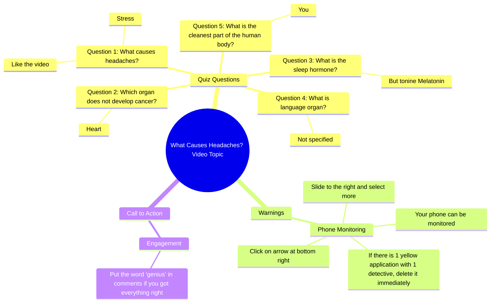

# Human Body Quiz: What Causes Headaches?

> 🌐 **Read this in:** [English](../../en/2026-05/tiktok-transcript-quiz-sur-le-corps-humain-pourtoi-cultureg-quizz-france-corps-64ff.md) · **中文**

> **Creator:** [@quizdfi0](https://www.tiktok.com/@quizdfi0) · **Views:** 962.7K · **Posted:** 2026-05-25 · **Niche:** entertainment
>
> **TL;DR:** The hook challenges the viewer with a trivia question and implies a high-stakes failure, prompting them to stay for the 'last question'.

[Watch original video →](https://vm.tiktok.com/ZS9YGHCeD53eJ-8RJew/ تتم مشاركة هذا المنشور عبر TikTok Lite. نزّل TikTok Lite للاستمتاع بمزيد من المنشورات: https://www.tiktok.com/tiktoklite)

## Why This Went Viral

## 钩子（前3秒）
- **逐字开场白：** "什么导致头痛？压力"
- **钩子模式：** **提问→即时回答**（"测验/挑战"模式的子类）
- **为何能阻止滑动：** 它引诱观众进行快速知识测试。第二行（"点赞视频。如果你答对了，没人能通过最后一题"）制造了一种**虚假的优越感**，然后立即威胁它——观众感到必须留下来证明自己比"没人"更聪明。

## 情绪节奏
- **节拍1 – 好奇心+挑战：** "什么导致头痛？" → 观众在心里作答。快速的多巴胺刺激。
- **节拍2 – 紧张+错失恐惧：** "没人能通过最后一题" → 赌注提高。观众觉得*必须*留下来看看自己是否是例外。
- **节拍3 – 悬念+警觉：** "你的手机可能被监控……立即删除" → 从冷知识突然转向**安全威胁**。这是转折点——视频从脑筋急转弯转向生存警告。
- **节拍4 – 解脱+奖励：** "如果你全答对了……在评论区打'天才'" → 观众感到被认可。他们想要这个标签。
- **高潮时刻：** 安全警告（"立即删除"）——这是情绪最强烈的台词，旨在触发行动（评论、分享、检查设置）。

## 关键词密度
| 词语/短语 | 次数（约） | 驱动因素 |
|-----------|-----------|----------|
| "什么"（提问模式） | 3 | **算法覆盖**——问题引发高互动（评论、回复） |
| "正确答案"/"全答对了" | 2 | **情感吸引**——认可与自我 |
| "立即删除" | 1（但强烈） | **算法+情感**——紧迫感驱动分享与收藏 |
| "天才" | 1 | **情感吸引**——身份标签，触发评论 |
| "没人能通过" | 1 | **情感吸引**——稀缺性与挑战 |
| "手机可能被监控" | 1 | **算法覆盖**——高好奇心点击率 |

## 为何能传播
1. **虚假稀缺+自我诱饵：** "没人能通过最后一题"让答对者感到特别。他们分享以证明自己是例外。*（具体台词："没人能通过最后一题"）*
2. **突然的类型转换（冷知识→安全恐慌）：** 从无害测验转向"你的手机被监控"是**出乎意料且令人警觉的**。这触发**强迫性收藏**——观众收藏视频以便稍后检查手机。*（具体台词："你的手机可能被监控……立即删除"）*
3. **低摩擦互动循环：** 视频明确要求点赞（"点赞视频"）、评论（"打'天才'这个词"）和分享（箭头指示）。这创建了一个**三步行动号召**，感觉像游戏。*（具体台词："点赞视频"、"点击箭头"、"打'天才'这个词"）*
4. **身份强化评论诱饵：** "在评论区打'天才'"是一个**自我标签陷阱**——观众想要这个头衔，他们的评论为算法的互动信号提供燃料。*（具体台词："在评论区打'天才'这个词"）*
5. **紧迫感+错失恐惧：** 安全警告以**时间敏感威胁**的方式传达（"立即删除"）。这促使观众分享给可能处于风险中的朋友。*（具体台词："立即删除"）*

## 你可以借鉴的
1. **"测验→恐慌"转折：** 从无害的冷知识问题开始，然后转向**个人安全或健康警告**。对比保持高留存率并驱动收藏。
2. **一个视频中的三步行动号召：** 不要只要求点赞——要求点赞、评论（带特定词语）和分享（带视觉指示）。让它感觉像**多步游戏**。
3. **身份标签作为评论诱饵：** 要求观众评论一个将他们标记为"聪明"或"知情"的词语（例如"天才"、"专家"、"幸存者"）。人们会**公开宣称这个身份**。

## Mind Map

## Full Transcript (Generated by [免费 TikTok 文稿生成器](https://toktranscript.com/?utm_source=github&utm_medium=breakdown&utm_campaign=tool_attribution))

> 📝 Transcripts on this page are auto-generated and show the first 60%. Want to transcribe any TikTok in 30 seconds and get the full version? [Try TokTranscript free →](https://toktranscript.com/?utm_source=github&utm_medium=breakdown&utm_campaign=transcript_cta)

What causes headaches? Stress Like the video. If you had the right answer, no one passes the last question. Which organ does not develop cancer Heart Before you continue, know that your phone can be monitored to find out. Click on the arrow at the bottom right, slide to the right and select more. If there is 1 yellow application wi

*[Read the full transcript on TokTranscript →](https://toktranscript.com/plaza/tiktok-transcript-quiz-sur-le-corps-humain-pourtoi-cultureg-quizz-france-corps-64ff?utm_source=github&utm_medium=breakdown&utm_campaign=transcript_full)*

## Browse More

- All [entertainment](../../by-niche/zh-CN/entertainment.md) breakdowns
- All [Challenge with stakes](../../by-pattern/zh-CN/hook-challenge-with-stakes.md) examples

## Video Info

| | |
|---|---|
| Creator | [@quizdfi0](https://www.tiktok.com/@quizdfi0) |
| Original video | [https://vm.tiktok.com/ZS9YGHCeD53eJ-8RJew/ تتم مشاركة هذا المنشور عبر TikTok Lite. نزّل TikTok Lite للاستمتاع بمزيد من المنشورات: https://www.tiktok.com/tiktoklite](https://vm.tiktok.com/ZS9YGHCeD53eJ-8RJew/ تتم مشاركة هذا المنشور عبر TikTok Lite. نزّل TikTok Lite للاستمتاع بمزيد من المنشورات: https://www.tiktok.com/tiktoklite) |
| Original title | Quiz sur le corps humain😎. #pourtoi #cultureg #quizz #france #corps  |
| Views | 962.7K (962700) |
| Posted | 2026-05-25 |
| Duration | 0s |
| Niche | `entertainment` |
| Hook pattern | `Challenge with stakes` |
| Original language | `en` (this page translated by AI) |
| Available languages | en, zh-CN |
| Generated | 2026-05-27 by [TokTranscript](https://toktranscript.com/) |

---

*This breakdown is for educational analysis under fair use. Original video © [@quizdfi0](https://www.tiktok.com/@quizdfi0). All transcripts are auto-generated and may contain errors.*

*Want to analyze your own TikToks like this? [TikTok 转录工具 →](https://toktranscript.com/viral-breakdown?utm_source=github&utm_medium=breakdown&utm_campaign=footer_cta)*