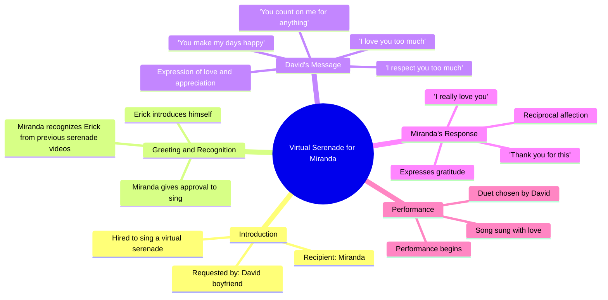

# Virtual Serenade Surprise: What Happened Next

> 🌐 **Read this in:** [English](../../en/2026-05/tiktok-transcript-serenata-virtual-mira-lo-que-pas-amor-duosfreefire-garenafre-ff5e.md) · **中文**

> **Creator:** [@soyerickcanto](https://www.tiktok.com/@soyerickcanto) · **Views:** 1.1M · **Posted:** 2026-05-26 · **Niche:** entertainment
>
> **TL;DR:** The hook creates immediate curiosity by revealing a hired virtual serenade, making viewers want to see the surprise unfold.

[Watch original video →](https://www.tiktok.com/@soyerickcanto/video/7592389638652759303?is_from_webapp=1&sender_device=pc&web_id=7603080485002610184)

## Why This Went Viral

## 钩子（前3秒）
- **逐字内容：** "我被雇来唱歌，给他的女朋友送上一场虚拟小夜曲，然后事情就这样发生了"（画面分屏，一边是歌手，另一边是女友的反应）。
- **钩子模式：** 场景 + 对比（歌手先铺垫了一个"工作"场景，紧接着切到女友的实时反应，营造出"这是真的"的对比效果）。
- **为何能让人停下滑动：** 开场白承诺了一个窥探式的、充满情感且未经编排的时刻。观众立刻会好奇：*这家伙是谁？女友的反应会怎样？* 分屏画面（一边是歌手，另一边是女友）在视觉上暗示着即将发生什么——这是一个经典的"反应视频"触发点。

## 情感节奏
- **节拍1 – 好奇（0-3秒）：** 歌手解释设定。观众会问：*她会惊喜吗？她会哭吗？*
- **节拍2 – 期待 + 紧张（3-10秒）：** 女友被邀请进来（"邀请她，邀请她"）。她接听电话，歌手透露是男友雇了他。这是"揭秘"节拍——观众等待她的情感回应。
- **节拍3 – 情感共鸣（10-30秒）：** 男友说话。他的话语真诚（"我太爱你了，我太尊重你了"）。这是**高潮**——未经编排、发自内心的爱的告白。女友的反应（流泪、"哎呀亲爱的，太谢谢你了"）就是回报。
- **节拍4 – 释然 + 温暖（30秒至结尾）：** 歌曲开始。"她会喜欢吗？"的紧张感得到化解。视频在安全、令人愉悦的氛围中结束。

## 关键词密度
| 关键词 / 短语 | 出现次数（约） | 为何有效 |
|------------------|-----------------|--------------|
| "爱" / "我爱你" | 8次以上 | **情感吸引力** – 触及对爱的普遍渴望；触发算法的"关系"话题聚类。 |
| "小夜曲" / "虚拟小夜曲" | 4次 | **算法覆盖** – 小众、可搜索的术语（人们会搜索"虚拟小夜曲创意"）。 |
| "雇" / "雇了我" | 2次 | **算法覆盖** – 暗示"服务"类内容，因其新颖性而易于分享。 |
| "女友" / "男友" | 5次 | **情感吸引力 + 覆盖** – 高互动率的关系类关键词。 |
| "谢谢" | 4次 | **情感吸引力** – 感谢信号传递真实情感；鼓励观众产生好感。 |
| "宝贝" / "珍贵的" / "我的生命" | 5次 | **情感吸引力** – 亲密感标记；让这一刻显得私密，增加窥探式的分享价值。 |

## 为何能传播开来
1. **窥探式的情感回报** – 观众得以观看一个私密、未经编排的爱与惊喜时刻。男友质朴的话语（"你知道我太爱你了"）感觉真实，而非刻意安排。这触发了"尴尬到甜蜜"的病毒式传播机制——观众分享是因为感觉像在窥探一段真实的关系。
2. **基于服务的新颖性** – "我被雇来唱歌"是一个清晰、独特的钩子。人们分享是因为"虚拟小夜曲"这个概念既新颖又容易引起共鸣（每个人都想给伴侣惊喜）。这个视频成为了"如何做到"或"看我发现了什么"的模板。
3. **情感镜像** – 女友的反应（流泪、欢笑、"哎呀亲爱的，太谢谢你了"）就是回报。观众会镜像她的情绪，从而增加分享的可能性（人们会分享那些让他们感觉良好或感动落泪的内容）。
4. **分屏结构** – 视觉格式（一边是歌手，一边是女友）创造了一个清晰的叙事弧线。易于理解，观众感觉仿佛身临其境。这本身就具有分享性，因为它采用了"反应视频"的格式，而该格式已被证明具有病毒式传播的机制。
5. **低参与门槛** – 视频以一首歌结束，这是一个自然的"暂停"点。观众更有可能评论（"这太甜了"，"我希望我男友也这样做"），因为情感高峰已过，留下他们处于温暖、反思的状态。

## 你可以借鉴什么
1. **"邀请"技巧** – 不要直接切入内容，而是创造一个小小的悬念时刻。在这个视频中，歌手在女友加入前说"邀请她，邀请她"。这建立了期待感，让观众感觉自己参与了过程。*应用方法：* 在揭示惊喜或结果之前，添加一句"铺垫"对话，将回报延迟2-3秒。
2. **"质朴告白"三明治** – 男友的话语未经编排、充满情感且具体（"你让我的每一天都很快乐"）。这是病毒式传播的核心。*应用方法：* 在任何惊喜/反应视频中，让给予惊喜的人在主要事件前说2-3句真诚、未经提示的话。不要写脚本——让他们发自内心地说话。那个质朴的时刻才是被分享的关键。
3. **分屏反应格式** – 视频使用了简单的分屏：表演者在一侧，接收者在另一侧。这让观众能同时看到设置和反应。*应用方法：* 对于任何"惊喜"或"揭秘"内容（礼物、恶作剧、公告），在同一个画面中录制双方，或使用分屏。这会加倍情感冲击力，让视频感觉更完整。

## Mind Map

## Full Transcript (Generated by [TokTranscript](https://toktranscript.com/?utm_source=github&utm_medium=breakdown&utm_campaign=tool_attribution))

> 📝 Transcripts on this page are auto-generated and show the first 60%. Want to transcribe any TikTok in 30 seconds and get the full version? [Try TokTranscript free →](https://toktranscript.com/?utm_source=github&utm_medium=breakdown&utm_campaign=transcript_cta)

I was hired to sing and give a virtual serenade to his girlfriend and that's what happened I'm already dale bro invite her invite her invite her dale bro I'm already inviting her hello love hello love hello Miranda how are you well maybe you don't call me my name is Erick I sing and I do virtual serenades eh yes I know you I have seen your serenade videos. Ah seriously well today it was your turn to your boyfriend David eh has hired me to sing you a song and I don't know if I can sing it to you if you give me the approval to sing it to you yes of course dale va great well eh I don't know if David wants to tell you something brother something you want to say to your girlfriend before you start singing. Hello 

*[Read the full transcript on TokTranscript →](https://toktranscript.com/plaza/tiktok-transcript-serenata-virtual-mira-lo-que-pas-amor-duosfreefire-garenafre-ff5e?utm_source=github&utm_medium=breakdown&utm_campaign=transcript_full)*

## Browse More

- All [entertainment](../../by-niche/zh-CN/entertainment.md) breakdowns
- All [Mystery Setup](../../by-pattern/zh-CN/hook-mystery-setup.md) examples

## Video Info

| | |
|---|---|
| Creator | [@soyerickcanto](https://www.tiktok.com/@soyerickcanto) |
| Original video | [https://www.tiktok.com/@soyerickcanto/video/7592389638652759303?is_from_webapp=1&sender_device=pc&web_id=7603080485002610184](https://www.tiktok.com/@soyerickcanto/video/7592389638652759303?is_from_webapp=1&sender_device=pc&web_id=7603080485002610184) |
| Original title | Serenata virtual, mira lo que pasó…  #amor #duosfreefire #garenafreef... |
| Views | 1.1M (1100000) |
| Posted | 2026-05-26 |
| Duration | 0s |
| Niche | `entertainment` |
| Hook pattern | `Mystery Setup` |
| Original language | `en` (this page translated by AI) |
| Available languages | en, zh-CN |
| Generated | 2026-05-27 by [TokTranscript](https://toktranscript.com/) |

---

*This breakdown is for educational analysis under fair use. Original video © [@soyerickcanto](https://www.tiktok.com/@soyerickcanto). All transcripts are auto-generated and may contain errors.*

*Want to analyze your own TikToks like this? [TikTok 转录工具 →](https://toktranscript.com/viral-breakdown?utm_source=github&utm_medium=breakdown&utm_campaign=footer_cta)*