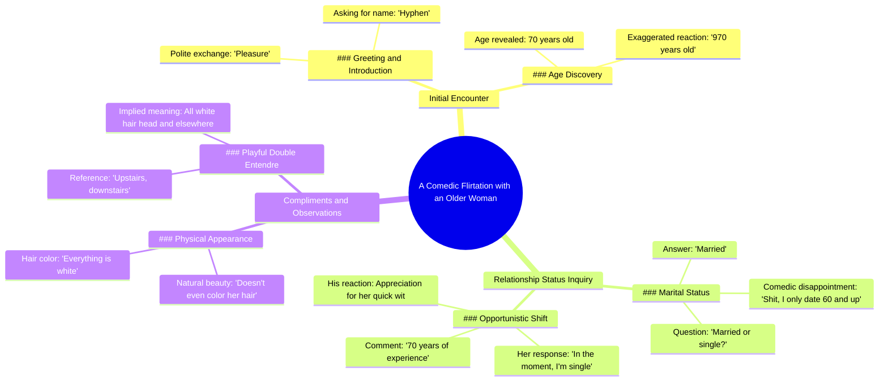

# 70-Year-Old Indian Grandma's Dating Game Is Strong

> 🌐 **Read this in:** [English](../../en/2026-05/tiktok-transcript-she-may-be-70-but-her-dating-game-is-timeless-indian-grandma-6bdc.md) · **中文**

> **Creator:** [@maxcomedian](https://www.tiktok.com/@maxcomedian) · **Views:** 2.1M · **Posted:** 2026-05-27 · **Niche:** entertainment
>
> **TL;DR:** The hook uses a playful exaggeration to immediately grab attention and set a humorous tone.

[Watch original video →](https://vt.tiktok.com/ZSxXbyUpA/)

## Why This Went Viral

## 钩子（前3秒）
- **原话开场：** "这些女士，真不错。嗨，你叫什么名字？海芬。海芬，幸会。你多大年纪？我70岁。她970岁。"
- **钩子模式：** 场景 + 数字（对话中先抛出具体年龄，再给出夸张对比）
- **为何能让人停下滑动：** 年龄差距的笑话（"70"对"970"）荒诞不经，瞬间让人困惑——观众要么重看，要么继续看下去，才能明白这是真实还是段子。快速自信的语调暗示着意想不到的内容即将到来。

## 情绪节奏
- **节拍1——好奇：** "这些女士，真不错。"——温暖、开放，赢得信任。
- **节拍2——俏皮张力：** "我只约会60岁以上的……我还以为你单身是我的幸运日，但看来不是。"——调情玩笑落地，制造出一个小悬念。
- **节拍3——转折/悬疑：** "此时此刻，我单身。"——她反转了剧本；观众不知道她是认真的还是开玩笑。
- **节拍4——释然+共鸣：** "那可是70年的经验啊。她知道不能错过机会。"——笑点以钦佩而非尴尬的方式化解了紧张。
- **节拍5——共鸣+视觉收尾：** "全是白的。楼上，楼下。"——创作者自嘲式的幽默，在共同的笑声中结束。
- **高潮时刻：** "此时此刻，我单身。"——正是这句台词，让视频可能走向尴尬或迷人；它最终落得迷人。

## 关键词密度
1. **"此时此刻"**（3次）——算法层面：重复短语触发模式识别；情感层面：将她塑造成随性、自信的形象。
2. **"单身"**（3次）——算法层面：高关注度的关系类关键词；情感层面：营造浪漫张力。
3. **"70"/"970"**（2次）——算法层面：视频标题/描述中的数字能提升点击率；情感层面：荒诞对比驱动分享性。
4. **"经验"**（1次，但贯穿始终）——情感层面：将年龄重新定义为资产而非负担。
5. **"楼上，楼下"**（1次）——情感层面：视觉隐喻令人难忘且易于引用。
6. **"美丽"**（1次）——情感层面：正面强化，让这一刻显得真诚。
7. **"印度女性"**（1次）——算法层面：小众人群标签；情感层面：暗示文化特色与自豪感。

**算法驱动因素：** "单身"、"70"、"印度女性"——这些词可搜索、可追踪，并能切入关系/年龄差内容领域。

**情感吸引力驱动因素：** "此时此刻"、"经验"、"楼上，楼下"——这些词易于引用、引发共鸣，并产生"我想像她一样"的效果。

## 为何能传播
1. **年长女性出人意料的自信。** "此时此刻，我单身"堪称抓住机会而不显急切的典范。观众将其作为"如何在任何年龄都保持魅力"的范例分享。
2. **年龄笑话是一个病毒式数学谜题。** "970岁"如此荒诞，迫使人们重看和评论（"她真说了970？"）。这推动了观看时长和互动信号。
3. **创作者先设定浪漫前提，再以钦佩之情颠覆它。** 他一开始调情，最后却赞美她的自然美（"甚至不染头发"）。这避免了搭讪失败的尴尬，反而变得温馨——这是一个高分享度的情感类别。
4. **"楼上，楼下"是一个即时的梗模板。** 这是一个视觉化、自嘲式的笑点，观众可以在自己关于衰老或白发的视频中引用和复用。
5. **互动感觉真实而非剧本化。** 镜头晃动、自然的停顿、真诚的笑声——它通过了平台奖励的"真实性测试"。

## 你可以借鉴什么
1. **使用"荒诞数字"钩子。** 以真实事实开场，然后立即将其夸张成笑话（例如，"我30岁。我930岁。"）。这能制造模式中断，迫使观众重看。
2. **将追求转为赞美。** 以调情前提开始，然后转向真诚的钦佩。这能将潜在的尴尬时刻变成病毒式"温馨"片段。
3. **以视觉化、自嘲式的笑点收尾。** "楼上，楼下"是一个看得见的隐喻。在你的下一个视频中，用一句描绘自身缺点的台词收尾——这能让创作者更讨喜，让这一刻更易分享。

## Mind Map

## Full Transcript (Generated by [TokTranscript](https://toktranscript.com/?utm_source=github&utm_medium=breakdown&utm_campaign=tool_attribution))

> 📝 Transcripts on this page are auto-generated and show the first 60%. Want to transcribe any TikTok in 30 seconds and get the full version? [Try TokTranscript free →](https://toktranscript.com/?utm_source=github&utm_medium=breakdown&utm_campaign=transcript_cta)

These ladies, so nice. Hi. What's your name? Hyphen. Hyphen, pleasure. How old are you? I'm 70. She's 970 years old. You guys are married or single? Married. Oh, married. Shit, I. I only date 60 and up, so I thought you might be single as my lucky day, but no. In the moment, I'm single. In the moment, you're single? I love Indian women. In t

*[Read the full transcript on TokTranscript →](https://toktranscript.com/plaza/tiktok-transcript-she-may-be-70-but-her-dating-game-is-timeless-indian-grandma-6bdc?utm_source=github&utm_medium=breakdown&utm_campaign=transcript_full)*

## Browse More

- All [entertainment](../../by-niche/zh-CN/entertainment.md) breakdowns
- All [Exaggerated compliment](../../by-pattern/zh-CN/hook-exaggerated-compliment.md) examples

## Video Info

| | |
|---|---|
| Creator | [@maxcomedian](https://www.tiktok.com/@maxcomedian) |
| Original video | [https://vt.tiktok.com/ZSxXbyUpA/](https://vt.tiktok.com/ZSxXbyUpA/) |
| Original title | She may be 70 but her dating game is timeless! Indian grandma bringin... |
| Views | 2.1M (2100000) |
| Posted | 2026-05-27 |
| Duration | 0s |
| Niche | `entertainment` |
| Hook pattern | `Exaggerated compliment` |
| Original language | `en` (this page translated by AI) |
| Available languages | en, zh-CN |
| Generated | 2026-05-28 by [TokTranscript](https://toktranscript.com/) |

---

*This breakdown is for educational analysis under fair use. Original video © [@maxcomedian](https://www.tiktok.com/@maxcomedian). All transcripts are auto-generated and may contain errors.*

*Want to analyze your own TikToks like this? [TokTranscript 转录工具 →](https://toktranscript.com/viral-breakdown?utm_source=github&utm_medium=breakdown&utm_campaign=footer_cta)*