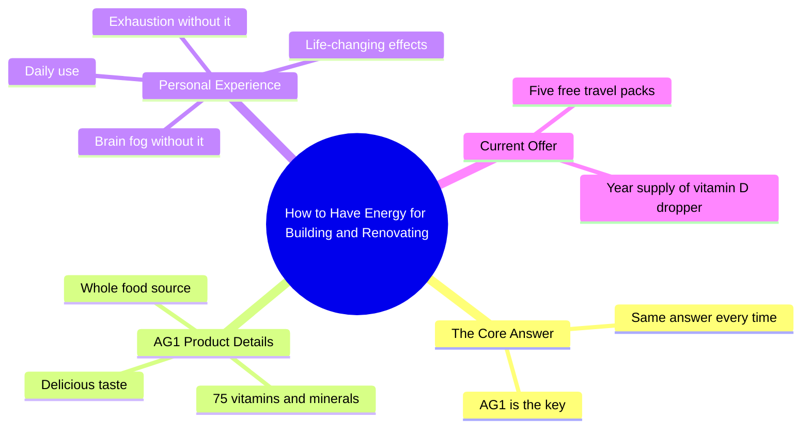

# The Number One Question I Get Has the Same Answer: AG1

> 🌐 **Read this in:** [English](../../en/2026-05/tiktok-transcript-the-number-one-question-i-get-always-has-the-same-answer-i-d-d0f4.md) · **中文**

> **Creator:** [@thehonesthome_](https://www.tiktok.com/@thehonesthome_) · **Views:** 24.3M · **Posted:** 2026-05-29 · **Niche:** other
>
> **TL;DR:** Poses a relatable question about energy and productivity, immediately engaging viewers who seek similar results.

[Watch original video →](https://www.tiktok.com/@thehonesthome_/video/7021306251829071110?is_from_webapp=1&sender_device=pc&web_id=7637572452097754637)

## Why This Went Viral

## 钩子（前3秒）
- **逐字开场白：**“我被问得最多的问题是，你怎么有那么多精力去建造和翻新你做的所有空间？”
- **钩子模式类型：**场景+对比（高能量创作者 vs. 观众对疲惫的假设）
- **为何能让人停下刷屏：**它直接回应了一个常见问题，瞬间引发好奇。“所有精力”与“建造和翻新”之间的对比，暗示了一个针对普遍痛点（精力不足）的答案，让观众感到被理解，并渴望得到解决方案。

## 情感节奏
- **节拍1 – 好奇：**“我被问得最多的问题是……”——观众凑近，期待一个秘密。
- **节拍2 – 紧张/共鸣：**“……你怎么有那么多精力……”——观众意识到自己的疲惫。
- **节拍3 – 信任/亲密：**“你知道我只分享我喜欢的东西”——建立可信度和个人背书。
- **节拍4 – 解脱/认同：**“当我不服用它时，我会脑雾，一整天都筋疲力尽”——肯定观众的挣扎，让产品感觉像解决方案。
- **节拍5 – 高潮（情感巅峰）：**“我喜欢这东西。它改变了我的生活。”——高度情感共鸣，感觉像真实的转变故事。
- **节拍6 – 行动/紧迫感：**“当你现在查看AG1……他们会免费送你五包旅行装”——以限时激励收尾，推动转化。

## 关键词密度
- **“精力”**（3次）——推动算法覆盖（高搜索量词）和情感吸引力（观众痛点）。
- **“脑雾”**（1次）——具体症状，与疲惫的高效能人士深度共鸣；强烈的情感触发点。
- **“改变了我的生活”**（1次）——高情感权重；暗示转变，而不仅仅是实用性。
- **“喜欢”**（2次）——情感吸引力；建立信任和好感。
- **“免费”**（2次）——算法覆盖（促销信号）和转化驱动力。
- **“AG1”**（2次）——品牌关键词；对搜索可见性和品牌回忆至关重要。
- **“旅行装”**（1次）——具体、有形的利益，感觉有价值且低风险。

## 为何能传播
1. **直接回答一个高流量、有共鸣的问题。**“你怎么有那么多精力？”是创作者、建造者和忙碌人群的普遍痛点。视频感觉像个人秘密，而不是推销话术。
2. **使用“之前/之后”的情感弧线，而不展示画面。**“脑雾/疲惫”与“改变了我的生活”之间的对比，创造了一个感觉真实且令人向往的微型故事。
3. **信任优先的框架。**“你知道我只分享我喜欢的东西”将创作者定位为策展人，而非付费代言人。这降低了抵触情绪，增加了可分享性。
4. **紧迫感而不施压。**免费旅行装和维生素D滴管提供了具体、低摩擦的即时行动奖励，推动分享和点击。
5. **简短、有力、情感密集。**每一行都有目的：好奇、认同、解决方案、转变、行动号召。没有废话——非常适合短格式的留存。

## 你可以借鉴什么
1. **以常见问题开头。**用观众实际问你的问题开始视频。它能瞬间吸引人，感觉像个人回应，而不是泛泛的内容。
2. **使用“之前/之后”的情感对比，而不展示画面。**描述负面状态（脑雾、疲惫）和积极结果（改变了我的生活），创造一个感觉真实且有共鸣的微型故事。
3. **将你的背书定位为策展，而非推广。**说“我只分享我喜欢的东西”或“我离不开它”来建立信任，让观众觉得他们得到了内幕提示，而不是广告。

## Mind Map

## Full Transcript (Generated by [TokTranscript 转录工具](https://toktranscript.com/?utm_source=github&utm_medium=breakdown&utm_campaign=tool_attribution))

> 📝 Transcripts on this page are auto-generated and show the first 60%. Want to transcribe any TikTok in 30 seconds and get the full version? [Try TokTranscript free →](https://toktranscript.com/?utm_source=github&utm_medium=breakdown&utm_campaign=transcript_cta)

My most asked question is how do you have all the energy you do to build and renovate all the spaces that you do? And it's the same answer every time. You already know I only share stuff with you that I love and I can't live without. AG1 is 75 vitamins and minerals from a whole food source. It tastes delicious. When I don't take it, I have br

*[Read the full transcript on TokTranscript →](https://toktranscript.com/plaza/tiktok-transcript-the-number-one-question-i-get-always-has-the-same-answer-i-d-d0f4?utm_source=github&utm_medium=breakdown&utm_campaign=transcript_full)*

## Browse More

- All [other](../../by-niche/zh-CN/other.md) breakdowns
- All [Curiosity Gap](../../by-pattern/zh-CN/hook-curiosity-gap.md) examples

## Video Info

| | |
|---|---|
| Creator | [@thehonesthome_](https://www.tiktok.com/@thehonesthome_) |
| Original video | [https://www.tiktok.com/@thehonesthome_/video/7021306251829071110?is_from_webapp=1&sender_device=pc&web_id=7637572452097754637](https://www.tiktok.com/@thehonesthome_/video/7021306251829071110?is_from_webapp=1&sender_device=pc&web_id=7637572452097754637) |
| Original title | The number one question I get always has the same answer. I drink AG1... |
| Views | 24.3M (24300000) |
| Posted | 2026-05-29 |
| Duration | 0s |
| Niche | `other` |
| Hook pattern | `Curiosity Gap` |
| Original language | `en` (this page translated by AI) |
| Available languages | en, zh-CN |
| Generated | 2026-05-30 by [TokTranscript](https://toktranscript.com/) |

---

*This breakdown is for educational analysis under fair use. Original video © [@thehonesthome_](https://www.tiktok.com/@thehonesthome_). All transcripts are auto-generated and may contain errors.*

*Want to analyze your own TikToks like this? [TokTranscript →](https://toktranscript.com/viral-breakdown?utm_source=github&utm_medium=breakdown&utm_campaign=footer_cta)*