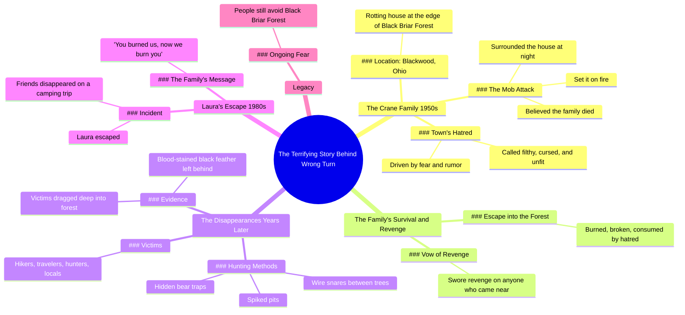

# The Terrifying True Story Behind Wrong Turn

> 🌐 **Read this in:** [English](../../en/2026-05/tiktok-transcript-the-real-story-behind-wrong-turn-creepy-1900s-storytime-wron-337b.md) · **中文**

> **Creator:** [@darkhistorytales1](https://www.tiktok.com/@darkhistorytales1) · **Views:** 5.8M · **Posted:** 2026-05-24 · **Niche:** entertainment
>
> **TL;DR:** Opens with a promise of a scary secret origin, hooking viewers who know the movie.

[Watch original video →](https://vm.tiktok.com/ZNRn9bLj9/)

## Why This Went Viral

## 钩子（前3秒）
- **开场白原文：**“这是《致命弯道》背后令人毛骨悚然的故事”
- **钩子模式：** **大胆断言**（将热门恐怖片与“真实”故事挂钩）+ **场景设定**（20世纪50年代，宁静小镇，俄亥俄州布莱克伍德）
- **为何能吸引人：** 它承诺揭示知名IP《致命弯道》不为人知的隐秘背景，瞬间激发好奇心与“真实故事”的神秘感。“令人毛骨悚然的故事”一词立即营造出情感张力。

## 情感节奏
1. **好奇**（0-3秒）： “《致命弯道》背后令人毛骨悚然的故事”——观众渴望知晓秘密。
2. **紧张**（3-10秒）： “暴民包围了房子并放火焚烧”——不公与危险。
3. **共鸣**（10-15秒）： “被烧得支离破碎，被仇恨吞噬”——对反派产生同情。
4. **悬疑**（15-25秒）： “人们开始失踪……树林里遍布陷阱”——威胁升级。
5. **高潮**（25-30秒）： “低语着‘你们烧死了我们，现在我们要烧死你们’”——直接引用复仇台词，带来感官冲击。
6. **解脱与余悸**（30-35秒）： “直到今天，人们仍避开那片树林”——结局收束，但恐惧挥之不去。

## 关键词密度
- **“烧死”/“火”**（出现4次）——驱动情感共鸣（不公、复仇）。
- **“森林”/“树林”**（出现5次）——算法覆盖（地点类恐怖、徒步/户外细分领域）。
- **“家族”/“克兰”**（出现5次）——情感共鸣（悲剧反派起源）。
- **“失踪”/“消失”**（出现3次）——算法覆盖（悬疑、真实犯罪）。
- **“陷阱”/“猎杀”**（出现3次）——情感共鸣（生存恐怖）。
- **“复仇”**（出现2次）——情感共鸣（道德复杂性）。
- **“布莱克伍德”/“黑荆棘”**（出现3次）——算法覆盖（当地传说、Creepypasta SEO）。

## 为何能传播
1. **IP借势：** 《致命弯道》是知名恐怖系列。视频无需版权即可借助其文化影响力。喜爱该片的观众会因好奇而点击。
2. **暴民正义起源故事：** 家族被暴民活活烧死——将反派转变为令人同情的受害者。“被烧得支离破碎，被仇恨吞噬”这句话引发道德愤怒，易于分享。
3. **伪纪录片/都市传说框架：** “人们开始失踪……少数逃脱者声称……”模仿真实幸存者证词。具体细节“沾满血迹的黑羽毛”显得真实且具画面感，便于复述。
4. **直接复仇台词：** “你们烧死了我们，现在我们要烧死你们”是完美的金句。简短、有节奏、情感强烈——适合TikTok混剪、反应视频或文字叠加。
5. **开放式恐惧：** “直到今天，人们仍避开那片树林”邀请观众评论“我绝不会去那里”或“这地方离我很近”——推动互动循环。

## 可借鉴之处
1. **以知名IP + “真实故事”框架开场：** 以“这是[热门电影/游戏]背后令人毛骨悚然的故事”开场，瞬间吸引该IP粉丝。例如：“这是《女巫布莱尔》背后的真实故事。”
2. **使用反派起源弧线：** 先让反派令人同情（被活活烧死、被排斥），再变成怪物。这创造情感复杂性，观众会分享并争论“谁才是真正的恶人？”
3. **以直接、可重复的台词结尾：** 设计一句可提取为金句的台词（如“你们烧死了我们，现在我们要烧死你们”）。这推动混剪、拼接和口口相传。保持10字以内，节奏有力。

## Mind Map

## Full Transcript (Generated by [TokTranscript](https://toktranscript.com/?utm_source=github&utm_medium=breakdown&utm_campaign=tool_attribution))

> 📝 Transcripts on this page are auto-generated and show the first 60%. Want to transcribe any TikTok in 30 seconds and get the full version? [Try TokTranscript free →](https://toktranscript.com/?utm_source=github&utm_medium=breakdown&utm_campaign=transcript_cta)

this is the terrifying story behind Wrong Turn in the 1950s near the quiet town of Blackwood Ohio there lived a family called the Crane Family they stayed in a rotting house at the edge of Black Briar Forest the town's people hated them calling them filthy cursed and unfit to live among others one night driven by fear and rumour a mob surrounded the house and set it on fire believing the family would die with it the cranes survived they disappeared into the forest burned broken and consumed by hatred from then on they swore revenge on anyone who came near years later people started vanishing around black Briar forest hikers travelers hunters even locals the few who escaped claimed the family hunted like a

*[Read the full transcript on TokTranscript →](https://toktranscript.com/plaza/tiktok-transcript-the-real-story-behind-wrong-turn-creepy-1900s-storytime-wron-337b?utm_source=github&utm_medium=breakdown&utm_campaign=transcript_full)*

## Browse More

- All [entertainment](../../by-niche/zh-CN/entertainment.md) breakdowns
- All [Mystery/Curiosity Gap](../../by-pattern/zh-CN/hook-mystery-curiosity-gap.md) examples

## Video Info

| | |
|---|---|
| Creator | [@darkhistorytales1](https://www.tiktok.com/@darkhistorytales1) |
| Original video | [https://vm.tiktok.com/ZNRn9bLj9/](https://vm.tiktok.com/ZNRn9bLj9/) |
| Original title | the real story behind wrong turn  #creepy #1900s #storytime #wrongturn  |
| Views | 5.8M (5800000) |
| Posted | 2026-05-24 |
| Duration | 0s |
| Niche | `entertainment` |
| Hook pattern | `Mystery/Curiosity Gap` |
| Original language | `en` (this page translated by AI) |
| Available languages | en, zh-CN |
| Generated | 2026-05-24 by [TokTranscript](https://toktranscript.com/) |

---

*This breakdown is for educational analysis under fair use. Original video © [@darkhistorytales1](https://www.tiktok.com/@darkhistorytales1). All transcripts are auto-generated and may contain errors.*

*Want to analyze your own TikToks like this? [免费 TikTok 文稿生成器 →](https://toktranscript.com/viral-breakdown?utm_source=github&utm_medium=breakdown&utm_campaign=footer_cta)*