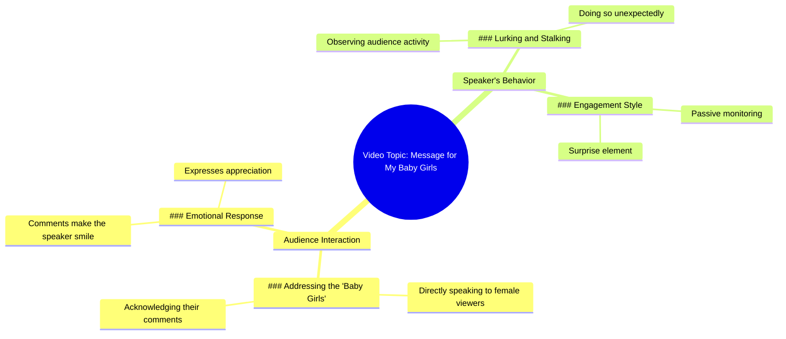

# This Is for All My Baby Girls

> 🌐 **Read this in:** [English](../../en/2026-05/tiktok-transcript-this-is-for-all-my-babygorls-2021tiktok-fyp-targetaudience-9e0a.md) · **中文**

> **Creator:** [@lolpomz](https://www.tiktok.com/@lolpomz) · **Views:** 1.3M · **Posted:** 2026-05-22 · **Niche:** entertainment
>
> **TL;DR:** Creates immediate intimacy and belonging by singling out a group.

[Watch original video →](https://www.tiktok.com/t/ZTB8qqYbq/)

## Why This Went Viral

## 钩子（前3秒）
- **逐字开场白：** "这是献给我所有的小公主们。"
- **钩子模式：** **针对特定受众的直接对话** — 立即点名一个特定群体（"小公主们"），并暗示一种个人联系。
- **为何能让人停下滑动：** 它瞬间营造出归属感和好奇心。认同自己是"小公主"的观众会感到被看见、被点名。那句"我看到你们的评论"暗示了一种准社会关系，让观众觉得创作者是在直接对他们说话，而不是对着一群人。

## 情感节奏
- **节拍1 — 温暖与归属感（0–3秒）：** "这是献给我所有的小公主们。" — 营造一个安全、亲密的空间。
- **节拍2 — 认可与感激（3–6秒）：** "女士们，我看到你们的评论了，它们让我微笑。" — 强化准社会纽带；让观众感到被欣赏。
- **节拍3 — 俏皮的紧张感（6–9秒）：** "我在潜伏，我在跟踪，就在你最意想不到的时候。" — 从甜蜜转向调皮，引入惊喜和悬念的元素。
- **高潮时刻：** "跟踪"这个词 — 它颠覆了温暖的基调，制造出一阵俏皮的恐惧/兴奋感，让观众继续看下去，想知道这个转折会引向何方。

## 关键词密度
| 关键词/短语 | 触达 vs. 吸引力 | 为何有效 |
|----------------|----------------|--------------|
| **小公主们** | 情感吸引力 | 创造部落认同感；在感受到姐妹情谊的女性中极易分享 |
| **我看到你 / 你们的评论** | 算法触达 + 吸引力 | 推动互动（评论、分享），因为观众感到被认可 |
| **潜伏** | 吸引力 | 增添神秘感和亲密感；暗示持续的关注 |
| **跟踪** | 吸引力 | 高冲击力词汇，制造紧张感和震撼效果 |
| **在你最意想不到的时候** | 吸引力 | 营造悬念和错失恐惧症 |

## 为何能传播
1. **大规模准社会亲密感** — "女士们，我看到你们的评论了"让每位观众都感到被个人认可，尽管这是一对多的信息。这会触发认可带来的多巴胺冲击，推动分享和评论。
2. **通过语气转换制造紧张感** — 从甜蜜（"让我微笑"）到掠夺性（"潜伏和跟踪"）的切换制造了认知冲击。观众会重看以捕捉情绪变化的精确时刻，从而提高留存率和循环播放性。
3. **低参与门槛** — "小公主们"是一个宽泛、包容的标识。任何感觉自己是个"小公主"（柔软、被保护、被珍视）的女性都能立刻认领这个内容，使其易于@朋友或评论"是我"。
4. **神秘感 + 错失恐惧症** — "在你最意想不到的时候"暗示着持续、不可预测的关注。这让观众感觉自己参与了一场秘密游戏，鼓励他们继续关注后续内容，或评论"👀"以表示他们在看。
5. **短小精悍的脚本** — 每个词都有其目的：身份认同、认可、紧张感、悬念。没有废话意味着高重看率和易于记忆以便转发。

## 你可以借鉴的点
1. **以针对特定群体的直接对话开场** — 使用你的受众已经用来称呼自己的昵称或标识（例如，"悲伤女孩"、"深夜胡思乱想者"、"混乱小恶魔"）。这能瞬间筛选并建立联系。
2. **在10秒内制造语气转折** — 以温暖/柔和开场，然后转向意想不到的方向（俏皮的威胁、黑色幽默、脆弱感）。这种对比能防止观众划走。
3. **以暗示性的悬念结尾** — 不要说完整个想法。使用"在你最意想不到的时候"或"这时事情就变得有趣了"这样的短语，迫使观众重看或等待下一个视频。这能提升观看时长和系列内容的参与度。

## Mind Map

## Full Transcript (Generated by [TokTranscript 转录工具](https://toktranscript.com/?utm_source=github&utm_medium=breakdown&utm_campaign=tool_attribution))

> 📝 Transcripts on this page are auto-generated and show the first 60%. Want to transcribe any TikTok in 30 seconds and get the full version? [Try TokTranscript free →](https://toktranscript.com/?utm_source=github&utm_medium=breakdown&utm_campaign=transcript_cta)

This is for all my baby girls. I see your comments, ladies, and they make me smi

*[Read the full transcript on TokTranscript →](https://toktranscript.com/plaza/tiktok-transcript-this-is-for-all-my-babygorls-2021tiktok-fyp-targetaudience-9e0a?utm_source=github&utm_medium=breakdown&utm_campaign=transcript_full)*

## Browse More

- All [entertainment](../../by-niche/zh-CN/entertainment.md) breakdowns
- All [Direct address to a specific audience](../../by-pattern/zh-CN/hook-direct-address-to-a-specific-audience.md) examples

## Video Info

| | |
|---|---|
| Creator | [@lolpomz](https://www.tiktok.com/@lolpomz) |
| Original video | [https://www.tiktok.com/t/ZTB8qqYbq/](https://www.tiktok.com/t/ZTB8qqYbq/) |
| Original title | this is for all my babygorls #2021tiktok #fyp #targetaudience |
| Views | 1.3M (1300000) |
| Posted | 2026-05-22 |
| Duration | 0s |
| Niche | `entertainment` |
| Hook pattern | `Direct address to a specific audience` |
| Original language | `en` (this page translated by AI) |
| Available languages | en, zh-CN |
| Generated | 2026-05-25 by [TokTranscript](https://toktranscript.com/) |

---

*This breakdown is for educational analysis under fair use. Original video © [@lolpomz](https://www.tiktok.com/@lolpomz). All transcripts are auto-generated and may contain errors.*

*Want to analyze your own TikToks like this? [免费 TikTok 文稿生成器 →](https://toktranscript.com/viral-breakdown?utm_source=github&utm_medium=breakdown&utm_campaign=footer_cta)*