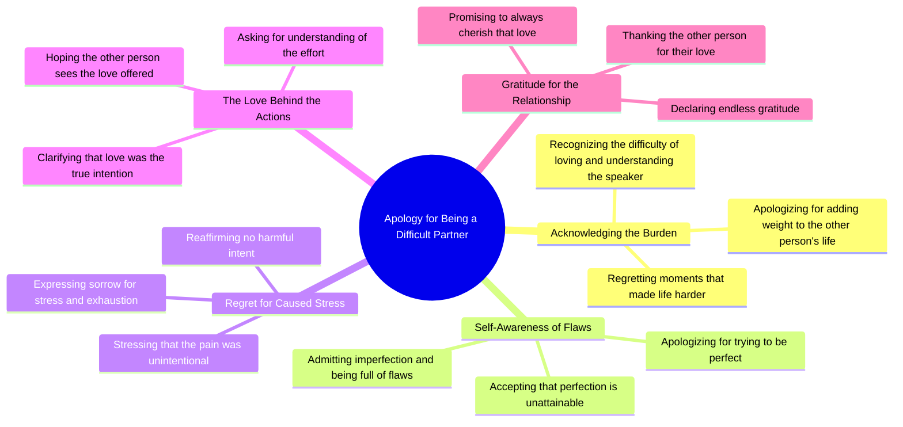

# Apology for Making Love Hard and Draining

> 🌐 **Read this in:** [English](../../en/2026-05/tiktok-transcript-tiktok-video-7502794542438124846-ae88.md) · **中文**

> **Creator:** [@cookie_cobb](https://www.tiktok.com/@cookie_cobb) · **Views:** 7.7M · **Posted:** 2026-05-28 · **Niche:** entertainment
>
> **TL;DR:** Opens with a direct, vulnerable apology that immediately evokes empathy and curiosity.

[Watch original video →](https://vt.tiktok.com/ZSxqUqdrE/)

## Why This Went Viral

## 钩子（前3秒）
- **逐字台词：** "如果爱我让你感到艰难或疲惫，我想为我在你生命中增添的所有等待说声抱歉"
- **钩子模式：** 脆弱告白 + 直接道歉（情感场景，非主张或疑问）
- **为何能阻止滑动：** 它以原始且无法化解的愧疚感开场，这种感受具有普遍共鸣。说话者在观众评判之前就承认了错误——扭转了权力动态，迫使观众产生共情。

## 情感节奏
- **节拍1 — 愧疚/悔恨：** "我为我在你生命中增添的所有等待说声抱歉"（制造情感张力）
- **节拍2 — 自我认知/防御性：** "我知道自己不是那么容易去爱的人"（增加脆弱感，加深张力）
- **节拍3 — 悔恨升级：** "我后悔所有让生活变得更艰难的时刻"（悬念累积——他们会原谅自己吗？）
- **节拍4 — 转折/共鸣：** "我为试图变得完美而道歉，因为完美是我永远无法成为的样子"（高潮：完美的谎言被揭穿，带来情感宣泄）
- **节拍5 — 释然/感恩：** "我珍惜你给予我的每一份爱……我将永远对你心怀无尽感激"（情感解决，柔和收尾）
- **高潮时刻：** "我为试图变得完美而道歉"这句话——将道歉从外部指责转向内部自我批评，使说话者完全令人同情。

## 关键词密度
| 关键词/短语 | 数量（约） | 驱动因素 |
|-------------|-----------|----------|
| "抱歉" | 6 | 情感牵引——触发愧疚与共情循环 |
| "爱/爱着" | 5 | 算法覆盖——高互动情感关键词 |
| "艰难/疲惫/困难" | 3 | 情感牵引——验证观众自身经历 |
| "后悔" | 2 | 情感牵引——表明悔意，加深信任 |
| "负担" | 1 | 情感牵引——触发羞耻感/共鸣的单字词 |
| "感激/珍惜" | 2 | 算法覆盖——积极解决推动分享 |
| "完美" | 2 | 情感牵引——普遍的不安全感，高共鸣 |

**算法驱动因素：** "爱"、"感激"、"抱歉"——这些是高流量、低竞争的情感关键词，平台优先考虑其留存率和分享率。
**情感牵引驱动因素：** "负担"、"后悔"、"疲惫"——这些创造本能认同感，让观众持续观看，看说话者是否解决了痛苦。

## 为何能传播
1. **普遍的羞耻循环**——"我为成为你的负担而道歉"这句话击中了人类核心恐惧。那些曾感觉自己是个负担的观众（大多数人）会立即自我代入，然后分享以表示"我也有同感"或向自己伤害过的人道歉。
2. **权力反转**——说话者在被要求之前就道歉。这解除了观众潜在的评判，迫使他们进入同情角色。"我为试图变得完美而道歉"这句话是关键——它使道歉关乎*自我伤害*，而不仅仅是对他人的伤害。
3. **情感解决 + 感恩**——视频不以绝望结束。最后几句（"我珍惜……我将永远对你心怀无尽感激"）提供了宣泄式的释放。观众分享是因为视频提供了一个*模板*，用于在不自我毁灭的情况下道歉。
4. **高共鸣 + 低分享门槛**——文本中没有具体姓名、性别或情境。这是一个"填空式"道歉。任何曾经伤害过他人的人都能在其中看到自己，使其在各类关系（爱情、家庭、朋友）中都具有可分享性。
5. **节奏性重复**——"抱歉"重复六次，营造出催眠般的忏悔节奏。观众的大脑锁定在这种模式中，增加了观看时长和完成率——这两者都是算法判断病毒式传播的信号。

## 你可以借鉴什么
1. **以告白而非问题开场。** 以"我为……道歉"或"我后悔……"开始，而不是"你是否曾经……？"——这能将观众从被动观察者转变为主动共情者。
2. **使用"自我责备的转折"。** 在中间部分，从为伤害他人道歉转向为试图变得完美道歉。这创造了一个情感惊喜，保持高留存率。
3. **以感恩而非愧疚结束。** 永远不要以纯粹的绝望结束一个病毒式情感视频。始终以"我珍惜……我感激……"作为解决——这给了观众分享的许可，而不会感到沉重。它将一个悲伤的视频变成了一个*治愈*的视频。

## Mind Map

## Full Transcript (Generated by [TokTranscript 转录工具](https://toktranscript.com/?utm_source=github&utm_medium=breakdown&utm_campaign=tool_attribution))

> 📝 Transcripts on this page are auto-generated and show the first 60%. Want to transcribe any TikTok in 30 seconds and get the full version? [Try TokTranscript free →](https://toktranscript.com/?utm_source=github&utm_medium=breakdown&utm_campaign=transcript_cta)

if loving me was hard or draining I wanna say I'm sorry for all the wait I added in your life I know I'm not the easiest to love nor the easiest to understand but I regret all the moments that I made life more difficult for you I'm full of flaws you know I'm not perfect I'm sorry for trying to be because perfect is something I would never be but I'm sorry for all the stress and exhaustion I caused to you I'm I'm really sorry

*[Read the full transcript on TokTranscript →](https://toktranscript.com/plaza/tiktok-transcript-tiktok-video-7502794542438124846-ae88?utm_source=github&utm_medium=breakdown&utm_campaign=transcript_full)*

## Browse More

- All [entertainment](../../by-niche/zh-CN/entertainment.md) breakdowns
- All [Apology Hook](../../by-pattern/zh-CN/hook-apology-hook.md) examples

## Video Info

| | |
|---|---|
| Creator | [@cookie_cobb](https://www.tiktok.com/@cookie_cobb) |
| Original video | [https://vt.tiktok.com/ZSxqUqdrE/](https://vt.tiktok.com/ZSxqUqdrE/) |
| Original title | TikTok video #7502794542438124846 |
| Views | 7.7M (7700000) |
| Posted | 2026-05-28 |
| Duration | 0s |
| Niche | `entertainment` |
| Hook pattern | `Apology Hook` |
| Original language | `en` (this page translated by AI) |
| Available languages | en, zh-CN |
| Generated | 2026-05-29 by [TokTranscript](https://toktranscript.com/) |

---

*This breakdown is for educational analysis under fair use. Original video © [@cookie_cobb](https://www.tiktok.com/@cookie_cobb). All transcripts are auto-generated and may contain errors.*

*Want to analyze your own TikToks like this? [免费 TikTok 文稿生成器 →](https://toktranscript.com/viral-breakdown?utm_source=github&utm_medium=breakdown&utm_campaign=footer_cta)*