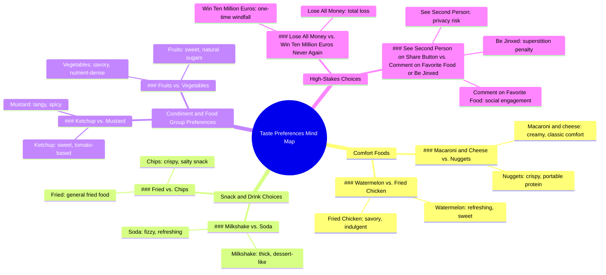

# tu préfères... 🔴 🔵? macaroni au fromage  nuggets de poulet  snickers ...

> 🌐 **Read this in:** [English](../../en/2026-05/tiktok-transcript-tu-pr-f-res-macaroni-au-fromage-nuggets-de-poulet-snickers-8840.md) · **中文**

> **Creator:** [@noro.tupreferes](https://www.tiktok.com/@noro.tupreferes) · **Views:** 1.0M · **Posted:** 2026-05-23 · **Niche:** other
>
> **TL;DR:** Challenges the viewer's taste, prompting immediate engagement.

[Watch original video →](https://vm.tiktok.com/ZS9YCYe7wbGpK-EDO4i/ تتم مشاركة هذا المنشور عبر TikTok Lite. نزّل TikTok Lite للاستمتاع بمزيد من المنشورات: https://www.tiktok.com/tiktoklite)

## Why This Went Viral

## 钩子（前3秒）
- **逐字开场白：**“让我看看你品味如何，你喜欢好吃的通心粉奶酪还是鸡块。”
- **钩子模式：** 提问/挑战（带有挑衅意味的“让我看看你品味如何”）
- **为何能留住观众：** 开场将视频定位为对个人身份（“品味”）的考验，并立即迫使观众做出二选一，营造出低风险却难以抗拒的回应冲动。快节奏的语速预示着这是一场快速、引人入胜的挑战。

## 情绪节奏
- **节拍1（好奇）：**“让我看看你品味如何”——观众想要证明自己。
- **节拍2（紧张）：** 每个二选一（通心粉奶酪 vs. 鸡块、运动鞋 vs. 特趣巧克力）都制造出微观决策，累积轻微压力。
- **节拍3（升级）：**“输光所有钱或赢一千万欧元，但条件是再也不能”——赌注突然飙升，引发更深层次的参与。
- **节拍4（反转/悬念）：**“看看当你点击分享时出现的第二个人”——引入一个神秘、可分享的机制。
- **节拍5（放松/解决）：** 最终选择（水果 vs. 蔬菜、番茄酱 vs. 芥末酱）轻松且低风险，以轻松基调收尾。
- **高潮时刻：**“赢一千万欧元，但条件是再也不能”的选择——情绪张力达到顶峰。

## 关键词密度
1.  **“还是”**——驱动二选一结构；算法识别度高（清晰的模式识别）
2.  **“喜欢”**——情感吸引力（个人身份、品味）
3.  **“品味”**——情感吸引力（自我、自我验证）
4.  **“选择”**——算法识别度高（动作动词、参与触发词）
5.  **“再也不能”**——情感吸引力（损失厌恶、后悔）
6.  **“分享”**——算法识别度高（直接行动号召）
7.  **“倒霉”**——情感吸引力（迷信、害怕错过）
8.  **“评论”**——算法识别度高（参与提示）
9.  **“赢一千万欧元”**——情感吸引力（幻想、高赌注）
10. **“食物”**——算法识别度高（广泛、高流量话题）

## 为何能传播
1.  **二选一格式迫使思维参与。** 每位观众都会在脑海中自动选择一个选项——即使不评论。这种被动参与能提升观看时长。*文本证据：“你喜欢好吃的通心粉奶酪还是鸡块”——没有中立选项。*
2.  **赌注升级制造成瘾性紧张感。** 从无聊的食物选择跳到“输光所有钱或赢一千万欧元”，吸引那些想看游戏能玩到多远的观众。*文本证据：“输光所有钱或赢一千万欧元，但条件是再也不能。”*
3.  **神秘的分享机制推动传播。** “看看当你点击分享时出现的第二个人”是一个直接、由好奇心驱动的行动号召，利用了平台的分享功能。*文本证据：“看看当你点击分享时出现的第二个人以及更多。”*
4.  **迷信/倒霉威胁提高评论率。** “评论你最喜欢的食物，否则永远倒霉”利用轻微恐惧将被动观众转化为活跃评论者，提升算法信号。*文本证据：“评论你最喜欢的食物，否则永远倒霉。”*
5.  **通用话题（食物）+ 低认知负荷。** 每个人对通心粉奶酪 vs. 鸡块都有自己的看法——无需专业知识，任何人都能立即参与。*文本证据：“炸鸡还是薯条。喝奶昔还是喝苏打水。”*

## 你可以借鉴什么
1.  **以身份挑战开场。** 用“让我看看你是否拥有[特质]”开场——它能触发自我意识和好奇心。将你的视频定位为一场测试，而不仅仅是内容。
2.  **使用“阶梯式”赌注结构。** 从低风险的二选一开始，然后升级到高赌注（金钱、损失、倒霉），让观众一直看到最后。
3.  **嵌入神秘的分享机制。** 添加一句“看看当你分享这个时会发生什么”——它利用好奇心，直接推动病毒式传播，而无需请求点赞。

## Mind Map

## Full Transcript (Generated by [TokTranscript](https://toktranscript.com/?utm_source=github&utm_medium=breakdown&utm_campaign=tool_attribution))

> 📝 Transcripts on this page are auto-generated and show the first 60%. Want to transcribe any TikTok in 30 seconds and get the full version? [Try TokTranscript free →](https://toktranscript.com/?utm_source=github&utm_medium=breakdown&utm_campaign=transcript_cta)

Let's see if you have good taste, do you prefer good macaroni and cheese or nuggets. Sneakers or twix watermelon or fried chicken? Lose all your money or win ten million euros, but never again. See the second person who appears when you click on 

*[Read the full transcript on TokTranscript →](https://toktranscript.com/plaza/tiktok-transcript-tu-pr-f-res-macaroni-au-fromage-nuggets-de-poulet-snickers-8840?utm_source=github&utm_medium=breakdown&utm_campaign=transcript_full)*

## Browse More

- All [other](../../by-niche/zh-CN/other.md) breakdowns
- All [unknown](../../by-pattern/zh-CN/hook-unknown.md) examples

## Video Info

| | |
|---|---|
| Creator | [@noro.tupreferes](https://www.tiktok.com/@noro.tupreferes) |
| Original video | [https://vm.tiktok.com/ZS9YCYe7wbGpK-EDO4i/ تتم مشاركة هذا المنشور عبر TikTok Lite. نزّل TikTok Lite للاستمتاع بمزيد من المنشورات: https://www.tiktok.com/tiktoklite](https://vm.tiktok.com/ZS9YCYe7wbGpK-EDO4i/ تتم مشاركة هذا المنشور عبر TikTok Lite. نزّل TikTok Lite للاستمتاع بمزيد من المنشورات: https://www.tiktok.com/tiktoklite) |
| Views | 1.0M (1000000) |
| Posted | 2026-05-23 |
| Duration | 0s |
| Niche | `other` |
| Hook pattern | `unknown` |
| Original language | `en` (this page translated by AI) |
| Available languages | en, zh-CN |
| Generated | 2026-05-24 by [TokTranscript](https://toktranscript.com/) |

---

*This breakdown is for educational analysis under fair use. Original video © [@noro.tupreferes](https://www.tiktok.com/@noro.tupreferes). All transcripts are auto-generated and may contain errors.*

*Want to analyze your own TikToks like this? [TikTok 转录工具 →](https://toktranscript.com/viral-breakdown?utm_source=github&utm_medium=breakdown&utm_campaign=footer_cta)*