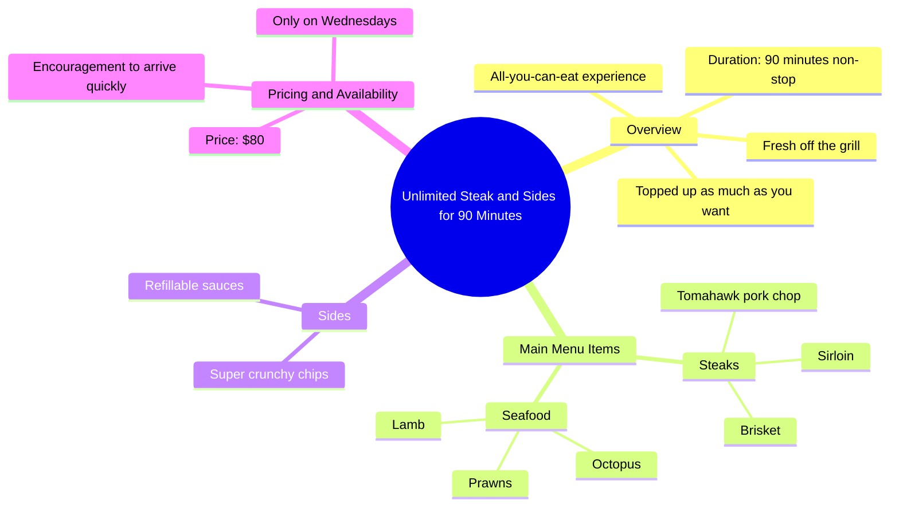

# Unlimited Steak and Sides for 90 Minutes in Sydney

> 🌐 **Read this in:** [English](../../en/2026-05/tiktok-transcript-unlimited-steak-run-follow-for-best-sydney-guide-get-10-off-a4a9.md) · **中文**

> **Creator:** [@eunicexplores](https://www.tiktok.com/@eunicexplores) · **Views:** 1.5M · **Posted:** 2026-05-22 · **Niche:** food
>
> **TL;DR:** Combines the allure of unlimited food with a time limit, creating urgency and desire.

[Watch original video →](https://vt.tiktok.com/ZSx6qXAAk/)

## Why This Went Viral

## 钩子（前3秒）
- **原话开场：** "在这里，你可以连续90分钟无限享用牛排和配菜。"
- **钩子模式：** 大胆承诺 + 稀缺性（"无限"、"连续"、"90分钟"）
- **为何能让人停下滑动：** 它承诺了一种罕见的高价值体验（高级肉类自助餐），并设定了时间限制，立即引发错失恐惧症和对地点及价格的好奇心。

## 情绪节奏
1. **好奇（0-3秒）：** "无限牛排和配菜"——观众想知道在哪里以及如何实现。
2. **期待（3-10秒）：** 列举高级菜品（西冷牛排、牛胸肉、战斧牛排、羊肉、大虾、章鱼）——建立欲望和感官期待。
3. **满足（10-15秒）：** "超级酥脆的薯条和酱料"——加入亲切、舒适的元素，将奢华感融入日常享受。
4. **紧迫（15-18秒）：** "仅在每周三，只需80美元"——制造时间压力和价格冲击。
5. **行动号召（18-20秒）：** "所以你最好跑着来"——将紧迫感转化为行动，给观众留下明确的下一步。
- **高潮：** 价格（80美元）和日期（每周三）的揭晓——观众决定是否值得的关键时刻。

## 关键词密度
| 关键词 | 出现次数 | 功能 |
|---------|----------|------|
| 无限 | 2次 | 算法覆盖（高价值、可搜索） |
| 牛排 | 2次 | 情感吸引（渴望、高级） |
| 配菜 | 2次 | 情感吸引（完整性、价值感） |
| 90分钟 | 1次 | 稀缺性驱动（时间限制） |
| 每周三 | 1次 | 算法覆盖（特定日期搜索） |
| 80美元 | 1次 | 情感吸引（价值锚点、冲击感） |
| 现烤出炉 | 1次 | 情感吸引（感官、信任） |
| 不断续加 | 1次 | 情感吸引（丰盛、无限制） |

- **算法覆盖：** "无限"、"牛排"、"每周三"——美食优惠的高搜索量。
- **情感吸引：** "现烤出炉"、"不断续加"、"超级酥脆"——触发味觉和舒适感。

## 为何能传播
1. **极致价值主张：** "连续90分钟无限享用牛排和配菜"——优惠好到值得分享（人们会@爱吃牛排的朋友）。
2. **具体性建立信任：** "西冷牛排、牛胸肉、战斧猪排、羊肉、大虾和章鱼"——详细清单表明真实性和品质，而非普通自助餐。
3. **稀缺性+低价：** "仅在每周三，只需80美元"——创造限时、可负担的奢华感，让人觉得是个秘密（推动收藏和分享）。
4. **可操作的行动号召：** "所以你最好跑着来"——低门槛、高紧迫感的指令，将观众转化为顾客。
5. **感官语言：** "现烤出炉"、"超级酥脆的薯条"——触发渴望，让观众想亲自体验。

## 你可以借鉴的点
1. **以最惊人的主张开头：** "无限牛排"胜过"超值牛排优惠"——始终以最强的价值陈述开场。
2. **列举具体高级菜品以建立欲望：** 不要说"各种肉类"——直接点名"西冷牛排、牛胸肉、战斧牛排、羊肉、大虾、章鱼"以激发想象力和信任。
3. **在最后5秒用稀缺性+价格锚定：** 在高潮时揭晓日期和价格以制造紧迫感——然后立即告诉他们行动（"跑着来"）。

## Mind Map

## Full Transcript (Generated by [TokTranscript](https://toktranscript.com/?utm_source=github&utm_medium=breakdown&utm_campaign=tool_attribution))

> 📝 Transcripts on this page are auto-generated and show the first 60%. Want to transcribe any TikTok in 30 seconds and get the full version? [Try TokTranscript free →](https://toktranscript.com/?utm_source=github&utm_medium=breakdown&utm_campaign=transcript_cta)

This is where you can get unlimited steak and sides non stop for 90 minutes. Everything is fresh off the grill and topped up as much as you want, including sirloin brisket, Tomahawk pork chop, lamb prawns and octopus. This also includes a bunch

*[Read the full transcript on TokTranscript →](https://toktranscript.com/plaza/tiktok-transcript-unlimited-steak-run-follow-for-best-sydney-guide-get-10-off-a4a9?utm_source=github&utm_medium=breakdown&utm_campaign=transcript_full)*

## Browse More

- All [food](../../by-niche/zh-CN/food.md) breakdowns
- All [Scarcity + Abundance](../../by-pattern/zh-CN/hook-scarcity-abundance.md) examples

## Video Info

| | |
|---|---|
| Creator | [@eunicexplores](https://www.tiktok.com/@eunicexplores) |
| Original video | [https://vt.tiktok.com/ZSx6qXAAk/](https://vt.tiktok.com/ZSx6qXAAk/) |
| Original title | UNLIMITED STEAK?! RUN. 🤠 follow for best sydney guide ✨ get 10% off T... |
| Views | 1.5M (1500000) |
| Posted | 2026-05-22 |
| Duration | 0s |
| Niche | `food` |
| Hook pattern | `Scarcity + Abundance` |
| Original language | `en` (this page translated by AI) |
| Available languages | en, zh-CN |
| Generated | 2026-05-25 by [TokTranscript](https://toktranscript.com/) |

---

*This breakdown is for educational analysis under fair use. Original video © [@eunicexplores](https://www.tiktok.com/@eunicexplores). All transcripts are auto-generated and may contain errors.*

*Want to analyze your own TikToks like this? [拆解你自己的 TikTok →](https://toktranscript.com/viral-breakdown?utm_source=github&utm_medium=breakdown&utm_campaign=footer_cta)*