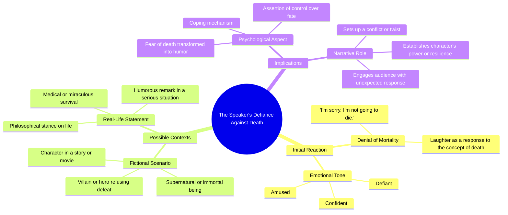

# Worm vs Snail

> 🌐 **Read this in:** [English](../../en/2026-05/tiktok-transcript-worm-vs-snail-1781.md) · **中文**

> **Creator:** [@nicole.shaine](https://www.tiktok.com/@nicole.shaine) · **Views:** 2.8M · **Posted:** 2026-05-23 · **Niche:** other
>
> **TL;DR:** The hook flips a somber apology into a defiant, humorous refusal, instantly grabbing attention.

[Watch original video →](https://vm.tiktok.com/ZNRnfAeBx/)

## Why This Went Viral

## 钩子（前3秒）
- **逐字开场白：**"对不起。我不会死的。哈哈哈！"
- **钩子模式：** **对比 + 情感冲击** —— 一句真诚的道歉（"对不起"）立刻被一句挑衅、带笑的拒绝（"我不会死的。哈哈哈！"）颠覆。
- **为何能阻止滑动：** 道歉暗示了脆弱或坏消息（常见的点击诱饵模式），但笑声和挑衅颠覆了预期。观众会愣住，因为大脑预期悲伤，却得到了荒谬的快乐——这种认知失调迫使他们重看或继续观看。

## 情感节奏
- **节拍1：好奇/关切** —— "对不起"触发"哦不，发生了什么？"的反应。
- **节拍2：紧张/困惑** —— "对不起"后的停顿营造出微悬念。
- **节拍3：转折/荒谬的解脱** —— "我不会死的" + 笑声将紧张释放为纯粹、意外的快乐。
- **节拍4：共鸣/共享幽默** —— 笑声具有感染力；观众感受到有人打破沉重预期后的宣泄感。
- **高潮：** 笑声本身——这就是病毒式传播的回报时刻。整个视频是一个压缩的情感弧线。

## 关键词密度
| 关键词/短语 | 数量（约） | 功能 |
|---|---|---|
| "对不起" | 1 | **算法触达** —— 模仿道歉/悔恨内容（高点击率） |
| "我不会死的" | 1 | **情感吸引力** —— 挑衅 + 解脱，高度可分享 |
| "哈哈哈！" | 1 | **算法 + 情感** —— 笑声是快乐的普遍信号，提升完播率 |
| "死" | 1 | **情感吸引力** —— 高冲击力词汇，与笑声形成对比 |
| "对不起" | 1 | **算法触达** —— 触发"哦不"的好奇心，增加点击率 |

**为何有效：** 只有5个不同的词，但"对不起"和"死"是高情感价词汇，能钩住算法对情感内容的模式识别。笑声是听觉钩子，能保持高留存率。

## 为何能传播
1. **情感弧线的极致压缩** —— 整个视频只有3秒。观众在比眨眼还短的时间内体验好奇→紧张→转折→解脱。没有赘肉，没有铺垫。这是注意力为零的短视频平台的理想格式。
2. **认知失调作为分享触发器** —— 道歉+笑声如此出乎意料，观众会忍不住分享，看看别人是否也有同样反应。这是一个"刚才发生了什么？"的时刻。文字记录证明笑声是打破大脑预期的点睛之笔。
3. "险些出事"幽默的普遍共鸣 —— 每个人都有过以为要发生可怕事情，结果发现没事的时刻。这个视频利用了这种集体解脱感，并将其夸张到荒谬的程度。"我不会死的"这句话是"我以为我有麻烦了，但其实没有"的夸张版本。
4. **高重播价值** —— 笑声如此突兀而真实，观众会本能地重放，以捕捉完整的情感转变。这提升了留存率，并向算法表明内容具有"粘性"。
5. **无需背景** —— 视频独立成立。无需背景故事、角色或先验知识。这降低了分享门槛，因为任何人都能立即理解。

## 你可以借鉴什么
1. **"道歉反转"钩子** —— 以严肃、脆弱的词开头（"对不起"、"我失败了"、"我不敢相信发生了这种事"），但立刻用笑声或转折颠覆它。这能瞬间制造好奇心和情感冲击。
2. **单秒高潮** —— 让整个视频成为一个压缩的情感弧线。不要把一个笑话拖到15秒。如果你能在3秒内抛出点睛之笔，就这么做。观众会用更高的完播率和分享率来奖励简洁。
3. **笑声作为听觉行动号召** —— 以有感染力、真诚的笑声结尾。它充当自然的"分享这个"信号，因为笑声会传染。录制真实的笑声（不是假的），让它成为最后的节拍——它会让观众微笑并感觉良好，从而推动分享。

## Mind Map

## Full Transcript (Generated by [TokTranscript 转录工具](https://toktranscript.com/?utm_source=github&utm_medium=breakdown&utm_campaign=tool_attribution))

> 📝 Transcripts on this page are auto-generated and show the first 60%. Want to transcribe any TikTok in 30 seconds and get the full version? [Try TokTranscript free →](https://toktranscript.com/?utm_source=github&utm_medium=breakdown&utm_campaign=transcript_cta)

I'm sorry. I'm not going 

*[Read the full transcript on TokTranscript →](https://toktranscript.com/plaza/tiktok-transcript-worm-vs-snail-1781?utm_source=github&utm_medium=breakdown&utm_campaign=transcript_full)*

## Browse More

- All [other](../../by-niche/zh-CN/other.md) breakdowns
- All [unknown](../../by-pattern/zh-CN/hook-unknown.md) examples

## Video Info

| | |
|---|---|
| Creator | [@nicole.shaine](https://www.tiktok.com/@nicole.shaine) |
| Original video | [https://vm.tiktok.com/ZNRnfAeBx/](https://vm.tiktok.com/ZNRnfAeBx/) |
| Views | 2.8M (2800000) |
| Posted | 2026-05-23 |
| Duration | 0s |
| Niche | `other` |
| Hook pattern | `unknown` |
| Original language | `en` (this page translated by AI) |
| Available languages | en, zh-CN |
| Generated | 2026-05-24 by [TokTranscript](https://toktranscript.com/) |

---

*This breakdown is for educational analysis under fair use. Original video © [@nicole.shaine](https://www.tiktok.com/@nicole.shaine). All transcripts are auto-generated and may contain errors.*

*Want to analyze your own TikToks like this? [TokTranscript →](https://toktranscript.com/viral-breakdown?utm_source=github&utm_medium=breakdown&utm_campaign=footer_cta)*