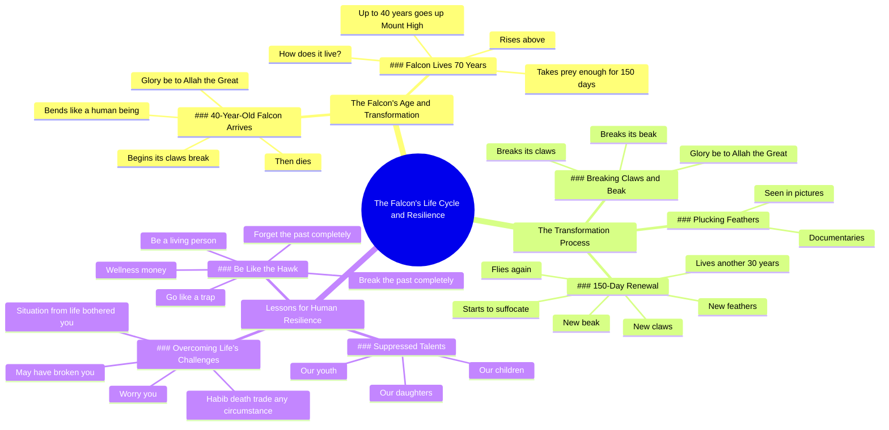

# Falcon Tortures Itself 150 Days to Be Reborn

> 🌐 **Read this in:** [English](../../en/2026-06/tiktok-transcript-19-150-8621.md) · **中文**

> **Creator:** [@thenoveloffaith0](https://www.tiktok.com/@thenoveloffaith0) · **Views:** 4.2M · **Posted:** 2026-06-12 · **Niche:** other
>
> **TL;DR:** Opens with a precise, surprising age for a falcon, immediately making viewers wonder what happens next.

[Watch original video →](https://vm.tiktok.com/ZNRcaNmcE/)

## Why This Went Viral

## 钩子（前3秒）
- **逐字内容：** "当猎鹰到来时，它已经40岁了。赞美伟大的真主。"
- **钩子模式：** **场景 + 大胆断言** — 以故事中段切入，给出具体年龄（40岁）和一句宗教感叹，营造敬畏感。
- **为何能让人停下滑动：** 年龄出乎意料（猎鹰不会在40岁"到来"），宗教用语增添了分量。观众瞬间困惑又好奇——他们想知道40岁时发生了什么。

## 情感节奏
1. **好奇** — "当猎鹰到来时，它已经40岁了……"（这到底是什么意思？）
2. **敬畏/惊叹** — "赞美伟大的真主……它的爪子开始断裂……像人一样弯曲。"
3. **紧张** — "然后它死了。"（突然、震撼）
4. **悬念** — "那只活了70年的猎鹰……它是怎么活下来的？"
5. **高潮** — "然后150天。给它新的羽毛……新的爪子……新的喙。"
6. **共鸣** — "像这只鹰一样……打破过去，彻底忘记过去。"
7. **情感行动号召** — "做一个活着的人。"

**高潮时刻：** 150天的蜕变——重生的瞬间。这是情感回报落地的时刻。

## 关键词密度
| 关键词/短语 | 出现次数（约） | 作用 |
|-------------|---------------|------|
| "赞美真主" | 3 | 情感牵引——宗教敬畏，让人停下滑动 |
| "40年"/"150天"/"30年" | 3+ | 算法覆盖——数字引发好奇和留存 |
| "打破"/"断裂" | 4 | 情感牵引——痛苦、蜕变、共鸣 |
| "新的"（羽毛/爪子/喙） | 3 | 情感牵引——希望、重生 |
| "像这只鹰一样"/"变得如此重要" | 2 | 情感牵引——直接行动号召、身份认同 |
| "处境"/"境况"/"困扰你" | 3 | 算法覆盖——人生建议类高搜索词 |

**算法驱动因素：** 数字（40、150、30）+ "处境"/"境况"——这些是可搜索、可分享的关键词。

**情感驱动因素：** "赞美真主" + "打破" + "新的"——这些营造了敬畏、痛苦和希望。

## 为何能传播
1. **神话般的蜕变故事** — 猎鹰的重生是一个普适的隐喻。这不只是关于一只鸟；而是关于克服人生最艰难的时刻。文字稿明确将其与"我们的孩子、我们的青年、我们的女儿"联系起来——使其具有个人色彩，跨越不同人群都能分享。
2. **宗教框架增强信任** — "赞美真主"重复了三次。对穆斯林观众来说，这标志着真实和深度。对非穆斯林来说，这增添了异域感和好奇心。宗教框架让内容显得神圣，而不仅仅是病毒式传播。
3. **数字+视觉意象=高留存** — "40年"、"150天"、"30年"具体且容易记住。猎鹰折断自己喙和爪子的视觉冲击足以让观众重看或分享。文字稿提到"我在图片/一些纪录片中看到过"——这种视觉证据是关键。
4. **直接的情感行动号召** — "像这只鹰一样……打破过去，彻底忘记过去。"这是一个清晰、可执行的收获。观众可以立即将其应用到自己的生活中，从而引发评论和分享。
5. **普适的痛点** — "生活中的某个处境困扰你……让你担忧……可能已经击垮了你"——这几乎是全人类共通的体验。视频将个人痛苦转化为一个共享的、充满希望的信息。这是病毒式共情的核心。

## 你可以借鉴什么
1. **以数字+谜团开头。** "当猎鹰到来时，它已经40岁了。"不要解释——直接陈述一个奇怪、具体的事实。观众的大脑会用好奇心填补空白。
2. **使用三幕蜕变弧线。** 痛苦（打破）→ 过程（150天）→ 重生（全新的一切）。围绕清晰的"之前/之中/之后"来构建任何建议类视频。观众记住的是旅程，而不是事实。
3. **将普适的教训锚定在特定的动物或物体上。** 猎鹰不是随意选的——它威严、稀有、视觉冲击力强。选择一个具体的事物（鹰、树、山），让它成为你隐喻的主角。不要只说"克服困难"——要展示鹰折断自己的喙。

## Mind Map

## Full Transcript (Generated by [TokTranscript 转录工具](https://toktranscript.com/?utm_source=github&utm_medium=breakdown&utm_campaign=tool_attribution))

> 📝 Transcripts on this page are auto-generated and show the first 60%. Want to transcribe any TikTok in 30 seconds and get the full version? [Try TokTranscript free →](https://toktranscript.com/?utm_source=github&utm_medium=breakdown&utm_campaign=transcript_cta)

When the falcon arrives, it is 40 years old Glory be to Allah the Great begins its claws break And from his continent He bends like a human being, Glory be to Allah Then he dies. The falcon that lives 70 years How does he live it? They say for up to 40 years he goes up Mount Up High It takes him prey enough for 150 days He takes prey for him and rises above Then Glory be to Allah begins to pluck his feathers I saw this in pictures Some documentaries And then he breaks his claws And breaks its beak, Glory be to Allah the Great Then 150 days. And give him new feathers And new claws And a new beak. And it starts to suffocate Fly on their words again live يحفر في هذا

*[Read the full transcript on TokTranscript →](https://toktranscript.com/plaza/tiktok-transcript-19-150-8621?utm_source=github&utm_medium=breakdown&utm_campaign=transcript_full)*

## Browse More

- All [other](../../by-niche/zh-CN/other.md) breakdowns
- All [Curiosity gap with specific age](../../by-pattern/zh-CN/hook-curiosity-gap-with-specific-age.md) examples

## Video Info

| | |
|---|---|
| Creator | [@thenoveloffaith0](https://www.tiktok.com/@thenoveloffaith0) |
| Original video | [https://vm.tiktok.com/ZNRcaNmcE/](https://vm.tiktok.com/ZNRcaNmcE/) |
| Original title | جزء19|طائر عذّب نفسه 150 يومًا… ليولد من جديد! 😳#قصه_مواثره #حكايات #... |
| Views | 4.2M (4200000) |
| Posted | 2026-06-12 |
| Duration | 0s |
| Niche | `other` |
| Hook pattern | `Curiosity gap with specific age` |
| Original language | `en` (this page translated by AI) |
| Available languages | en, zh-CN |
| Generated | 2026-06-13 by [TokTranscript](https://toktranscript.com/) |

---

*This breakdown is for educational analysis under fair use. Original video © [@thenoveloffaith0](https://www.tiktok.com/@thenoveloffaith0). All transcripts are auto-generated and may contain errors.*

*Want to analyze your own TikToks like this? [TokTranscript →](https://toktranscript.com/viral-breakdown?utm_source=github&utm_medium=breakdown&utm_campaign=footer_cta)*