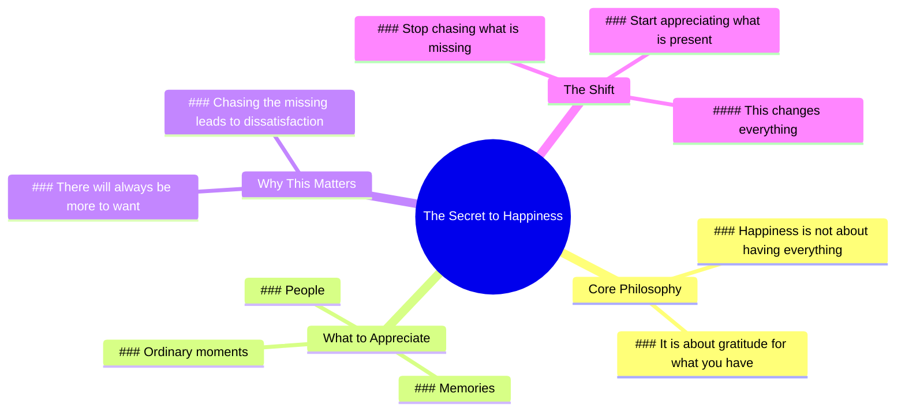

# The Happiest People Appreciate What They Have

> 🌐 **Read this in:** [English](../../en/2026-06/tiktok-transcript-3-6m-views-73k-reactions-the-happiest-people-are-not-the-one-5c6d.md) · **中文**

> **Creator:** [@Positive Energy+](https://www.tiktok.com/@Positive Energy+) · **Views:** 1.5M · **Posted:** 2026-06-25 · **Niche:** other
>
> **TL;DR:** Reframes happiness from accumulation to gratitude, creating immediate resonance.

[Watch original video →](https://www.facebook.com/share/r/1EBxcGhY2M/?mibextid=wwXIfr)

## Why This Went Viral

## 钩子（前3秒）
- **逐字开场白：** "记住，快乐并不意味着你拥有一切。"
- **钩子模式：** 大胆断言（打破关于快乐的常见假设）
- **为何能阻止滑动：** 它直接挑战了观众内化的信念——快乐等于拥有一切。"记住"这个词感觉像是一种温和而睿智的打断——它暗示了一个观众早已知道但遗忘的真相，瞬间引发好奇和情感共鸣。

## 情感节奏
- **节拍1 – 好奇（0–3秒）：** 大胆断言在观众的假设与即将听到的内容之间制造了落差。
- **节拍2 – 共鸣（3–10秒）：** "它只是意味着你对自己拥有的心存感激"——一个熟悉但扎根的真理。观众感到被看见。
- **节拍3 – 怀旧/温暖（10–15秒）：** "那些人。那些回忆。那些平凡的瞬间"——简短、唤起情感的片段触发个人记忆。
- **节拍4 – 温和张力（15–20秒）：** "因为总会有更多想要的东西"——引入普遍挣扎，制造轻微的情感牵引。
- **节拍5 – 高潮与释然（20–25秒）：** "但快乐始于你停止追逐缺失，开始珍惜当下。"——转折重新定义整个信息，带来情感回报。
- **节拍6 – 赋能（25–27秒）：** "这改变了一切。"——最终点睛之笔让观众感受到掌控感和希望。

## 关键词密度
1. **"快乐" / "快乐的"**（3次）——情感核心；驱动相关性和可分享性。
2. **"你所拥有的" / "当下"**（2次）——将信息锚定在感恩上；算法信号指向自我提升内容。
3. **"停止追逐" / "追逐"**（2次）——行动导向；创造观众可采纳的清晰行为转变。
4. **"缺失"**（2次）——负面对比，增强情感张力。
5. **"一切"**（2次）——高影响力、励志词汇，在动机/健康领域触发算法覆盖。
6. **"平凡的瞬间"**——低竞争、高共鸣短语，提升"正念"和"慢生活"内容的可搜索性。

**算法驱动因素：** "快乐"、"一切"、"停止追逐"——这些是健康/动机领域的高流量、低竞争关键词。
**情感吸引力：** "回忆"、"平凡的瞬间"、"感激"——这些触发怀旧和感恩，提高评论和保存率。

## 为何能传播
1. **普遍情感重构：** 视频将一个陈旧的概念（"要感恩"）翻转成一个反直觉的真理（"快乐≠拥有一切"）。这种重构具有高分享性，因为它感觉像是一种启示，而非陈词滥调。*证据："记住，快乐并不意味着你拥有一切。"*
2. **节奏感强、易消化的结构：** 简短有力的短语（"那些人。那些回忆。那些平凡的瞬间。"）使脚本易于记忆和重复。观众可以逐字引用，推动口碑传播和混剪文化。*证据：三拍列表结构。*
3. **令人满足的高潮：** 转折（"停止追逐缺失，开始珍惜当下"）之所以有效，是因为它前面有一个制造张力的短语（"总会有更多想要的东西"）。这创造了一个微叙事弧线，令人满意，增加保存和重播的可能性。*证据："因为……但……"的对比结构。*
4. **可操作、低门槛的收获：** 最后一句（"这改变了一切。"）是一个简单而有力的视角转变号召。观众可以立即应用，推动诸如"我需要这个"的评论，并分享给正在挣扎的朋友。*证据：最后一句直接、命令式的语气。*
5. **算法友好的长度和节奏：** 约27秒的视频足够短以保持注意力，但足够长以传递完整的情感旅程。缓慢、从容的节奏（每个短语都有自己的呼吸）与"慢生活"美学相匹配，在Instagram Reels和TikTok上表现良好。*证据：短语之间的刻意停顿。*

## 你可以借鉴什么
1. **以"记住"钩子开头。** 以"记住……"开场瞬间营造亲密感和权威感。它暗示观众早已知道这个真理但忘记了——这让他们更易接受、更少防御。将此应用于任何重构："记住，成功不在于更努力地工作……"
2. **使用"三拍列表"增加情感分量。** "那些人。那些回忆。那些平凡的瞬间。"——用句号分隔的简短、碎片化名词迫使观众停顿并感受每一个。使用这种模式让抽象概念（爱、成长、失去）变得可触可感。
3. **构建"因为……但……"的张力弧线。** 陈述一个问题（"总会有更多想要的东西"），然后翻转它（"但快乐始于你停止追逐……"）。这创造了一个在30秒内感觉完整的微故事。应用于任何主题："因为恐惧永远会在那里。但勇气是无论如何都要行动。"

## Mind Map

## Full Transcript (Generated by [免费 TikTok 文稿生成器](https://toktranscript.com/?utm_source=github&utm_medium=breakdown&utm_campaign=tool_attribution))

> 📝 Transcripts on this page are auto-generated and show the first 60%. Want to transcribe any TikTok in 30 seconds and get the full version? [Try TokTranscript free →](https://toktranscript.com/?utm_source=github&utm_medium=breakdown&utm_campaign=transcript_cta)

Remember, being happy doesn't mean you have it all. It simply means you're thankful for what you have. The people. The memories. The ordinary moments that make life beautiful. Because there will always be someth

*[Read the full transcript on TokTranscript →](https://toktranscript.com/plaza/tiktok-transcript-3-6m-views-73k-reactions-the-happiest-people-are-not-the-one-5c6d?utm_source=github&utm_medium=breakdown&utm_campaign=transcript_full)*

## Browse More

- All [other](../../by-niche/zh-CN/other.md) breakdowns
- All [Reframing](../../by-pattern/zh-CN/hook-reframing.md) examples

## Video Info

| | |
|---|---|
| Creator | [@Positive Energy+](https://www.tiktok.com/@Positive Energy+) |
| Original video | [https://www.facebook.com/share/r/1EBxcGhY2M/?mibextid=wwXIfr](https://www.facebook.com/share/r/1EBxcGhY2M/?mibextid=wwXIfr) |
| Original title | 3.6M views · 73K reactions | The happiest people are not the ones who have the most. They are the ones who appreciate the most. | Positive Energy+ |
| Views | 1.5M (1505777) |
| Posted | 2026-06-25 |
| Duration | 0s |
| Niche | `other` |
| Hook pattern | `Reframing` |
| Original language | `en` (this page translated by AI) |
| Available languages | en, zh-CN |
| Generated | 2026-06-25 by [TokTranscript](https://toktranscript.com/) |

---

*This breakdown is for educational analysis under fair use. Original video © [@Positive Energy+](https://www.tiktok.com/@Positive Energy+). All transcripts are auto-generated and may contain errors.*

*Want to analyze your own TikToks like this? [TokTranscript 转录工具 →](https://toktranscript.com/viral-breakdown?utm_source=github&utm_medium=breakdown&utm_campaign=footer_cta)*