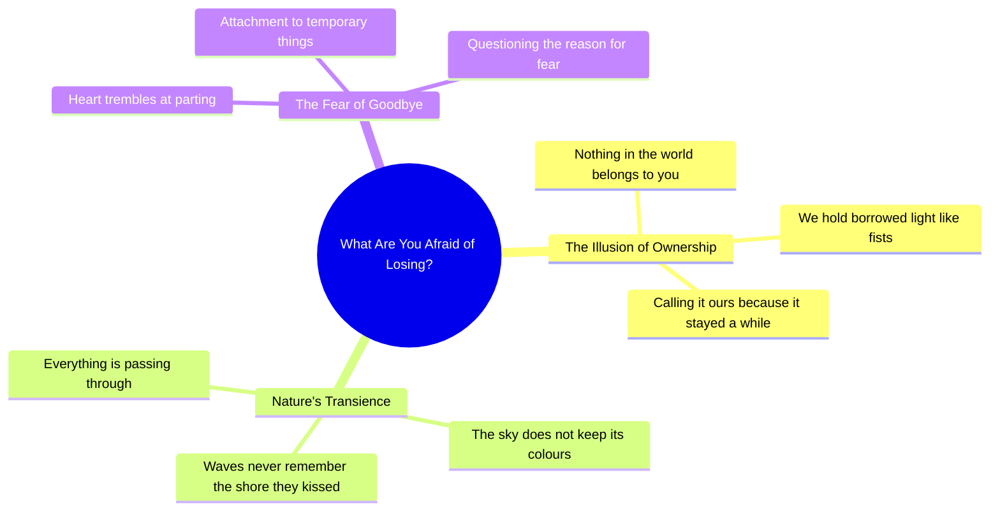

# Poem: What Are You Afraid of Losing When Nothing Belongs...

> 🌐 **Read this in:** [English](../../en/2026-06/tiktok-transcript-4-7m-views-170k-reactions-what-are-you-afraid-of-losing-when-a99b.md) · **中文**

> **Creator:** [@Whisprs "](https://www.tiktok.com/@Whisprs ") · **Views:** 1.7M · **Posted:** 2026-06-27 · **Niche:** other
>
> **TL;DR:** Opens with a provocative, universal question that challenges attachment and immediately engages the viewer's introspection.

[Watch original video →](https://www.facebook.com/share/r/18fkepJhnf/?mibextid=wwXIfr)

## Why This Went Viral

## 钩子（前3秒）
- **逐字开场白：**“当世上万物本不属于你时，你究竟在害怕失去什么？”
- **钩子模式：** 大胆的哲学式提问，挑战普遍认知（所有权）
- **为何能阻止滑动：** 这个问题充满悖论且令人不安——它颠覆了观众默认的“我确实拥有东西”的信念。认知失调迫使人们暂停以化解这种紧张感。

## 情感节奏
- **节拍1 – 好奇/不适（0–3秒）：** 开场问题带来轻微的认知冲击。观众会想：“等等，这确实是真的……但我不喜欢这样。”
- **节拍2 – 紧张/抗拒（4–8秒）：** “我们紧握拳头，攥着借来的光”——紧握与放开的隐喻制造了身体上的紧张感。观众能感受到紧握不放的费力。
- **节拍3 – 臣服/共鸣（9–12秒）：** “就连天空也无法留住它的色彩”——一个美丽且无可辩驳的真相，软化了抗拒。观众开始接受这个前提。
- **节拍4 – 情感释放（13–15秒）：** “海浪从不记得它们亲吻过的海岸”——一个凄美浪漫的画面，触发一种苦乐参半的美感。
- **节拍5 – 高潮/邀请（16–18秒）：** “为何你的心在告别时颤抖……？”——最后一个问题将悲伤重新定义为不必要的，带着悲伤与解脱交织的落点。
- **高潮时刻：** “告别”与“路过”的并置——情感巅峰在于意识到失去不可避免，却也自然而然。

## 关键词密度
| 词语/短语 | 出现次数（约） | 功能 |
|------------|----------------|----------|
| 失去 / 丢失 | 2 | **算法覆盖**——高搜索量的情感触发词（悲伤、恐惧） |
| 没有 / 无 | 3 | **算法覆盖**——负面框架驱动好奇点击 |
| 属于 / 你的 | 2 | **情感吸引力**——所有权焦虑、身份依附 |
| 借来的 / 路过 | 2 | **情感吸引力**——无常的隐喻，哲学深度 |
| 心 / 颤抖 | 各1 | **情感吸引力**——躯体化语言（基于身体的共鸣） |
| 天空 / 色彩 / 海浪 / 海岸 / 亲吻 | 共5 | **算法覆盖**——视觉化、诗意的关键词，提升在审美平台（Instagram、TikTok）上的可分享性 |

## 为何能传播
1. **普遍焦虑钩子**——“你在害怕失去什么？”触及了最易引发共鸣的恐惧（失去人、青春、身份、财产）。每个观众都有个人答案。
2. **对悲伤的诗意重构**——“海浪从不记得它们亲吻过的海岸”这一隐喻将心碎重新定义为美丽而非痛苦。这极具可分享性，因为它为旧痛提供了新视角。
3. **无行动号召，全是共鸣**——视频从不要求点赞或分享，这让观众*想要*将其作为礼物分享出去。最后一句（“你所爱的一切都只是路过”）是可引用的点睛之笔，人们会截图并转发。
4. **短小精悍，可循环播放**——约18秒的长度恰好能完成完整的情感弧线。诗意的结构使其像一句咒语，鼓励反复观看和保存。
5. **情感关键词的算法密度**——“失去”、“没有”、“属于”、“心”、“告别”是高互动信号，能将视频推入“悲伤/反思”内容集群，这类内容竞争低但留存率高。

## 你可以借鉴的
1. **以悖论而非陈述开头**——不要写“失去很难”，而是用一个挑战信念的问题开场（“当万物本不属于你时，你在害怕失去什么？”）。悖论迫使大脑停下来处理。
2. **使用躯体化隐喻**——用身体意象（拳头、借来的光、海浪亲吻海岸）代替抽象词汇（悲伤、依恋）。身体理解隐喻的速度比大脑更快。
3. **以无解的问题结尾**——不要化解紧张感。让观众带着问题离开。视频以“路过”结束——一个漂浮而非落定的词。这会让循环显得不完整，从而推动重复观看和保存。

## Mind Map

## Full Transcript (Generated by [免费 TikTok 文稿生成器](https://toktranscript.com/?utm_source=github&utm_medium=breakdown&utm_campaign=tool_attribution))

> 📝 Transcripts on this page are auto-generated and show the first 60%. Want to transcribe any TikTok in 30 seconds and get the full version? [Try TokTranscript free →](https://toktranscript.com/?utm_source=github&utm_medium=breakdown&utm_campaign=transcript_cta)

What are you afraid of losing, when nothing in the world actually belongs to you? We hold like fists around borrowed light, calling it ours because it stayed a while. But even the sky does not keep its colours, 

*[Read the full transcript on TokTranscript →](https://toktranscript.com/plaza/tiktok-transcript-4-7m-views-170k-reactions-what-are-you-afraid-of-losing-when-a99b?utm_source=github&utm_medium=breakdown&utm_campaign=transcript_full)*

## Browse More

- All [other](../../by-niche/zh-CN/other.md) breakdowns
- All [Rhetorical Question](../../by-pattern/zh-CN/hook-rhetorical-question.md) examples

## Video Info

| | |
|---|---|
| Creator | [@Whisprs "](https://www.tiktok.com/@Whisprs ") |
| Original video | [https://www.facebook.com/share/r/18fkepJhnf/?mibextid=wwXIfr](https://www.facebook.com/share/r/18fkepJhnf/?mibextid=wwXIfr) |
| Original title | 4.7M views · 170K reactions | What are you afraid of losing, when nothing in the world actually belongs to you. | Original Poem by Whisprs #deepthoughts #selfworth #USA #canada #UK | Whisprs " |
| Views | 1.7M (1711076) |
| Posted | 2026-06-27 |
| Duration | 0s |
| Niche | `other` |
| Hook pattern | `Rhetorical Question` |
| Original language | `en` (this page translated by AI) |
| Available languages | en, zh-CN |
| Generated | 2026-06-29 by [TokTranscript](https://toktranscript.com/) |

---

*This breakdown is for educational analysis under fair use. Original video © [@Whisprs "](https://www.tiktok.com/@Whisprs "). All transcripts are auto-generated and may contain errors.*

*Want to analyze your own TikToks like this? [我们用的转录工具 →](https://toktranscript.com/viral-breakdown?utm_source=github&utm_medium=breakdown&utm_campaign=footer_cta)*