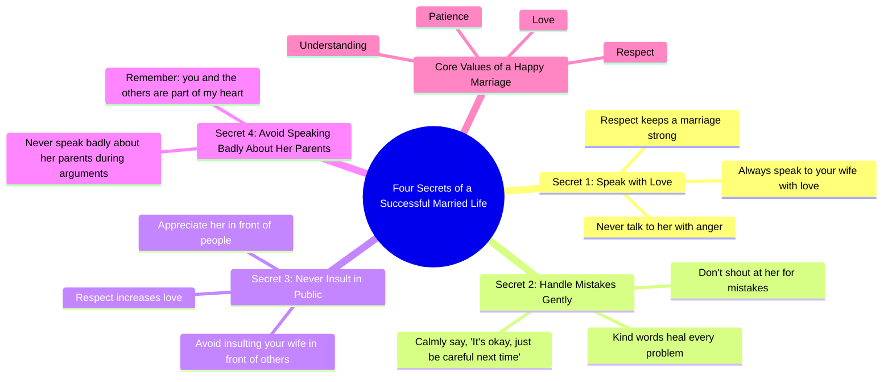

# 4 Secrets of a Happy Married Life – A Mother’s Advice

> 🌐 **Read this in:** [English](../../en/2026-06/tiktok-transcript-802k-views-22k-reactions-4-secrets-of-a-happy-married-life-a-e640.md) · **中文**

> **Creator:** [@Speak English Fluently](https://www.tiktok.com/@Speak English Fluently) · **Views:** 365.9K · **Posted:** 2026-06-05 · **Niche:** other
>
> **TL;DR:** Promises a numbered list of valuable secrets, creating immediate curiosity and anticipation.

[Watch original video →](https://www.facebook.com/reel/912746148235878)

## Why This Went Viral

## 钩子（前3秒）
- **原话开场：** "儿子，今天我想告诉你幸福婚姻生活的四个秘诀。"
- **钩子模式：** 场景+数字（以"儿子"直接称呼，配合数字列表承诺——"四个秘诀"）
- **为何能吸引人：** 以父亲教诲的口吻立即建立权威感和亲密感。"秘诀"的承诺激发好奇心——观众想知道这四个秘诀是什么，尤其是有伴侣或重视婚姻智慧的人。"儿子"的称呼让内容既个人化又具有普适性。

## 情感节奏
- **第一拍（好奇+尊重）：** "永远用爱和妻子说话。永远不要带着怒气和她说话。"——奠定道德清晰和温和权威的基调。
- **第二拍（紧张→释然）：** "如果她犯了错，不要对她大吼大叫。平静地说：'没关系，下次小心点就好。'"——引入潜在冲突（犯错），并立即用模范回应化解，带来释然感。
- **第三拍（共鸣+自豪）：** "永远不要在别人面前侮辱你的妻子。相反，要在人前赞美她。"——触及尊重和公开荣誉的共同价值观，唤起听众的自豪感。
- **第四拍（情感高潮）：** "如果你们吵架了，永远不要说她父母的坏话。记住，你和他们都在我心里。"——转折点：建议从夫妻延伸到姻亲，加深情感投入。"在我心里"这句话成为高潮——一个充满温暖和连接的瞬间。
- **结尾（感恩+收束）：** "谢谢妈妈。我会永远记住这四课。"——儿子的回应提供了令人满意的情感回报，强化了教诲的影响力。

## 关键词密度
- **爱**（出现3次）——驱动情感吸引力；核心价值词，与观众对连接的渴望产生共鸣。
- **尊重**（出现3次）——双重功能：算法覆盖（高互动社会价值）+情感吸引力（普遍关系需求）。
- **妻子**（出现3次）——特定目标受众（已婚男性）+引发夫妻间的共鸣。
- **永远不**（出现3次）——制造对比和紧迫感（"永远不要带着怒气说话"、"永远不要侮辱"、"永远不要说坏话"）；建议类内容的算法关键词。
- **犯错**（出现1次，但在"平静地说"一句中隐含）——引发同理心和宽恕；频率低但情感分量重。
- **父母**（在高潮部分出现1次）——将情感范围从夫妻扩展到家庭；在注重家庭的观众中推动分享。
- **幸福婚姻**（在结尾出现1次）——吸引寻求改善关系的观众的理想化短语。

## 为何能传播
1. **以紧凑列表形式呈现的普世关系智慧。** 文本结构为四个清晰、可操作的规则。观众容易记住并分享"四个秘诀"——非常适合转发、引用和保存作为参考。
2. **通过亲子框架实现情感真实性。** "父亲教导儿子"的设定创造了即时信任捷径。观众感觉自己从慈爱的长辈那里获得了经过时间考验、非商业化的建议——这种形式绕过怀疑，触发怀旧情绪。
3. **扩展情感范围的高潮转折。** 第四个秘诀（"永远不要说岳父母的坏话"）是最出乎意料且情感最强烈的。它让观众感到惊讶，使建议比典型的关系技巧更深刻，引发"这条不一样"的评论。
4. **结尾嵌入的行动号召。** "谢谢妈妈。我会永远记住这四课"作为软性CTA——它含蓄地邀请观众反思、评论自己的经验，或与伴侣分享。感恩的语气让互动显得自然，而非强迫。
5. **在夫妻和家庭群体中高度可分享。** 建议足够中性，适用于任何关系，但"儿子"的框架特别针对男性——一个在关系内容中常被忽视的群体。这在家庭和夫妻群体中创造了小众的病毒传播循环。

## 你可以借鉴什么
1. **使用带个人框架的数字列表。** 不要说泛泛的"5个技巧"，而是说"我爸爸给了我5个秘诀"或"这是我妈妈教我的"。个人背景故事增加信任，让列表显得有分量而非刻意编造。
2. **构建"软高潮"——把最情感化或最令人惊讶的点留到最后。** 在这个文本中，关于姻亲的第四个秘诀最引人共鸣。组织你的建议，让最后一点最有冲击力——观众会记住并分享它。
3. **以学习者的感恩回应结尾。** 不要只给出建议；展示接受者的反应（"谢谢妈妈。我会永远记住。"）。这创造了完整的情感弧线，给观众一个满意的结局——让他们更有可能互动或保存视频。

## Mind Map

## Full Transcript (Generated by [拆解你自己的 TikTok](https://toktranscript.com/?utm_source=github&utm_medium=breakdown&utm_campaign=tool_attribution))

> 📝 Transcripts on this page are auto-generated and show the first 60%. Want to transcribe any TikTok in 30 seconds and get the full version? [Try TokTranscript free →](https://toktranscript.com/?utm_source=github&utm_medium=breakdown&utm_campaign=transcript_cta)

Son, today I want to tell you four secrets of a successful married life. First, always speak to your wife with love. Never talk to her with anger. Because respect keeps a marriage strong. Second, if she makes a mistake, don't shout at her. Calmly say, It's okay, just be careful next time. Kind words heal every problem. Third, never insult your wife in front of others. Instead, appreciate her in front of people because respect increases

*[Read the full transcript on TokTranscript →](https://toktranscript.com/plaza/tiktok-transcript-802k-views-22k-reactions-4-secrets-of-a-happy-married-life-a-e640?utm_source=github&utm_medium=breakdown&utm_campaign=transcript_full)*

## Browse More

- All [other](../../by-niche/zh-CN/other.md) breakdowns
- All [List-based curiosity gap](../../by-pattern/zh-CN/hook-list-based-curiosity-gap.md) examples

## Video Info

| | |
|---|---|
| Creator | [@Speak English Fluently](https://www.tiktok.com/@Speak English Fluently) |
| Original video | [https://www.facebook.com/reel/912746148235878](https://www.facebook.com/reel/912746148235878) |
| Original title | 802K views · 22K reactions | 4 Secrets of a Happy Married Life – A Mother’s Advice | English Speaking Practice This dialogue helps learners practice simple and meaningful English sentences about respect, love, patience, and understanding in married life. It improves daily conversation skills and teaches positive relationship values. #englishspeakingpractice #lifelesson #learnenglish #parentadvice #marriedlife #marriage | Speak English Fluently |
| Views | 365.9K (365906) |
| Posted | 2026-06-05 |
| Duration | 0s |
| Niche | `other` |
| Hook pattern | `List-based curiosity gap` |
| Original language | `en` (this page translated by AI) |
| Available languages | en, zh-CN |
| Generated | 2026-06-06 by [TokTranscript](https://toktranscript.com/) |

---

*This breakdown is for educational analysis under fair use. Original video © [@Speak English Fluently](https://www.tiktok.com/@Speak English Fluently). All transcripts are auto-generated and may contain errors.*

*Want to analyze your own TikToks like this? [拆解你自己的 TikTok →](https://toktranscript.com/viral-breakdown?utm_source=github&utm_medium=breakdown&utm_campaign=footer_cta)*