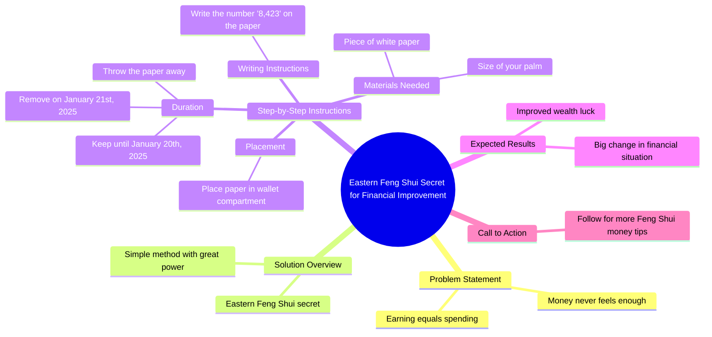

# Feng Shui Tip: Write 8423 on Paper to Improve Finances

> 🌐 **Read this in:** [English](../../en/2026-06/tiktok-transcript-always-feel-like-money-s-tight-let-me-share-a-feng-shui-tip-eb25.md) · **中文**

> **Creator:** [@emotionaldestiny](https://www.tiktok.com/@emotionaldestiny) · **Views:** 2.7M · **Posted:** 2026-06-30 · **Niche:** finance
>
> **TL;DR:** Identifies a common financial frustration and promises a mystical solution.

[Watch original video →](https://www.tiktok.com/t/ZP8G6regY/)

## Why This Went Viral

## 钩子（前3秒）
- **逐字开场白：** "如果你总觉得钱不够花，赚多少花多少，今天我要教你一个东方风水秘诀来改善这种情况。"
- **钩子模式：** 情感痛点 + 秘密知识的承诺（"永远不够"与"改善秘诀"的对比）
- **为何能阻止滑动：** 直接点出普遍焦虑（财务不足），并提供神秘、低成本的解决方案——观众会觉得"这说的就是我"和"我必须知道这个秘密。"

## 情感节奏
- **节拍1 — 痛点共鸣：** "如果你总觉得钱不够花"——触发认同感和不适感
- **节拍2 — 好奇心飙升：** "我要教你一个东方风水秘诀"——承诺隐藏的、异域的知识
- **节拍3 — 紧张感：** "方法很简单，但力量很大"——制造期待
- **节拍4 — 指导（悬念）：** "在上面写上8423……放进钱包里……一直留到2025年1月20日"——逐步仪式形成心理清单
- **节拍5 — 释放/奖励：** "做完之后，你会发现你的财务状况和财运都有大变化。好运！"——希望和掌控感的情感回报
- **高潮：** 具体日期"2025年1月20日"——一个让行动显得紧迫且真实的截止日期

## 关键词密度
| 关键词/短语 | 出现频率（约） | 算法驱动（覆盖面） | 情感吸引力 |
|--------------|----------------|-------------------|------------|
| 钱/财务 | 3 | 高（财务领域） | 高（痛点） |
| 风水秘诀 | 2 | 中（神秘领域） | 高（专属感） |
| 简单/力量大 | 2 | 低 | 高（对比） |
| 钱包 | 2 | 低 | 高（可操作） |
| 2025年1月20日 | 1 | 低（独特日期） | 极高（紧迫感） |
| 财富/好运 | 2 | 中（励志领域） | 高（奖励） |

- **算法驱动因素：** "钱"、"风水"——广泛搜索词；"秘诀"——点击诱饵触发器
- **情感驱动因素：** "永远不够"、"大变化"、"财运"——恐惧+希望组合

## 为何能传播
1. **普遍痛点+零努力解决：** "如果你总觉得钱不够花"击中80%以上的成年人。"在纸上写个数字"的解决方案简单得离谱——可分享性强，因为风险低、希望大。
2. **神秘权威+截止日期：** "东方风水秘诀"暗示古老、可信的智慧。具体日期（"2025年1月20日"）创造倒计时——观众分享是为了自我监督或"拯救"朋友。
3. **行动链：** 逐步指导（"拿一张白纸……写上8423……放进钱包里"）易于截图和复制。这驱动评论如"我做了！"，从而提升互动。
4. **30秒内的情绪过山车：** 痛苦→好奇→指导→释然→希望。压缩完整故事弧（设定、紧张、解决）的短视频会被反复观看和分享。
5. **带有错失恐惧症的行动号召：** "如果你想了解更多……别忘了关注我"——将一次性仪式转化为内容系列钩子，鼓励关注以获取未来的"秘诀"。

## 你可以借鉴的点
1. **痛点优先的钩子：** 以具体、可共鸣的挫折感开场（"如果你总觉得钱不够花"）——而不是泛泛的"大家好"。点出确切的情感伤口能阻止滑动。
2. **"简单但强大"的对比：** 将你的解决方案描述为极其简单，但背后有隐藏权威支持（"东方秘诀"）。这降低了尝试的门槛，增加了可分享性。
3. **创造截止日期仪式：** 给观众一个具体行动和明确的未来日期（例如，"一直留到1月20日"）。截止日期将被动观看转化为主动参与——并在日期到来时驱动回访互动。

## Mind Map

## Full Transcript (Generated by [TokTranscript 转录工具](https://toktranscript.com/?utm_source=github&utm_medium=breakdown&utm_campaign=tool_attribution))

> 📝 Transcripts on this page are auto-generated and show the first 60%. Want to transcribe any TikTok in 30 seconds and get the full version? [Try TokTranscript free →](https://toktranscript.com/?utm_source=github&utm_medium=breakdown&utm_campaign=transcript_cta)

If you always feel like money is never enough, earning as much as you spend, today I'm going to teach you an eastern feng Shui secret to improve this situation. The method is simple, but it holds great power. You need to take a piece of white paper about the size of your palm and write 8,423 on it. Then place it in the compartment of your wallet. Leave it there until

*[Read the full transcript on TokTranscript →](https://toktranscript.com/plaza/tiktok-transcript-always-feel-like-money-s-tight-let-me-share-a-feng-shui-tip-eb25?utm_source=github&utm_medium=breakdown&utm_campaign=transcript_full)*

## Browse More

- All [finance](../../by-niche/zh-CN/finance.md) breakdowns
- All [Problem-Agitate-Solution](../../by-pattern/zh-CN/hook-problem-agitate-solution.md) examples

## Video Info

| | |
|---|---|
| Creator | [@emotionaldestiny](https://www.tiktok.com/@emotionaldestiny) |
| Original video | [https://www.tiktok.com/t/ZP8G6regY/](https://www.tiktok.com/t/ZP8G6regY/) |
| Original title | Always feel like money's tight Let me share a Feng Shui tip to improv... |
| Views | 2.7M (2700000) |
| Posted | 2026-06-30 |
| Duration | 0s |
| Niche | `finance` |
| Hook pattern | `Problem-Agitate-Solution` |
| Original language | `en` (this page translated by AI) |
| Available languages | en, zh-CN |
| Generated | 2026-07-01 by [TokTranscript](https://toktranscript.com/) |

---

*This breakdown is for educational analysis under fair use. Original video © [@emotionaldestiny](https://www.tiktok.com/@emotionaldestiny). All transcripts are auto-generated and may contain errors.*

*Want to analyze your own TikToks like this? [TokTranscript 转录工具 →](https://toktranscript.com/viral-breakdown?utm_source=github&utm_medium=breakdown&utm_campaign=footer_cta)*