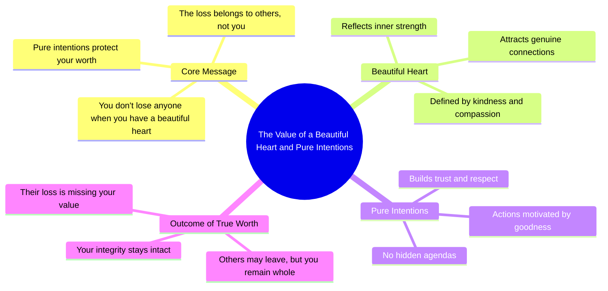

# Always Remember: You Don't Lose Them, They Lose You

> 🌐 **Read this in:** [English](../../en/2026-06/tiktok-transcript-always-remember-when-motivacion-motivacionvideo-motivacionqu-e331.md) · **中文**

> **Creator:** [@siyal.motivation](https://www.tiktok.com/@siyal.motivation) · **Views:** 1.3M · **Posted:** 2026-06-11 · **Niche:** other
>
> **TL;DR:** The hook flips a common fear of loss into an empowering statement of self-worth.

[Watch original video →](https://vm.tiktok.com/ZNRvv8YGx/)

## Why This Went Viral

## 钩子（前3秒）
- **逐字内容：** "永远记住，当你拥有一颗美丽的心灵、纯粹的意图时，你并没有失去任何人，而是他们失去了你。"
- **钩子模式：** **大胆断言** + **对比**（你没有失去 → 他们失去了你）
- **为何能阻止滑动：** 它将一种痛苦且普遍的恐惧（"我失去了某人"）翻转成一种赋能的重新定义。"永远"一词暗示着永恒的智慧，让人感觉像是一个秘密真理。对比鲜明且出人意料，迫使观众暂停并思考。

## 情感节奏
1. **好奇心** – "永远记住..."（感觉像是一堂即将揭示的课程）
2. **紧张感** – "...当你拥有一颗美丽的心灵、纯粹的意图时..."（观众为失去而绷紧神经）
3. **转折/解脱** – "...你并没有失去任何人，而是他们失去了你。"（重新定义以赋能释放紧张感）
4. **共鸣** – 这句话久久萦绕，让观众将其应用于自己过去的伤心或内疚。
- **高潮时刻：** 正是"他们失去了你"这几个字——这是情感上的回报。它从受害者转变为胜利者。

## 关键词密度
- **"失去" / "失去了"**（3次）– 算法覆盖（分手/心碎内容的高搜索量）+ 情感吸引力（对失去的恐惧）
- **"你"**（4次）– 情感吸引力（个人化、直接，感觉像是对观众说的）
- **"美丽的心灵"** – 情感吸引力（身份认同、理想化）
- **"纯粹的意图"** – 情感吸引力（道德认可、自我安慰）
- **"他们"**（2次）– 算法覆盖（触发"他们 vs. 我"的好奇心，驱动评论）
- **"记住"** – 情感吸引力（记忆锚定，让这句话深入人心）

## 为何能传播
1. **重新定义普遍痛点** – 几乎每个人都曾感受过"失去"某人。视频将其翻转成"他们失去了你"，这作为一种自我肯定，极易分享。（句子：*"你并没有失去任何人，而是他们失去了你"*）
2. **高评论诱饵** – 这句话邀请人们标记那些"需要听到这个"的朋友，或分享自己作为拥有"美丽心灵"一方的故事。（句子：*"当你拥有一颗美丽的心灵、纯粹的意图时"*）
3. **可重复、可引用的结构** – 这句话简短、有节奏感，易于作为文字叠加或音频片段转发。这是一个"麦克风掉落"的时刻，适用于多个平台。（句子：*"永远记住..."*）
4. **低门槛的情感共鸣** – 无需特定背景（没有名字、性别或情境）。任何在关系中感到委屈的人都能投射其中。（句子：*"他们失去了你"*）
5. **算法密度** – 关键词"失去"、"心灵"和"意图"在自助和关系领域搜索量高，提升了可发现性。（句子：*"美丽的心灵、纯粹的意图"*）

## 你可以借鉴的
1. **"翻转剧本"的钩子** – 从一个常见的信念或恐惧开始，然后以一个出人意料的逆转结束。例如："你以为自己不够好？实际上，是他们还没准备好迎接你。"
2. **保持一句话** – 整个病毒式传播的核心就是一句话。无需铺垫、故事或填充。短视频奖励密度。将核心信息控制在15字以内。
3. **使用"你"和"他们"实现即时共鸣** – 这对代词创造了一种清晰的"我们 vs. 他们"的动态，让观众感到被看见并以一种积极的方式产生防御心理。它还会触发评论（"这说的是我的前任"）。

## Mind Map

## Full Transcript (Generated by [TokTranscript 转录工具](https://toktranscript.com/?utm_source=github&utm_medium=breakdown&utm_campaign=tool_attribution))

> 📝 Transcripts on this page are auto-generated and show the first 60%. Want to transcribe any TikTok in 30 seconds and get the full version? [Try TokTranscript free →](https://toktranscript.com/?utm_source=github&utm_medium=breakdown&utm_campaign=transcript_cta)

Always remember, when you have a beautiful heart, pure intentions

*[Read the full transcript on TokTranscript →](https://toktranscript.com/plaza/tiktok-transcript-always-remember-when-motivacion-motivacionvideo-motivacionqu-e331?utm_source=github&utm_medium=breakdown&utm_campaign=transcript_full)*

## Browse More

- All [other](../../by-niche/zh-CN/other.md) breakdowns
- All [Reversal of expectation](../../by-pattern/zh-CN/hook-reversal-of-expectation.md) examples

## Video Info

| | |
|---|---|
| Creator | [@siyal.motivation](https://www.tiktok.com/@siyal.motivation) |
| Original video | [https://vm.tiktok.com/ZNRvv8YGx/](https://vm.tiktok.com/ZNRvv8YGx/) |
| Original title | always remember when !!! #motivacion #motivacionvideo #motivacionquot... |
| Views | 1.3M (1300000) |
| Posted | 2026-06-11 |
| Duration | 0s |
| Niche | `other` |
| Hook pattern | `Reversal of expectation` |
| Original language | `en` (this page translated by AI) |
| Available languages | en, zh-CN |
| Generated | 2026-06-12 by [TokTranscript](https://toktranscript.com/) |

---

*This breakdown is for educational analysis under fair use. Original video © [@siyal.motivation](https://www.tiktok.com/@siyal.motivation). All transcripts are auto-generated and may contain errors.*

*Want to analyze your own TikToks like this? [免费 TikTok 文稿生成器 →](https://toktranscript.com/viral-breakdown?utm_source=github&utm_medium=breakdown&utm_campaign=footer_cta)*