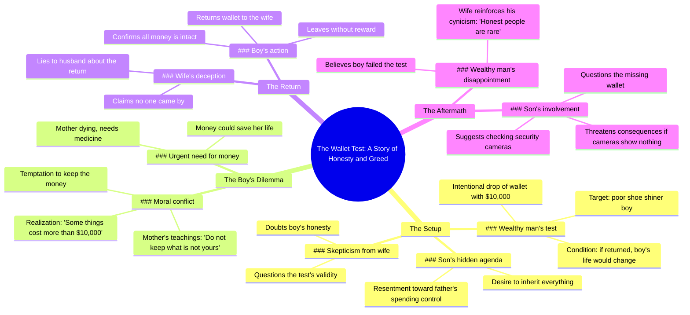

# Shoe Shiner Returns Wallet, Gets Life Changed

> 🌐 **Read this in:** [English](../../en/2026-06/tiktok-transcript-brainrot-ai-fruitdrama-fruits-fruitstory-4d72.md) · **中文**

> **Creator:** [@gyropatich](https://www.tiktok.com/@gyropatich) · **Views:** 11.6M · **Posted:** 2026-06-24 · **Niche:** entertainment
>
> **TL;DR:** Immediately establishes a life-or-death stakes with a child's plea.

[Watch original video →](https://www.tiktok.com/@gyropatich/video/7653555523538668822)

## Why This Went Viral

## 钩子（前3秒）
- **逐字开场白：**“不错，小子。给。谢谢。先生。我妈需要药。”
- **钩子模式：**场景 + 反差（富家子弟用掉落的钱包测试穷小子 vs. 男孩对药物的迫切需求）
- **为何能让人停下滑动：**一句随意的“不错，小子”与男孩急切的“我妈需要药”之间立刻形成道德困境。观众被高风险的设定吸引：男孩会留下钱还是归还？

## 情感节奏
1. **好奇** → “我故意掉了钱包……如果他明天来归还，我就改变他的一生。”
2. **紧张** → “你真以为一个挣扎求生的孩子会归还几千块钱？”
3. **悬念** → “这钱包里有1万块。我妈快不行了。她需要这药。”
4. **道德冲突（高潮）** → “但我不能留下不属于我的东西。她不是这样教我的。”
5. **释然 + 反转** → “我昨晚把钱包给了你妻子。” → “我妻子说没人来过。”
6. **最终悬念** → “查一下夜间安保监控。如果监控里什么都没有，你会后悔的。”

**高潮时刻：**男孩的内心独白：“有些东西比1万块钱更值钱。”这是情感巅峰，观众要么敬佩他的正直，要么感受到他牺牲的重量。

## 关键词密度
| 词语/短语 | 频率 | 目的 |
|-------------|-----------|---------|
| 1万 / 10,000美元 | 6 | 算法驱动：高价值数字引发好奇和留存 |
| 钱包 | 5 | 情感驱动：象征考验的具体物品 |
| 母亲 / 妈妈 | 4 | 情感驱动：引发共情的普遍触发点 |
| 归还 / 送回 | 4 | 情感驱动：道德行为，制造紧张感 |
| 穷 | 3 | 算法驱动：阶级反差推动互动 |
| 药 | 3 | 情感驱动：生死攸关的赌注 |
| 孩子 / 男孩 | 3 | 情感驱动：纯真 vs. 堕落 |
| 妻子 | 2 | 反转：背叛揭露，推动重看 |

**算法驱动因素：**“1万”（高价值数字）、“穷”（阶级冲突）、“归还”（动作动词）。  
**情感吸引力：**“母亲”、“药”、“孩子”——这些瞬间引发共情和道德投入。

## 为何能传播
1. **道德困境 + 反转结局** — 男孩归还了钱包，但妻子撒谎。这颠覆了预期的“圆满结局”，制造了悬念。观众必须评论来化解紧张感：“查监控！”
2. **阶级冲突叙事** — 富人的测试（“穷人没多少机会”）vs. 男孩的正直。这触及深层的社会怨恨和希望，跨越政治和社会经济界限推动分享。
3. **高赌注数字** — “1万美元”具体、庞大且令人难忘。它为牺牲设定了明确基准，使故事易于复述和比较。
4. **可共鸣的角色原型** — 挣扎的儿子、怀疑的富人、撒谎的妻子。每个都是观众能立即评判的熟悉套路，激发评论辩论。
5. **重看价值** — 反转（妻子撒谎）让观众想重看以寻找线索。第一次观看是情感体验；第二次是侦探工作。

## 你可以借鉴的
1. **以道德考验开场** — 视频开头就设置一个清晰的“做还是不做？”困境。观众应在3秒内了解赌注。例如：“我把手机落在优步上了。如果司机归还，我就帮他还清车贷。”
2. **使用具体、整数的数字** — “1万美元”比“很多钱”更容易病毒式传播。整数、大数字易于记忆、分享和比较。始终量化赌注。
3. **以悬念反转结尾** — 不要完全解决故事。留下一个未解答的问题（例如“查监控”）。这能推动评论、分享和后续视频。反转应颠覆观众的预期。

## Mind Map

## Full Transcript (Generated by [拆解你自己的 TikTok](https://toktranscript.com/?utm_source=github&utm_medium=breakdown&utm_campaign=tool_attribution))

> 📝 Transcripts on this page are auto-generated and show the first 60%. Want to transcribe any TikTok in 30 seconds and get the full version? [Try TokTranscript free →](https://toktranscript.com/?utm_source=github&utm_medium=breakdown&utm_campaign=transcript_cta)

Not bad, kid. Here. Thank you. Sir. My mom needs medicine. Don't waste it. Poor people don't get many chances. I intentionally dropped my wallet with $10,000 in front of that poor shoe shiner kid today. If he comes to return it tomorrow, I am going to change his entire life. You honestly believe a struggling kid is going to return thousands of dollars? We are about to find out. He throws 10,000 away testing some poor kids loyalty. But when I wanna spend my own money, he questions every single cent. One day, everything in the safe, this house, all of it will be entirely and only mine. 10,000 inside this wallet. My mother is dying. She needs this medicine. God knows I desperately need this money to save her life. But I cannot keep what does not belong to me. That is not how she raised me. That is not who we are. This money could fix everything. The medicine, the hospital, everything. My mother could live. But if I keep it, every time I look at her, I will

*[Read the full transcript on TokTranscript →](https://toktranscript.com/plaza/tiktok-transcript-brainrot-ai-fruitdrama-fruits-fruitstory-4d72?utm_source=github&utm_medium=breakdown&utm_campaign=transcript_full)*

## Browse More

- All [entertainment](../../by-niche/zh-CN/entertainment.md) breakdowns
- All [Emotional urgency](../../by-pattern/zh-CN/hook-emotional-urgency.md) examples

## Video Info

| | |
|---|---|
| Creator | [@gyropatich](https://www.tiktok.com/@gyropatich) |
| Original video | [https://www.tiktok.com/@gyropatich/video/7653555523538668822](https://www.tiktok.com/@gyropatich/video/7653555523538668822) |
| Original title | #brainrot #ai #fruitdrama #fruits #fruitstory  |
| Views | 11.6M (11600000) |
| Posted | 2026-06-24 |
| Duration | 0s |
| Niche | `entertainment` |
| Hook pattern | `Emotional urgency` |
| Original language | `en` (this page translated by AI) |
| Available languages | en, zh-CN |
| Generated | 2026-06-25 by [TokTranscript](https://toktranscript.com/) |

---

*This breakdown is for educational analysis under fair use. Original video © [@gyropatich](https://www.tiktok.com/@gyropatich). All transcripts are auto-generated and may contain errors.*

*Want to analyze your own TikToks like this? [TokTranscript →](https://toktranscript.com/viral-breakdown?utm_source=github&utm_medium=breakdown&utm_campaign=footer_cta)*