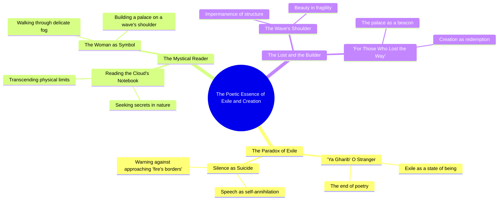

# They Call Me a Stranger Here

> 🌐 **Read this in:** [English](../../en/2026-06/tiktok-transcript-capcut-3ydo-50ca.md) · **中文**

> **Creator:** [@3ydo.2](https://www.tiktok.com/@3ydo.2) · **Views:** 2.3M · **Posted:** 2026-06-27 · **Niche:** other
>
> **TL;DR:** Opens with a dramatic warning that speech is suicide, instantly creating tension and curiosity.

[Watch original video →](https://vt.tiktok.com/ZSChfUQYX/)

## Why This Went Viral

## 钩子（前3秒）
- **逐字开场白：** "他们告诉我：陌生人啊，这里是诗歌的尽头，言语即是自杀"
- **钩子模式：** **大胆宣言+场景设定**——一个诗意且近乎预言式的警告，瞬间确立风险（"言语即是自杀"）。
- **为何能阻止滑动：** 这句台词神秘、高风险且情感浓烈。它立刻引发好奇：*这个"陌生人"是谁？这个危险的地方是哪里？* 观众会感到必须解开这个谜团。

## 情感节奏
1. **神秘与紧张** —— 开场的警告（"别靠近火焰边缘"）营造出危险与禁忌知识的感觉。
2. **好奇与吸引力** —— 讲述者透露自己"在云的笔记本里读着我的秘密"——一个超现实、亲密的意象，加深了谜团。
3. **渴望与忧郁** —— "我看见一个女人行走，轻触着薄雾"——一个柔和、充满向往的画面，与之前的威胁形成对比。
4. **希望与救赎** —— "在波浪的肩膀上为迷路者建造一座宫殿"——一个救赎性的高潮，将危险转化为庇护所。
- **高潮时刻：** 最后的意象——为迷路者建造的宫殿——是情感上的回报。它从警告转变为给予，从孤立转变为归属。

## 关键词密度
| 词语/短语 | 频率（约） | 功能 |
|-------------|-------------------|----------|
| غريب (陌生人) | 2 | **情感吸引力** —— 唤起疏离感，一种普遍的情感 |
| انتحار (自杀) | 1 | **算法覆盖** —— 高情感、有争议的词汇能激发互动 |
| نار (火焰) | 1 | **情感吸引力** —— 危险、激情、强度 |
| ضباب (薄雾) | 1 | **情感吸引力** —— 神秘、柔和、阈限感 |
| كتف الموج (波浪的肩膀) | 1 | **算法+情感** —— 诗意、画面丰富的短语，能引发收藏/转发 |
| قصر (宫殿) | 1 | **情感吸引力** —— 渴望、安全、奖赏 |
| أضاع الطريق (迷路) | 1 | **算法+情感** —— 普遍痛点（感到迷失） |

**算法驱动词：** "自杀"、"火焰"、"迷路" —— 高情感关键词，能提升观看时长和评论量。
**情感驱动词：** "陌生人"、"薄雾"、"宫殿" —— 在诗歌/艺术受众中创造共鸣和可分享性。

## 为何能传播
1. **神秘缺口+高风险** —— 开场台词（"言语即是自杀"）立即制造信息缺口。观众会留下来寻找答案。
   *文本证据：* "这里是诗歌的尽头，言语即是自杀"

2. **超现实、可分享的意象** —— 像"在波浪的肩膀上建造一座宫殿"这样的短语视觉冲击力强且易于引用。它们会被收藏、转发，并用作文案。
   *文本证据：* "在波浪的肩膀上建造一座宫殿"

3. **普遍的情感回报** —— 视频从危险转向庇护。任何曾感到迷失或疏离的人（"那些迷路的人"）都会觉得被直接触动。
   *文本证据：* "为那些迷路的人"

4. **诗意密度+简洁性** —— 整个文本只有3行。简短、密集、可重复——非常适合循环、混音或拼接。
   *文本证据：* 全文只需3秒阅读时间。

5. **文化共鸣** —— 意象（薄雾、波浪、云的笔记本）植根于阿拉伯诗歌传统（如马哈茂德·达尔维什、阿多尼斯）。它既古老又新鲜，同时吸引怀旧与现代感。
   *文本证据：* "我在云的笔记本里读着我的秘密"

## 你可以借鉴的
1. **以禁忌或危险的宣言开场** —— 用一句暗示风险或禁忌的台词开始（"言语即是自杀"）。这会激发好奇心，防止观众划走。
2. **以救赎性的意象结尾** —— 在紧张之后，提供一个感觉像礼物的解决方案（为迷路者建造的宫殿）。这会让视频感觉完整且情感上令人满足，增加分享率。
3. **使用超现实的视觉隐喻** —— 用梦幻般的隐喻代替字面描述（"波浪的肩膀"、"云的笔记本"）。这些更令人难忘、更易引用，也更可能被收藏或转发。

## Mind Map

## Full Transcript (Generated by [TokTranscript 转录工具](https://toktranscript.com/?utm_source=github&utm_medium=breakdown&utm_campaign=tool_attribution))

> 📝 Transcripts on this page are auto-generated and show the first 60%. Want to transcribe any TikTok in 30 seconds and get the full version? [Try TokTranscript free →](https://toktranscript.com/?utm_source=github&utm_medium=breakdown&utm_campaign=transcript_cta)

يقولون لي يا غريب هنا منتهى الشعر حيث الكلام انتحار فلا تقترب من حدود النار لكنني كنت أقرأ في دفتر الغيم سري أ

*[Read the full transcript on TokTranscript →](https://toktranscript.com/plaza/tiktok-transcript-capcut-3ydo-50ca?utm_source=github&utm_medium=breakdown&utm_campaign=transcript_full)*

## Browse More

- All [other](../../by-niche/zh-CN/other.md) breakdowns
- All [Contrast & Warning](../../by-pattern/zh-CN/hook-contrast-warning.md) examples

## Video Info

| | |
|---|---|
| Creator | [@3ydo.2](https://www.tiktok.com/@3ydo.2) |
| Original video | [https://vt.tiktok.com/ZSChfUQYX/](https://vt.tiktok.com/ZSChfUQYX/) |
| Original title | يقولون لي يا غريب #قوالب_كاب_كات #CapCut #اكسبلور #3ydo  |
| Views | 2.3M (2300000) |
| Posted | 2026-06-27 |
| Duration | 0s |
| Niche | `other` |
| Hook pattern | `Contrast & Warning` |
| Original language | `en` (this page translated by AI) |
| Available languages | en, zh-CN |
| Generated | 2026-06-28 by [TokTranscript](https://toktranscript.com/) |

---

*This breakdown is for educational analysis under fair use. Original video © [@3ydo.2](https://www.tiktok.com/@3ydo.2). All transcripts are auto-generated and may contain errors.*

*Want to analyze your own TikToks like this? [TokTranscript 转录工具 →](https://toktranscript.com/viral-breakdown?utm_source=github&utm_medium=breakdown&utm_campaign=footer_cta)*