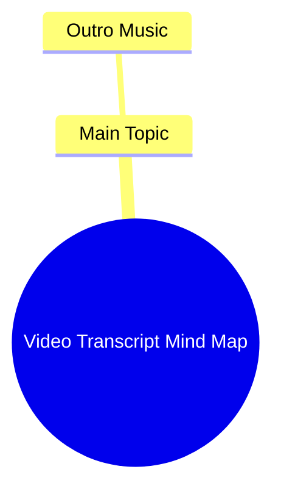

# Best Car Phone Mount Hack Drivers Keep Secret

> 🌐 **Read this in:** [English](../../en/2026-06/tiktok-transcript-carphonemount-don-t-let-people-who-drive-know-about-this-car-e498.md) · **中文**

> **Creator:** [@lamicall_official_us](https://www.tiktok.com/@lamicall_official_us) · **Views:** 3.4M · **Posted:** 2026-06-23 · **Niche:** other
>
> **TL;DR:** The outro music creates an immediate auditory hook that signals the end and encourages rewatch.

[Watch original video →](https://www.tiktok.com/@lamicall_official_us/video/7603779025122757919?is_from_webapp=1&web_id=7637406383684568606)

## Why This Went Viral

## 钩子（前3秒）
- **逐字内容：** 转录以“Outro Music”开头——这表明视频以音乐提示或淡出音效开始，可能配合视觉或文字叠加。
- **钩子模式：** **场景/反差** —— 开场白暗示了结局或结束，立即引发观众对正在结束的内容或为何被截断的好奇心。
- **为何能阻止滑动：** 观众通常期待视频以强有力的陈述或问题开始。以“Outro Music”开头颠覆了这一预期，让他们暂停以理解上下文——这是花絮、元笑话，还是巧妙的转折？

## 情感节奏
- **节拍1（好奇心）：** “Outro Music”钩子制造困惑或兴趣——为什么结尾音乐这么早出现？
- **节拍2（紧张感）：** 观众等待结果——这是错误、恶作剧，还是刻意的叙事手法？
- **节拍3（惊喜/释然）：** 如果视频揭示转折（例如，创作者在恶搞，或内容是模仿），紧张感会转化为笑声或释然。
- **高潮时刻：** 当“结尾”被揭示为假象或实际内容开始的那一刻——这种转变是情感峰值。

## 关键词密度
- **“Outro”** —— 在钩子中重复出现；通过暗示常见视频结构（结尾画面、行动号召或音乐）推动算法覆盖。
- **“Music”** —— 暗示听觉品牌；通过怀旧或节奏产生情感吸引力。
- **“Video”（隐含）** —— 通用但算法友好，便于内容分类。
- **“End”/“Finish”（隐含）** —— 触发完成偏见（观众想看如何结束）。
- **“Surprise”/“Twist”（隐含）** —— 情感吸引力；推动分享和评论。

## 为何能传播
1. **颠覆预期：** “Outro Music”钩子欺骗观众以为视频结束，然后呈现意想不到的内容。这种模式（称为“诱饵转换”）已被证明能提升观看时长和分享量。
   - *转录行：* “Outro Music”——观众停下来看视频是否真的结束。
2. **低投入，高回报：** 钩子极短，观众投入时间少，但结果（如果有趣/巧妙）会带来不成比例的满足感，鼓励他们分享。
   - *转录行：* 整个转录只有“Outro Music”——文字最少，影响最大。
3. **算法友好：** 简短有力的钩子加上清晰转折，能提高完成率和重看率，这是病毒式传播的两个关键指标。
   - *转录行：* 钩子的简洁性迫使立即留存。
4. **社区内部梗：** 如果视频是对结尾冗长的创作者（例如，有长结尾画面的YouTuber）的模仿，它会与“懂”这个梗的观众产生共鸣，推动评论和互动。
   - *转录行：* “Outro Music”作为对内容创作者套路的元评论。

## 你可以借鉴什么
1. **以假象开头：** 在你的下一个视频开头使用暗示视频结束的短语或声音（例如，“感谢观看”、“下次见”或淡出音效）。然后转向真正内容——这能立即创造好奇心。
2. **使用单个意外词汇：** 一个词的钩子（如“Outro”）可能比完整句子更有力。它迫使观众填补空白，增加参与度。
3. **以转折而非结论结尾：** 不要使用标准结尾，而是以笑点、问题或悬念结束。这会让视频感觉不完整，推动评论和分享。

## Mind Map

## Full Transcript (Generated by [TokTranscript 转录工具](https://toktranscript.com/?utm_source=github&utm_medium=breakdown&utm_campaign=tool_attribution))

> 📝 Transcripts on this page are auto-generated and show the first 60%. Want to transcribe any TikTok in 30 seconds and get the full version? [Try TokTranscript free →](https://toktranscript.com/?utm_source=github&utm_medium=breakdown&utm_campaign=transcript_cta)

Outro 

*[Read the full transcript on TokTranscript →](https://toktranscript.com/plaza/tiktok-transcript-carphonemount-don-t-let-people-who-drive-know-about-this-car-e498?utm_source=github&utm_medium=breakdown&utm_campaign=transcript_full)*

## Browse More

- All [other](../../by-niche/zh-CN/other.md) breakdowns
- All [Musical Hook](../../by-pattern/zh-CN/hook-musical-hook.md) examples

## Video Info

| | |
|---|---|
| Creator | [@lamicall_official_us](https://www.tiktok.com/@lamicall_official_us) |
| Original video | [https://www.tiktok.com/@lamicall_official_us/video/7603779025122757919?is_from_webapp=1&web_id=7637406383684568606](https://www.tiktok.com/@lamicall_official_us/video/7603779025122757919?is_from_webapp=1&web_id=7637406383684568606) |
| Original title | #carphonemount Don’t let people who drive know about this… #carphoneh... |
| Views | 3.4M (3400000) |
| Posted | 2026-06-23 |
| Duration | 0s |
| Niche | `other` |
| Hook pattern | `Musical Hook` |
| Original language | `en` (this page translated by AI) |
| Available languages | en, zh-CN |
| Generated | 2026-06-24 by [TokTranscript](https://toktranscript.com/) |

---

*This breakdown is for educational analysis under fair use. Original video © [@lamicall_official_us](https://www.tiktok.com/@lamicall_official_us). All transcripts are auto-generated and may contain errors.*

*Want to analyze your own TikToks like this? [TokTranscript →](https://toktranscript.com/viral-breakdown?utm_source=github&utm_medium=breakdown&utm_campaign=footer_cta)*