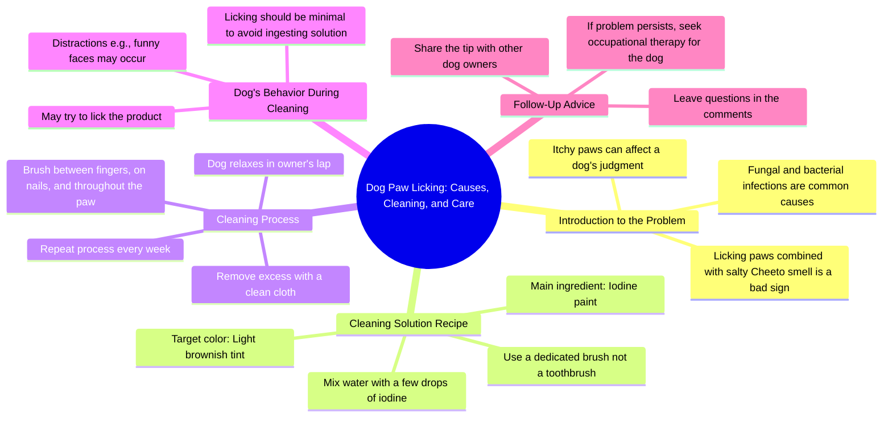

# Excessive Paw Itching Caused by Fungi and Bacteria

> 🌐 **Read this in:** [English](../../en/2026-06/tiktok-transcript-coceiras-em-excesso-nas-patolas-podem-ser-causadas-por-fungo-71c0.md) · **中文**

> **Creator:** [@larapitbull](https://www.tiktok.com/@larapitbull) · **Views:** 1.3M · **Posted:** 2026-06-29 · **Niche:** other
>
> **TL;DR:** The bizarre comparison of dog paw odor to Cheetos immediately grabs attention and creates curiosity.

[Watch original video →](https://www.tiktok.com/@larapitbull/video/7473998560808193285?is_from_webapp=1&web_id=7521868064577586694)

## Why This Went Viral

## 钩子（前3秒）
- **逐字开场白：**"我的靴子上有个痒，正在吞噬我的判断力。"
- **钩子模式：**场景 + 大胆断言（出人意料、恶心、个人问题）
- **为何能阻止滑动：**从一个奇怪、发自内心的问题中间开始（"我的靴子上有个痒……吞噬我的判断力"）——立刻制造困惑和好奇心。"靴子"一词（很可能是"爪子"的误译）加上"痒"暗示了动物内容，但措辞如此奇怪，让人不得不回头再看一遍。

## 情绪节奏
1. **厌恶 + 困惑**（0–3秒）——"我的靴子上有个痒……咸味奇多"——恶心、无厘头，让你想弄明白
2. **好奇心**（3–10秒）——"你知道吗？" + "超级大脑曼努埃拉"——引入角色，设定解决方案
3. **紧张感**（10–20秒）——"可怕的样子，看起来甚至像我妈妈诺埃尔的裂脚"——从视觉和情感上升级问题
4. **解脱 + 幽默**（20–30秒）——"加了几滴碘酒的水"——简单、荒谬的解决方案；"不是用来刷牙的刷子"——面无表情的玩笑
5. **温暖 + 傻气**（30–45秒）——"在你最喜欢的人类腿上放松"——甜蜜时刻被"驱除所有这些Funko和小饰品细菌"打断
6. **转折**（45–55秒）——"我们想舔几下是正常的……但只是一点点"——打破第四面墙，拿狗舔碘酒开玩笑
7. **高潮**（55–65秒）——"超级大脑曼努埃拉试图用鬼脸分散我的注意力"——笑点：狗比人聪明，威胁要使用暴力
8. **呼应 + 结尾**（65秒–结束）——"每周重复这个过程……如果没解决，就去找职业治疗……他可能怀孕了"——荒谬的无厘头结局

**高潮时刻：**"如果是她，我就用那碘酒水打她的头发"——狗的内心独白变得具有攻击性，制造出病毒式笑声。

## 关键词密度
- **"痒 / 舔 / 舔几下"** ——核心问题，驱动搜索和算法覆盖（常见宠物问题）
- **"超级大脑曼努埃拉"** ——重复的角色名字，制造持续笑点和表情包潜力
- **"爸爸"** ——情感吸引力，暗示照顾者关系，触发怀旧/舒适感
- **"肉饼 / 靴子 / 小饰品"** ——独特、发音错误的词语，令人难忘（算法好奇心）
- **"碘酒 / 刷子 / 清洁"** ——宠物护理搜索的实用关键词，驱动教程式覆盖
- **"Funko / 细菌 / 驱除"** ——荒谬的并置，驱动可分享性（不可搜索，但情感上粘人）
- **"怀孕"** ——最终笑点词，制造"等等，什么？"的反应，迫使观众重看

**算法驱动因素：**"痒"、"清洁"、"狗舔"——高搜索量的宠物护理术语。  
**情感驱动因素：**"爸爸"、"超级大脑曼努埃拉"、"怀孕"——创造角色依恋和荒谬幽默。

## 为何能传播
1. **误译喜剧** ——整个脚本读起来像糟糕的AI翻译或非母语者的文本。"靴子"指爪子，"肉饼"指肉垫，"小饰品"指爪子——这些错误本身就很有趣且易于分享，因为观众会因为发现它们而觉得自己更聪明。（例如："我的靴子上有个痒"）

2. **宠物视角叙述** ——视频从狗的视角讲述，带有傲慢、自以为是的内心独白。这是一种经过验证的病毒式格式（参见："这是我的情感支持人类"）。"当最小的女儿真好，不用工作"这句话就是一个完美例子——它将狗拟人化为一个被宠坏的小鬼。

3. **荒谬的无厘头结局** ——"他可能怀孕了"与视频内容毫无关系。这种随机的笑点迫使观众倒回、评论和分享，因为它太出人意料了。这与让"我是宝宝"和"这很好"表情包传播的机制相同。

4. ** relatable 问题 + 奇怪解决方案** ——狗舔爪子是宠物主人的普遍问题。解决方案（碘酒水）很简单，但以夸张的戏剧性呈现（"驱除所有这些Funko和小饰品细菌"）。这种平凡问题与戏剧化框架之间的对比非常易于分享。

5. **角色戏剧** ——视频创造了一个三角恋：狗（主角）、爸爸（英雄）、超级大脑曼努埃拉（反派）。"我就要用那碘酒水打她的头发"的威胁给了狗一个反派弧线。观众会评论"超级大脑曼努埃拉才是真正的MVP"或"支持爸爸"——推动互动。

## 你可以借鉴什么
1. **从宠物的视角叙述，赋予其傲慢的性格** ——给你的宠物一个独特的声音（被宠坏的、戏剧化的、爱评判的）。写出与甜蜜画面形成对比的对话。示例："我让他清理我的爪子，因为他是我最喜欢的人类。如果是你，我会咬掉你的手。"

2. **使用一个荒谬的误译或发音错误作为贯穿笑点** ——选择一个词（比如用"小饰品"指爪子）并重复使用。它成为视频内部的一个梗。观众会在评论中引用它。示例：把狗床称为"皇家宝座"或把零食称为"员工补偿"。

3. **以一个完全不相关的笑点结尾** ——最后一句在逻辑上不应与视频内容相关。它迫使观众重看。示例：在教如何给狗刷牙的教程后，以"如果你的狗还有口臭，检查一下它是否秘密地是条龙"结尾。

## Mind Map

## Full Transcript (Generated by [免费 TikTok 文稿生成器](https://toktranscript.com/?utm_source=github&utm_medium=breakdown&utm_campaign=tool_attribution))

> 📝 Transcripts on this page are auto-generated and show the first 60%. Want to transcribe any TikTok in 30 seconds and get the full version? [Try TokTranscript free →](https://toktranscript.com/?utm_source=github&utm_medium=breakdown&utm_campaign=transcript_cta)

I had an itch on my boots that I was consuming my judgment. and itches in the patties and excess together with the smell of salty, Cheetos are not a good sign. Did you know that? then the Megaly I like the way she is, called my daddy to do some cleaning prize with an ingredient that fights funds and bacteria perpetrators from this harassed itch and still leaves my bosses withered with this horrible aspect, looking like even my mother Noel's cracked foot. and the poisonous recipe is water with a few drops of iodine paint. AI Lise, how much is 1? call the pharmacy and ask, I drip how many drops drip until it gets like this? water more OR less in this color. oh, and you're going to need 1 brush too, but it's not a brush that you brush your teeth, it's not 1 brush just for that, see? ready, just relax in the lap of your favorite human being and let him do all the work of exorcising all these Funkos and trinket bacteria, well between the fingers, on the nails, throughout the patola. , I take the opportunity to reflect on my madam life and I thank heaven daddy for life, my sister's success and money. AI AI how good it is to be a youngest daughter and not have to work yes, now returning to the subject of cleaning, during the process it's quite It's normal that we want to do some licks, you know? after all it is something. strange to us and it doesn't hurt to lick a little bit, but it's

*[Read the full transcript on TokTranscript →](https://toktranscript.com/plaza/tiktok-transcript-coceiras-em-excesso-nas-patolas-podem-ser-causadas-por-fungo-71c0?utm_source=github&utm_medium=breakdown&utm_campaign=transcript_full)*

## Browse More

- All [other](../../by-niche/zh-CN/other.md) breakdowns
- All [Curiosity gap with absurd analogy](../../by-pattern/zh-CN/hook-curiosity-gap-with-absurd-analogy.md) examples

## Video Info

| | |
|---|---|
| Creator | [@larapitbull](https://www.tiktok.com/@larapitbull) |
| Original video | [https://www.tiktok.com/@larapitbull/video/7473998560808193285?is_from_webapp=1&web_id=7521868064577586694](https://www.tiktok.com/@larapitbull/video/7473998560808193285?is_from_webapp=1&web_id=7521868064577586694) |
| Original title | Coceiras em excesso nas patolas, podem ser causadas por fungos e bact... |
| Views | 1.3M (1300000) |
| Posted | 2026-06-29 |
| Duration | 0s |
| Niche | `other` |
| Hook pattern | `Curiosity gap with absurd analogy` |
| Original language | `en` (this page translated by AI) |
| Available languages | en, zh-CN |
| Generated | 2026-07-02 by [TokTranscript](https://toktranscript.com/) |

---

*This breakdown is for educational analysis under fair use. Original video © [@larapitbull](https://www.tiktok.com/@larapitbull). All transcripts are auto-generated and may contain errors.*

*Want to analyze your own TikToks like this? [TikTok 转录工具 →](https://toktranscript.com/viral-breakdown?utm_source=github&utm_medium=breakdown&utm_campaign=footer_cta)*