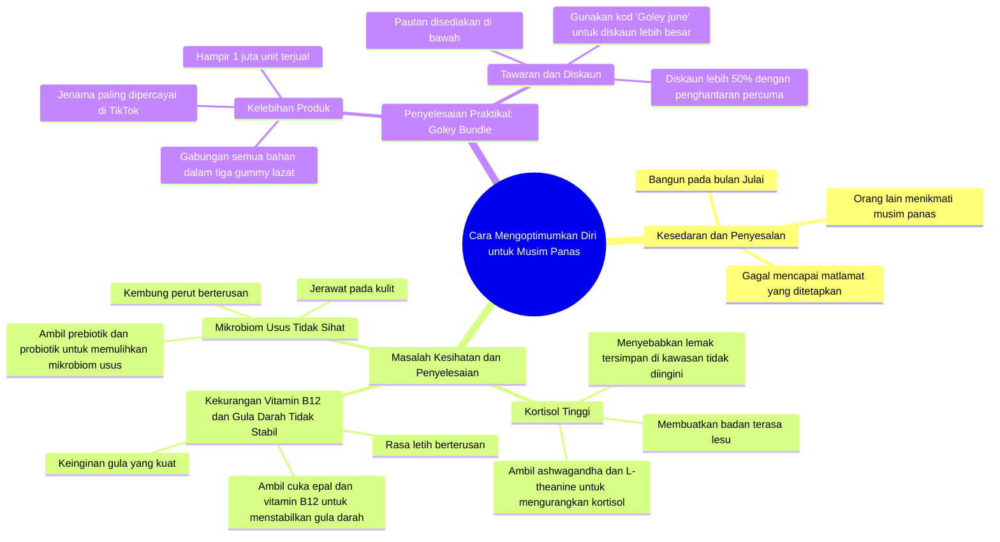

# Unlock Summer Body with Goli Gummies Routine

> 🌐 **Read this in:** [English](../../en/2026-06/tiktok-transcript-code-golijune-goli-ashwagandha-applecidervinegar-probiotics-1f33.md) · **中文**

> **Creator:** [@chrisorb](https://www.tiktok.com/@chrisorb) · **Views:** 3.4M · **Posted:** 2026-06-15 · **Niche:** fitness
>
> **TL;DR:** Creates immediate FOMO by contrasting others' enjoyment with the viewer's inaction.

[Watch original video →](https://vt.tiktok.com/ZSQCpPruv/)

## Why This Went Viral

## 钩子（前3秒）
- **逐字内容：** "你醒来发现现在已经是七月了。"
- **钩子类型：** 场景 + 对比（现实与期望的落差）
- **为何能让观众停止滑动：** 它立刻营造出 relatable 的感觉。谁没有过被落下的感觉？再加上"但你"——它触发了 FOMO 和不安感。

## 情绪节奏
- **内疚与悔恨** → "但你并没有像承诺的那样全力以赴"
- **希望与解决方案** → "这就是我要如何拯救自己"
- **科学分析** → 皮质醇激素、维生素B12、血糖——触发"专家"感
- **具体痛点** → 腹胀、皮肤爆痘、糖瘾——非常 relatable
- **高潮** → "问题是，如果你单独买所有这些……"——制造紧张感
- **释放与解决方案** → Goley Bundle、50%折扣、优惠码——即时解决方案

## 关键词密度
1. **皮质醇** – 科学触发点，对健康算法有强吸引力
2. **糖 / 糖瘾** – relatable，情绪性强
3. **腹胀** – 可视化，广为人知的身体问题
4. **肠道微生物组** – 健康热词，吸引兴趣
5. **Goley Bundle** – 产品名称，SEO搜索优化
6. **折扣 / 50%优惠** – 触发冲动购买
7. **全力以赴** – 激励性俚语，在TikTok上病毒式传播
8. **夏天 / 七月** – 季节背景，FOMO

**算法 vs 情绪：** "皮质醇"、"维生素B12"、"益生菌"对算法有强吸引力（健康类热门话题）。"腹胀"、"糖瘾"、"疲惫"对情绪有强吸引力（relatable）。

## 为何它能病毒式传播
1. **即时 relatable 的痛点** – "你醒来发现已经是七月了" – 每个人都曾有过被落下的感觉。它在3秒内就建立了强烈的情感钩子。
2. **科学公式 + 个人证言** – "高皮质醇水平会导致脂肪储存" – 听起来像专家，但以个人口吻传达。这提升了可信度，又没有推销感。
3. **问题 → 结构化解决方案** – 每个问题（皮质醇、糖、肠道）都有特定的补充剂。观众觉得"哦，这是为我准备的"，无需自己思考。
4. **紧迫感 + 折扣** – "50%优惠"、"免运费"、"优惠码 Goley june" – 制造 FOMO 并推动即时行动。"在价格回升之前" – 触发害怕错失的心理。
5. **经过验证的产品** – "已售出近100万件"、"TikTok最受信赖品牌" – 强大的社会证明，减少疑虑。

## 你可以借鉴什么
1. **使用"倒带"叙事** – "如果我们能倒回一个月" – 这制造了一种你已有经验的错觉。观众感觉像是得到了独家秘诀。
2. **列出具体问题及症状** – "强烈的糖瘾和总是感到疲惫" – 不要泛泛而谈。越具体，越多的人会觉得"那就是我！"
3. **将产品与优惠码 + 限时结合** – "优惠码 Goley june" + "在价格上涨之前" – 这将普通观看转化为即时行动。确保代码容易记住（产品名 + 月份）。

## Mind Map

## Full Transcript (Generated by [TokTranscript](https://toktranscript.com/?utm_source=github&utm_medium=breakdown&utm_campaign=tool_attribution))

> 📝 Transcripts on this page are auto-generated and show the first 60%. Want to transcribe any TikTok in 30 seconds and get the full version? [Try TokTranscript free →](https://toktranscript.com/?utm_source=github&utm_medium=breakdown&utm_campaign=transcript_cta)

You wake up and realize it's finally July. You look outside and see everyone's enjoying their summer but you, and then suddenly it hits you didn't lock in like you said you would. But if we could rewind back just one month, this is what I would do to save myself. High cortisol levels can cause fat to be stored in unwanted areas of the body and make you feel drained. Take ashwagandha and L theanine to help reduce my cortisol levels and balance out my mood. Intense sugar cravings and always feeling tired could be due to a vitamin B12 deficiency and unstable blood sugar levels. So I take apple cider vinegar and vitamin B12 to help stabilize my blood sugar levels. Constant bloating and skin breakouts could be due to a poor microbiome in your gut. So I would take a pre and post probiotic to help restore my gut's microbiome. Problem is, if you tried buying all these separately

*[Read the full transcript on TokTranscript →](https://toktranscript.com/plaza/tiktok-transcript-code-golijune-goli-ashwagandha-applecidervinegar-probiotics-1f33?utm_source=github&utm_medium=breakdown&utm_campaign=transcript_full)*

## Browse More

- All [fitness](../../by-niche/zh-CN/fitness.md) breakdowns
- All [Regret & Urgency](../../by-pattern/zh-CN/hook-regret-urgency.md) examples

## Video Info

| | |
|---|---|
| Creator | [@chrisorb](https://www.tiktok.com/@chrisorb) |
| Original video | [https://vt.tiktok.com/ZSQCpPruv/](https://vt.tiktok.com/ZSQCpPruv/) |
| Original title | Code: “GOLIJUNE”  #goli #ashwagandha #applecidervinegar #probiotics #... |
| Views | 3.4M (3400000) |
| Posted | 2026-06-15 |
| Duration | 0s |
| Niche | `fitness` |
| Hook pattern | `Regret & Urgency` |
| Original language | `ms` (this page translated by AI) |
| Available languages | en, zh-CN |
| Generated | 2026-06-16 by [TokTranscript](https://toktranscript.com/) |

---

*This breakdown is for educational analysis under fair use. Original video © [@chrisorb](https://www.tiktok.com/@chrisorb). All transcripts are auto-generated and may contain errors.*

*Want to analyze your own TikToks like this? [TokTranscript →](https://toktranscript.com/viral-breakdown?utm_source=github&utm_medium=breakdown&utm_campaign=footer_cta)*