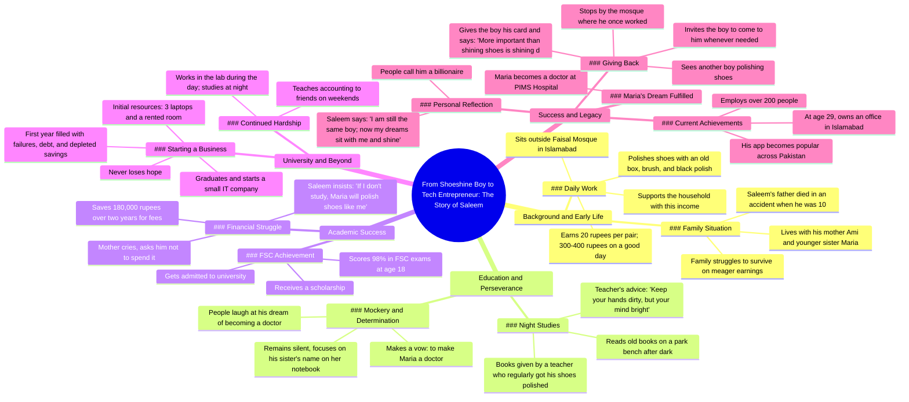

# Boy Shines Shoes Outside Faisal Mosque Islamabad Earns 40...

> 🌐 **Read this in:** [English](../../en/2026-06/tiktok-transcript-creatorsearchinsights-trustgod-faithoverfear-nasirkhan-foryo-271e.md) · **中文**

> **Creator:** [@nasirkhanofficial124](https://www.tiktok.com/@nasirkhanofficial124) · **Views:** 1.6M · **Posted:** 2026-06-04 · **Niche:** other
>
> **TL;DR:** Immediately paints a poignant picture of a young boy with a shoe shine box, evoking empathy and curiosity.

[Watch original video →](https://vm.tiktok.com/ZS929nDqXV76j-FSqUC/ This post is shared via TikTok Lite. Download TikTok Lite to enjoy more posts: https://www.tiktok.com/tiktoklite)

## Why This Went Viral

## 钩子（前3秒）
- **逐字开场白：** "在伊斯兰堡的费萨尔清真寺外，每天早上都有一个少年坐在那里。他叫萨利姆，手里拿着一个旧盒子、刷子和黑色鞋油。"
- **钩子模式：** 场景设定 / 人物介绍，细节生动（具体地点 + 名字 + 物品）。
- **为何能留住观众：** 具体细节（"费萨尔清真寺"、"萨利姆"、"旧盒子、刷子、黑色鞋油"）瞬间在脑海中形成画面，拉近情感距离。观众在划走之前，就被带入了一个真实、粗粝的人间故事。

## 情感节奏
- **第一拍 – 共情与同情：** 男孩的贫困与日常挣扎（每双鞋20卢比，一天最多赚300-400卢比）。
- **第二拍 – 紧张：** 父亲在萨利姆10岁时去世；人们总是催促他，却从不问他过得怎么样。
- **第三拍 – 希望/激励：** 老师送给他书本，说："即使双手沾满灰尘，也要让心灵保持明亮。"
- **第四拍 – 坚韧：** 因想当医生而遭嘲笑；他默默发誓，要让妹妹玛丽亚成为医生。
- **第五拍 – 胜利：** F.Sc.考试考了98%，获得奖学金，毕业后创办了一家IT公司。
- **第六拍 – 转折/高潮：** 五年后，他的应用在巴基斯坦广受欢迎；他雇佣了200多名员工；玛丽亚成为PIMS医院的医生。
- **第七拍 – 圆满与情感回报：** 他在清真寺前停下，将自己的名片递给一个新擦鞋男孩，说："擦亮梦想比擦亮鞋子更重要。"
- **高潮时刻：** "擦亮梦想比擦亮鞋子更重要"这句话——将整个故事浓缩成一句可引用、可分享的真理。

## 关键词密度
| 词语/短语 | 出现次数（约） | 驱动因素 |
|-------------|----------------|--------|
| جوتے (鞋子) | 6 | 情感吸引力（贫穷与卑微的象征） |
| پالش (鞋油) | 5 | 算法覆盖（独特、视觉化、可搜索） |
| خواب (梦想) | 4 | 情感吸引力（励志、可分享） |
| ڈاکٹر (医生) | 3 | 算法覆盖（高价值职业、可搜索） |
| سلیم (萨利姆) | 10+ | 情感吸引力（角色名字驱动认同感） |
| امی/بہن (母亲/妹妹) | 4 | 算法覆盖（家庭关键词触发共情） |
| پاکستان (巴基斯坦) | 2 | 算法覆盖（地理标签、文化相关性） |
| کمپنی (公司) | 2 | 情感吸引力（白手起家的叙事） |

- **算法驱动因素：** "鞋油"、"医生"、"巴基斯坦"、"公司"——可搜索、高流量词汇。
- **情感吸引力：** "梦想"、"鞋子"、"萨利姆"、"母亲/妹妹"——创造共鸣和可分享性。

## 为何能广泛传播
1. **普遍的"白手起家"原型：** 文本遵循经典的英雄之旅（贫困 → 挣扎 → 导师 → 胜利 → 回馈）。这种叙事结构在跨文化中天生具有病毒式传播潜力。
   - *具体台词：* "同一个萨利姆，29岁，在伊斯兰堡有自己的办公室，有200多人和他一起工作。"

2. **情感悬念与回报循环：** 故事制造紧张感（父亲去世、嘲笑、经济崩溃），并在令人满意的高潮中释放（成功、妹妹成为医生、他帮助另一个男孩）。这种情感循环触发多巴胺，促使观众分享。
   - *具体台词：* "玛丽亚，她现在在PIMS医院当医生。"

3. **结尾的"微智慧"金句：** 最后一句是一个独立、令人难忘的引语，可以截图、分享或用作标题。它成为视频的"可分享单元"。
   - *具体台词：* "擦亮梦想比擦亮鞋子更重要。"

4. **具体性创造可信度与可分享性：** 名字（萨利姆、玛丽亚、费萨尔清真寺、PIMS医院）、数字（20卢比、300-400卢比、98%、18万卢比、200人）和具体细节（旧盒子、刷子、黑色鞋油）让故事感觉真实可信。人们分享他们认为真实的东西。
   - *具体台词：* "他两年攒下的积蓄是十八万卢比。"

5. **社会认同与励志身份：** 故事验证了努力工作和教育可以战胜贫困的信念。观众分享它，以表明自己的价值观（坚韧、同情、希望）并激励他人。
   - *具体台词：* "如果我不读书，玛丽亚也会像我一样擦鞋。"

## 你可以借鉴什么
1. **以具体、感官化的场景开场：** 不要以泛泛的"这是一个关于……的故事"开头。相反，将观众直接带入一个时间、地点和物品中。"在费萨尔清真寺外……旧盒子、刷子、黑色鞋油。"这迫使大脑立即形成画面。
2. **使用"导师语录"作为叙事锚点：** 老师的话（"即使双手沾满灰尘，也要让心灵保持明亮"）在整篇中反复被呼应。在你自己的视频中，尽早引入一句令人难忘的台词，并在高潮处回响，以获得最大的情感共鸣。
3. **以"圆满"时刻结尾：** 展示主角回到最初的场景（清真寺），并做出一个小小的、象征性的善举（将名片递给另一个擦鞋男孩）。这创造了一个令人满意的叙事循环，观众会本能地想要分享。

## Mind Map

## Full Transcript (Generated by [免费 TikTok 文稿生成器](https://toktranscript.com/?utm_source=github&utm_medium=breakdown&utm_campaign=tool_attribution))

> 📝 Transcripts on this page are auto-generated and show the first 60%. Want to transcribe any TikTok in 30 seconds and get the full version? [Try TokTranscript free →](https://toktranscript.com/?utm_source=github&utm_medium=breakdown&utm_campaign=transcript_cta)

اسلام آباد کی فیصل مسجد کے باہر صبح ایک کم عمر لڑکا بیٹھا ہوتا تھا نام تھا سلیم ہاتھ میں پرانا ڈبہ برش اور کالے رنگ کی پالش پورا دن لوگوں کے جوتے چمکاتا ایک جوڑے کے صرف بیس روپے ملتے اگر دن اچھا گزر جاتا تو تین سو چار سو روپے بچ جاتے اور انہی سے گھر کا چولہا جلتا تھا گھر میں صرف امی اور چھوٹی بہن ماریاتی والد ایک حادثے میں اس وقت دنیا سے چلے گئے تھے جب سلیم صرف دس سال کا تھا لوگ آتے جلدی کرو بچے کہہ کر جوتے آگے بڑھا دیتے کسی نے کبھی یہ نہیں پوچھا کہ تمہارا حال کیسا ہے سلیم خاموشی سے کام کرتا رہتا رات کو جب مسجد کے باہر کی روشنیاں مدھم پڑ جاتی وہ پارک کی بینچ پر بیٹھ کر پرانی کتابیں کھول لیتا یہ کتابیں اس ایک استاد نے دی تھیں جو روز اس سے جوتے پالش کرواتا تھا استاد اکثر کہتا ہاتھ میلے ہوں تو کوئی بات نہیں دماغ روشن رکھو دن جوتوں کی پالش رات کتابوں کی روشنی لوگ مذاق اڑاتے یہ بھی کوئی بات ہے جوتے پالش کرنے والا ڈاکٹر بنے گا سلیم خاموش رہتا بس بہن کی کاپی پر لکھا نام دیکھتا اور دل میں ایک عہد دہراتا کہ ماریا کو ڈاکٹر بنانا ہے اٹھارہ سال کی عمر میں اس نے ایف ایس سی میں نائنٹی ایٹ پرسنٹ نمبر حاصل کیے سکالرشپ ملی اور یونیورسٹی میں داخلہ ہو گیا فیس کے لیے دو سال کی جمع پونجی ایک لاکھ اسی ہزار اس کے پاس تھی امی نے روتے ہوئے کہا بیٹا یہ پیسے خرچ نہ کرو باہر مشکل سے چل رہے ہیں سلیم نے مسکرا کر جواب دیا اگر میں نہ پڑھا تو ماریہ بھی میری طرح جو

*[Read the full transcript on TokTranscript →](https://toktranscript.com/plaza/tiktok-transcript-creatorsearchinsights-trustgod-faithoverfear-nasirkhan-foryo-271e?utm_source=github&utm_medium=breakdown&utm_campaign=transcript_full)*

## Browse More

- All [other](../../by-niche/zh-CN/other.md) breakdowns
- All [Character introduction with vivid detail](../../by-pattern/zh-CN/hook-character-introduction-with-vivid-detail.md) examples

## Video Info

| | |
|---|---|
| Creator | [@nasirkhanofficial124](https://www.tiktok.com/@nasirkhanofficial124) |
| Original video | [https://vm.tiktok.com/ZS929nDqXV76j-FSqUC/ This post is shared via TikTok Lite. Download TikTok Lite to enjoy more posts: https://www.tiktok.com/tiktoklite](https://vm.tiktok.com/ZS929nDqXV76j-FSqUC/ This post is shared via TikTok Lite. Download TikTok Lite to enjoy more posts: https://www.tiktok.com/tiktoklite) |
| Original title | #creatorsearchinsights #trustgod #faithoverfear#nasirkhan #foryoupage  |
| Views | 1.6M (1600000) |
| Posted | 2026-06-04 |
| Duration | 0s |
| Niche | `other` |
| Hook pattern | `Character introduction with vivid detail` |
| Original language | `en` (this page translated by AI) |
| Available languages | en, zh-CN |
| Generated | 2026-06-05 by [TokTranscript](https://toktranscript.com/) |

---

*This breakdown is for educational analysis under fair use. Original video © [@nasirkhanofficial124](https://www.tiktok.com/@nasirkhanofficial124). All transcripts are auto-generated and may contain errors.*

*Want to analyze your own TikToks like this? [TikTok 转录工具 →](https://toktranscript.com/viral-breakdown?utm_source=github&utm_medium=breakdown&utm_campaign=footer_cta)*