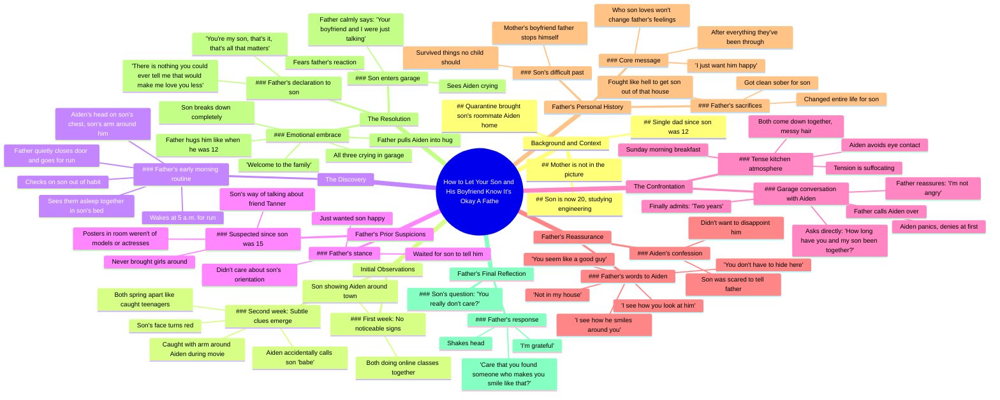

# Dara - Bangaranga, Your Eurovision 2026 Winning Song

> 🌐 **Read this in:** [English](../../en/2026-06/tiktok-transcript-dara-bangaranga-your-eurovision2026-winning-song-eurovisiond-3133.md) · **中文**

> **Creator:** [@ergerg74](https://www.tiktok.com/@ergerg74) · **Views:** 1.6M · **Posted:** 2026-06-21 · **Niche:** other
>
> **TL;DR:** Opens with a vulnerable, relatable question that immediately hooks the viewer by promising a heartfelt resolution.

[Watch original video →](https://vm.tiktok.com/ZNRTJxFJY/)

## Why This Went Viral

## 钩子（前3秒）
- **逐字开场白：**“我儿子和他朋友是一对，我该怎么让他们知道这没关系”
- **钩子模式：** 大胆陈述与疑问的混合体——父亲陈述了一个令人惊讶的前提（“我儿子和他朋友是一对”），并立即将其框定为脆弱的疑问（“我该怎么让他们知道这没关系”）
- **为何能阻止滑动：** 这句话颠覆了预期的反应。大多数父母会被描绘成*反对*孩子的性取向。而这位父亲却在努力*支持*它。“丑闻”前提与父亲温柔意图之间的张力瞬间引发了好奇心。

## 情感节奏
1. **好奇**（0:00–0:15）——“我儿子和他朋友是一对”设定了一个禁忌情境
2. **紧张**（0:15–1:30）——父亲注意到线索（早晨的宝贝、沙发上的手臂、睡在一起）制造悬念：*他会质问他们吗？*
3. **共鸣**（1:30–2:00）——凌晨5点跑步/戒酒背景故事增加了情感分量，并解释了*为什么*这位父亲与众不同
4. **高潮**（2:00–3:30）——与艾登在车库的对话：“你和我儿子在一起多久了”→“两年”→父亲平静的接纳
5. **释放/宣泄**（3:30–结尾）——车库里的三人拥抱，“欢迎加入这个家”——完整的情感回报
- **高潮时刻：**“没有什么，我是说没有什么，是你告诉我会让我少爱你一点的”

## 关键词密度
| 词语/短语 | 数量（约） | 算法性 vs. 情感性 |
|---|---|---|
| “儿子” | 15+ | **情感性**——锚定父子纽带 |
| “艾登” | 12+ | **情感性**——使伴侣人性化，让他变得真实 |
| “没关系”/“开心” | 8+ | **两者兼具**——算法性（积极情绪信号）+ 情感性（核心愿望） |
| “害怕”/“恐惧” | 6+ | **情感性**——驱动紧张与释然 |
| “车库” | 5+ | **算法性**——具体、视觉化、场景设定（通过心理意象提升观看时长） |
| “哭泣”/“眼泪” | 5+ | **情感性**——触发镜像神经元，促使分享 |
| “两年” | 3+ | **算法性**——具体数字提升可信度和留存率 |
| “早晨的宝贝” | 1（但关键） | **情感性**——泄露秘密的“口误” |

## 为何能广泛传播
1. **基于身份的情感回报**——父亲说了15次以上“我儿子”。身为父母、LGBTQ+孩子或盟友的观众看到了*自己身份的映射*。“你以为他爱谁会改变我对他的一切感受吗”这句话直接回应了观众对爱是有条件的恐惧。
2. **“安全港湾”模板**——视频遵循经典叙事弧线：秘密→紧张→发现→接纳→宣泄。这种结构在神经学上令人上瘾。高潮（“没有什么是你告诉我会让我少爱你一点的”）是一个*普世的情感承诺*，观众希望相信它是可能的。
3. **对“出柜”套路的颠覆**——通常出柜故事是关于孩子自我揭露。在这里，父亲已经知道并在等待。转折在于*他*才是那个需要“出柜”表示接纳的人。这种反转让故事显得新颖且值得分享。
4. **具体性创造普世性**——细节如“八小时车程”、“工程学”、“三月隔离开始”、“戒酒八年来每天凌晨5点跑步”让故事感觉*真实*。观众相信它是真的，从而降低了分享的阻力。戒酒细节是神来之笔——它解释了*为什么*这位父亲如此情感开放。
5. **“欢迎加入这个家”这句话**——这是可分享的金句。它简短、包容且情感充沛。观众可以剪辑它并作为独立的接纳时刻重新发布。

## 你可以借鉴什么
1. **“我早就知道”的转折**——不要用标准的“我害怕告诉你”的出柜故事，而是翻转它：父母已经怀疑并在等待。这创造了*双重悬念*（孩子会说出来吗？父母会反应好吗？）并使结局更令人满意。将此应用于任何秘密揭露的叙事。
2. **“颠覆性的对峙”场景**——与艾登在车库的对话开始时是对峙（“你和我儿子在一起多久了”），但立即转向接纳（“我不生气”）。这种模式（直接提问→冷静回应）适用于任何紧张关系的揭露。关键在于*明确说出紧张点*，然后化解它。
3. **“戒酒背景故事”作为角色速写**——父亲在一句话中提到了戒酒和争取监护权。这做到了三件事：(a) 解释了他的情感成熟度，(b) 使他成为一个有同情心的角色，(c) 增加了赌注（他本可能失去儿子）。在任何个人叙事中，加入一句*解释你为何成为现在这样的背景故事*。它让你的反应显得有分量，而非随意。

## Mind Map

## Full Transcript (Generated by [TokTranscript](https://toktranscript.com/?utm_source=github&utm_medium=breakdown&utm_campaign=tool_attribution))

> 📝 Transcripts on this page are auto-generated and show the first 60%. Want to transcribe any TikTok in 30 seconds and get the full version? [Try TokTranscript free →](https://toktranscript.com/?utm_source=github&utm_medium=breakdown&utm_campaign=transcript_cta)

my son and his friend are a couple how do I let them know it's okay I've been a single dad since my son was 12 his mother isn't in the picture he's 20 now studying engineering at a university eight hours away when quarantine hit in March he called and asked if his roommate Aiden could come stay with us too Aiden's family is back in Canada and he'd be stuck alone in their apartment I said of course they've been here six weeks now and they think they're being subtle the first week I didn't notice anything they kept to themselves mostly my son showing Aiden around town both of them doing online classes from the kitchen table week two is when things started clicking one morning Aiden's making coffee and my son walks in morning babe Aiden says and freezes tries to cover it with a cough I mean uh morning man I'm reading the newspaper I don't look up just say morning boys like I heard nothing I see my son's face go red in my peripheral vision Thursday night we're watching some action movie lights are off I'm in the recliner they're on the couch I get up to grab a beer and in the blue light from the tea I see my son's arm around Aiden's shoulders they spring apart like teenagers caught at prom I grab my beer sit back down anyone else want one no thanks they both say in unison voices a little too high Friday morning I wake up at 5 a m for my run like always I've done this routine for eight years ever since I got sober and fought for custody something makes me check on my son old habit from when he was younger and had nightmares I crack his bedroom door open they're both asleep in his bed Aiden's head on my son's chest my son's arm around him I stand there for maybe 10 seconds then I close the door quietly and go for my run here's the thing nobody knows I've suspected since he was 15 maybe earlier the way he talked about his friend Tanner in high school how he never brought girls around even when his friends did the posters in his room weren't of models or actresses I didn't care I just wanted him happy but I waited for him to tell me I figured he would when he was ready Saturday passes Sunday morning I'm making breakfast and they come down together hair messy both in sweatpants morning my son says morning I say back Aiden immediately goes to pour coffee won't make eye contact the tension in the kitchen is suffocating Sunday afternoon I'm in the garage working on my truck Aiden comes out to throw something away he sees me and turns to leave Aiden I call out hand me that wrench he does his hands shaking a little we stand there in silence for a minute I'm pretending to examine a belt how long have you and my son been together I ask not looking up I hear him inhale sharply sir I we're not I mean I look at him Aiden I'm not stupid and I'm not angry his eyes are wide panic two years he finally whispers we've been together two years I nod slowly that's a long time please don't he starts what be happy my son found someone who clearly cares about him I set down my tools I see how you look at him Aiden I see how he smiles around you Aiden's 

*[Read the full transcript on TokTranscript →](https://toktranscript.com/plaza/tiktok-transcript-dara-bangaranga-your-eurovision2026-winning-song-eurovisiond-3133?utm_source=github&utm_medium=breakdown&utm_campaign=transcript_full)*

## Browse More

- All [other](../../by-niche/zh-CN/other.md) breakdowns
- All [Curiosity Gap + Emotional Stakes](../../by-pattern/zh-CN/hook-curiosity-gap-emotional-stakes.md) examples

## Video Info

| | |
|---|---|
| Creator | [@ergerg74](https://www.tiktok.com/@ergerg74) |
| Original video | [https://vm.tiktok.com/ZNRTJxFJY/](https://vm.tiktok.com/ZNRTJxFJY/) |
| Original title | DARA - Bangaranga, your #Eurovision2026 winning song! 🇧🇬 #EurovisionD... |
| Views | 1.6M (1600000) |
| Posted | 2026-06-21 |
| Duration | 0s |
| Niche | `other` |
| Hook pattern | `Curiosity Gap + Emotional Stakes` |
| Original language | `en` (this page translated by AI) |
| Available languages | en, zh-CN |
| Generated | 2026-06-22 by [TokTranscript](https://toktranscript.com/) |

---

*This breakdown is for educational analysis under fair use. Original video © [@ergerg74](https://www.tiktok.com/@ergerg74). All transcripts are auto-generated and may contain errors.*

*Want to analyze your own TikToks like this? [TokTranscript →](https://toktranscript.com/viral-breakdown?utm_source=github&utm_medium=breakdown&utm_campaign=footer_cta)*