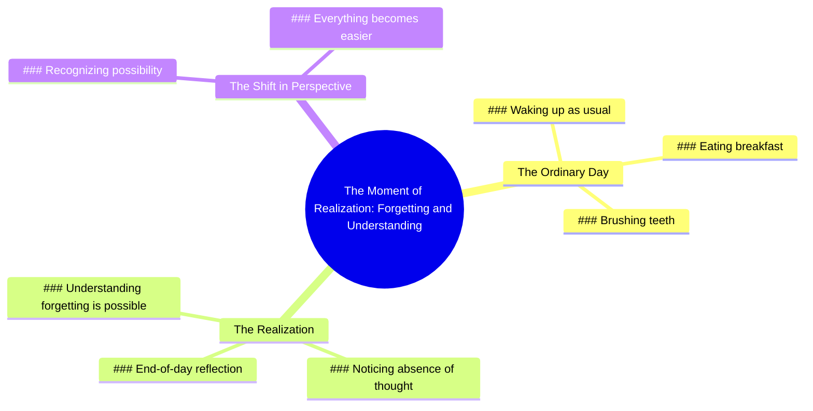

# Forgetting Happens When You Wake Up One Day

> 🌐 **Read this in:** [English](../../en/2026-06/tiktok-transcript-dimenticare-perte-fyp-foryoupage-andiamoneiperte-3c46.md) · **中文**

> **Creator:** [@utente.non_.disponibile](https://www.tiktok.com/@utente.non_.disponibile) · **Views:** 711.7K · **Posted:** 2026-06-04 · **Niche:** other
>
> **TL;DR:** Starts with an ordinary routine to lull the viewer, then delivers a profound realization about forgetting.

[Watch original video →](https://vt.tiktok.com/ZSQeWoq3J/)

## Why This Went Viral

## 钩子（前3秒）
- **逐字开场白：** "有一天你会像往常一样醒来，吃着早餐，刷着牙，然后在一天结束时，你会自己意识到：我几乎没想过这件事。"
- **钩子模式：** 场景 + 反差（日常琐事 → 突然醒悟）
- **为何能让人停下刷屏：** 它利用普遍熟悉的场景（早晨的例行公事）设下了一个无形的情感陷阱。观众瞬间认出这个场景，然后"我几乎没想过这件事"这句话引入了一种微妙而令人不安的反差——让他们忍不住凑近去理解其中的警示或洞见。

## 情感节奏
- **节拍1 – 好奇 / 熟悉感：** "有一天你会像往常一样醒来，吃着早餐，刷着牙"——安全、有共鸣、毫无风险。
- **节拍2 – 紧张 / 恐惧：** "然后在一天结束时，你会自己意识到：我几乎没想过这件事"——转折点出现。观众意识到这段视频是关于忘记去*思考*某件重要的事。
- **节拍3 – 悬念 / 揭示：** "那一刻，你会明白，原来你可以忘记"——高潮：忘记的瞬间变成了理解的瞬间。
- **节拍4 – 释然 / 接纳：** "当你看到这是可能的，一切都会变得更容易"——情感上的解决。紧张感化为一种宁静、哲思般的平和。

## 关键词密度
| 关键词 / 短语 | 出现次数（约） | 功能 |
|----------------|----------------|----------|
| "你" / "你自己" | 6 | **算法友好** — 高度个性化，推动观看时长和完成率（观众感觉被直接对话） |
| "意识到" / "明白" | 3 | **情感牵引** — 触发自我反思，让视频显得深刻 |
| "忘记" | 2 | **情感牵引** — 制造对错过重要事物的恐惧，勾起焦虑 |
| "一天" / "醒来" / "早餐" / "刷牙" | 4 | **算法友好** — 高搜索性（日常内容经久不衰） |
| "更容易" | 1 | **情感牵引** — 回报性词语，承诺解脱，推动分享欲 |

## 为何能广泛传播
1. **普适的切入点 + 隐藏的深度** — 钩子用每个人都能认出的无聊早晨例行公事开头，然后转向一个哲学洞见。这种"低门槛进入，高境界退出"的模式让观众觉得坚持看完很聪明，于是分享它来彰显自己的深度。
2. **"忘记思考"的悖论** — 那句"那一刻，你会明白，原来你可以忘记"是一个认知循环。它迫使观众停下来重新思考，从而增加观看时长和评论互动（人们会说"我一开始没懂"）。
3. **无需画面，音频优先的结构** — 这段文字本身就可以作为独立的口语作品。这使得它很容易在不同平台（TikTok、Reels、YouTube Shorts）上重新利用，只需简单的文字叠加或素材视频，降低了创作者的制作门槛。
4. **最后一句的情感回报** — "当你看到这是可能的，一切都会变得更容易"是一个释放阀。那些感受到"忘记"带来的紧张的观众，现在得到了一个舒缓的解决，从而触发保存或分享的冲动，作为"平静的提醒"。
5. **模糊性引发投射** — 视频从未说明你忘记了*什么*。观众自行填充自己的意义（一个人、一个目标、一种感觉），这让视频对每个人都感觉切身相关——这是病毒式传播的关键驱动力。

## 你可以借鉴什么
1. **"无聊 → 深刻"的转折** — 从一个高度具体、低风险的细节开始（刷牙、系鞋带、看手机），然后将其翻转成一个普适的人生洞见。这创造了一个"慢热"的钩子，奖励耐心。
2. **"你"的层层递进** — 在30秒的脚本中重复"你"或"你自己"至少5次。它迫使观众感觉被直接对话，从而增加留存率和个人投入。
3. **以解决悖论结尾** — 将你的结尾句构建成一个矛盾，最终变得令人安慰（例如，"忘记就是你记住的方式"）。这赋予了视频一种"智慧片段"的特质，人们会保存和分享以供日后反思。

## Mind Map

## Full Transcript (Generated by [我们用的转录工具](https://toktranscript.com/?utm_source=github&utm_medium=breakdown&utm_campaign=tool_attribution))

> 📝 Transcripts on this page are auto-generated and show the first 60%. Want to transcribe any TikTok in 30 seconds and get the full version? [Try TokTranscript free →](https://toktranscript.com/?utm_source=github&utm_medium=breakdown&utm_campaign=transcript_cta)

one day you will wake up as usual, you'll be eating breakfast, you will brush your teeth and at the end of the day you will realize for yourself I didn't think a little about it. that wil

*[Read the full transcript on TokTranscript →](https://toktranscript.com/plaza/tiktok-transcript-dimenticare-perte-fyp-foryoupage-andiamoneiperte-3c46?utm_source=github&utm_medium=breakdown&utm_campaign=transcript_full)*

## Browse More

- All [other](../../by-niche/zh-CN/other.md) breakdowns
- All [Relatable mundane setup with twist](../../by-pattern/zh-CN/hook-relatable-mundane-setup-with-twist.md) examples

## Video Info

| | |
|---|---|
| Creator | [@utente.non_.disponibile](https://www.tiktok.com/@utente.non_.disponibile) |
| Original video | [https://vt.tiktok.com/ZSQeWoq3J/](https://vt.tiktok.com/ZSQeWoq3J/) |
| Original title | dimenticare. #perte #fyp #foryoupage #andiamoneiperte  |
| Views | 711.7K (711700) |
| Posted | 2026-06-04 |
| Duration | 0s |
| Niche | `other` |
| Hook pattern | `Relatable mundane setup with twist` |
| Original language | `en` (this page translated by AI) |
| Available languages | en, zh-CN |
| Generated | 2026-06-05 by [TokTranscript](https://toktranscript.com/) |

---

*This breakdown is for educational analysis under fair use. Original video © [@utente.non_.disponibile](https://www.tiktok.com/@utente.non_.disponibile). All transcripts are auto-generated and may contain errors.*

*Want to analyze your own TikToks like this? [TikTok 转录工具 →](https://toktranscript.com/viral-breakdown?utm_source=github&utm_medium=breakdown&utm_campaign=footer_cta)*