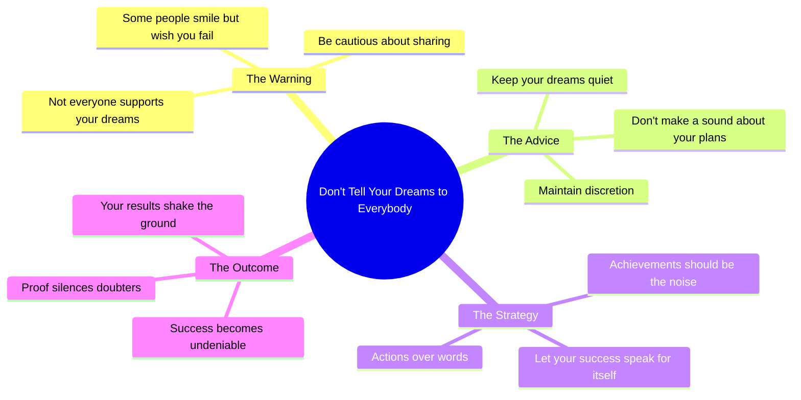

# Don't Tell Your Dreams to Everybody Around

> 🌐 **Read this in:** [English](../../en/2026-06/tiktok-transcript-don-t-tell-your-dreams-capcut-fyp-trend-lyrics-templatecapcu-55fa.md) · **中文**

> **Creator:** [@newtemplatee](https://www.tiktok.com/@newtemplatee) · **Views:** 9.6M · **Posted:** 2026-06-29 · **Niche:** entertainment
>
> **TL;DR:** Warns against oversharing dreams by highlighting hidden jealousy.

[Watch original video →](https://vm.tiktok.com/ZNRw1k9JF/)

## Why This Went Viral

## 钩子（前3秒）
- **逐字内容**："别把你的梦想告诉身边的每个人"
- **钩子模式**：大胆断言 / 警告
- **为何能让人停下滑动**：它瞬间触发自我反思。观众要么曾因分享梦想而受伤，要么心中藏着隐秘的抱负。这感觉像是一个知情者在你耳边低语真相。

## 情感节奏
- **好奇**（0–3秒）："别告诉别人你的梦想"——为什么？会发生什么？
- **紧张**（3–6秒）："有些人微笑，却想看你跌落"——引入背叛、嫉妒、不信任。
- **悬念**（6–9秒）："保持沉默，别发出声响"——营造一种隐秘、近乎共谋的氛围。
- **高潮 / 释放**（9–12秒）："让你的成功成为撼动大地的力量"——回报时刻。它将警告翻转成一个有力的、视觉化的沉默胜利隐喻。
- **共鸣**（高潮后）：观众沉浸在"我会证明他们错了"的感受中。

## 关键词密度
| 关键词 / 短语 | 出现次数（约） | 驱动因素 |
|----------------|----------------|----------|
| "别告诉" | 1（开头） | 算法 + 情感吸引力（否定引发好奇） |
| "梦想" | 1 | 情感吸引力（励志、个人化） |
| "每个人" | 1 | 算法（广泛、有共鸣） |
| "微笑" | 1 | 情感吸引力（与背叛形成对比） |
| "跌落" | 1 | 情感吸引力（恐惧、脆弱） |
| "沉默 / 声响" | 2 | 情感吸引力（秘密、紧张） |
| "成功" | 1 | 算法（高触达关键词） |
| "撼动大地" | 1 | 情感吸引力 + 视觉钩子（令人难忘、易于分享） |

- **算法触达**："梦想"、"成功"——平台青睐的高流量、励志关键词。
- **情感吸引力**："别告诉"、"跌落"、"沉默"、"撼动大地"——制造对比、脆弱感和电影般的收尾。

## 为何能广泛传播
1. **普遍的背叛恐惧**——"有些人微笑，却想看你跌落"触及近乎普遍的经历。观众将其作为警告分享给朋友，或用来验证自己的防备心理。
2. **"沉默力量"的幻想**——"让你的成功成为撼动大地的力量"是一句感觉像人生秘诀的短句。它很容易被用作标题、推文或纹身——从而推动跨平台分享。
3. **有节奏、催眠式的表达**——简短有力的句子（4行，12秒）创造出类似咒语的结构。观众会重播以吸收其韵律，提升留存率和算法信号。
4. **低采用门槛**——视频不需要背景、人脸或画面。任何人都可以拼接、引用或混音，使其成为可混搭的内容。
5. **高潮落在视觉隐喻上**——"撼动大地"是一个具体、可分享的画面。它容易想象（也更容易截图作为引文），从而推动收藏和分享。

## 你可以借鉴的要点
1. **"警告 → 回报"结构**——以警示性陈述开头（"别……"），用理由制造紧张（"因为……"），然后以胜利的画面收尾（"让……"）。这种弧线适用于任何励志领域（健身、商业、艺术）。
2. **使用有节奏的短句**——每行控制在5个词以内。这迫使每个词都有其存在的价值，并使视频感觉像吟唱或咒语——高度可重播和可引用。
3. **以具体、视觉化的隐喻结尾**——"撼动大地"并不抽象。它是你能想象到的东西。用生动的动作（"你的沉默变成一场风暴"）取代模糊的结尾（"你会快乐"）。

## Mind Map

## Full Transcript (Generated by [免费 TikTok 文稿生成器](https://toktranscript.com/?utm_source=github&utm_medium=breakdown&utm_campaign=tool_attribution))

> 📝 Transcripts on this page are auto-generated and show the first 60%. Want to transcribe any TikTok in 30 seconds and get the full version? [Try TokTranscript free →](https://toktranscript.com/?utm_source=github&utm_medium=breakdown&utm_campaign=transcript_cta)

Don't tell your dreams to everybody around Some people smile, but wanna see you down Keep it qui

*[Read the full transcript on TokTranscript →](https://toktranscript.com/plaza/tiktok-transcript-don-t-tell-your-dreams-capcut-fyp-trend-lyrics-templatecapcu-55fa?utm_source=github&utm_medium=breakdown&utm_campaign=transcript_full)*

## Browse More

- All [entertainment](../../by-niche/zh-CN/entertainment.md) breakdowns
- All [Cautionary advice with contrast](../../by-pattern/zh-CN/hook-cautionary-advice-with-contrast.md) examples

## Video Info

| | |
|---|---|
| Creator | [@newtemplatee](https://www.tiktok.com/@newtemplatee) |
| Original video | [https://vm.tiktok.com/ZNRw1k9JF/](https://vm.tiktok.com/ZNRw1k9JF/) |
| Original title | Don't tell your dreams #CapCut #fyp #trend #lyrics #templatecapcut  |
| Views | 9.6M (9600000) |
| Posted | 2026-06-29 |
| Duration | 0s |
| Niche | `entertainment` |
| Hook pattern | `Cautionary advice with contrast` |
| Original language | `en` (this page translated by AI) |
| Available languages | en, zh-CN |
| Generated | 2026-06-30 by [TokTranscript](https://toktranscript.com/) |

---

*This breakdown is for educational analysis under fair use. Original video © [@newtemplatee](https://www.tiktok.com/@newtemplatee). All transcripts are auto-generated and may contain errors.*

*Want to analyze your own TikToks like this? [TikTok 转录工具 →](https://toktranscript.com/viral-breakdown?utm_source=github&utm_medium=breakdown&utm_campaign=footer_cta)*