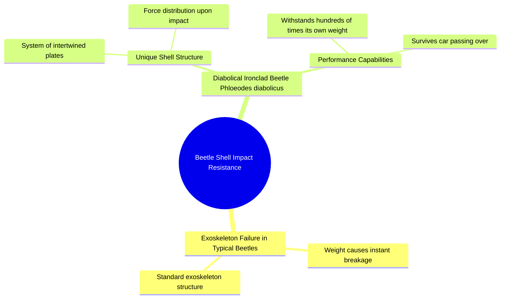

# The World's Strongest Beetle Shell Structure

> 🌐 **Read this in:** [English](../../en/2026-06/tiktok-transcript-el-escarabajo-m-s-fuerte-del-mundo-estadosunidos-datoscurios-e2a1.md) · **中文**

> **Creator:** [@datosh.2001](https://www.tiktok.com/@datosh.2001) · **Views:** 7.8M · **Posted:** 2026-06-04 · **Niche:** other
>
> **TL;DR:** Sets up a common expectation (beetle breaks) then subverts it with a surprising exception.

[Watch original video →](https://www.tiktok.com/@datosh.2001/video/7575742220318362911?is_from_webapp=1&sender_device=pc&web_id=7618668871714080263)

## Why This Went Viral

## 钩子（前3秒）
- **逐字开场白：**"当你踩到一只甲虫时，你的重量会落在它的外骨骼上，一旦被发现，它就会瞬间碎裂。"
- **钩子模式：**对比 / "但"字转折
- **为何能阻止滑动：**以一个普遍且能引发共鸣的动作（踩到虫子）开场——每个人都做过这种事。然后立即通过引入一种*不会碎裂*的甲虫来颠覆预期。"但"字预示着转折，迫使观众等待结果揭晓。

## 情感节奏
1. **好奇 + 轻微厌恶**（0–3秒）："当你踩到一只甲虫……它就会瞬间碎裂。"——熟悉，略带恶心。
2. **好奇**（4–7秒）："但*Phloeodes diabolicus*这个物种却不同。"——提及学名营造权威感；观众会凑近细看。
3. **紧张**（8–12秒）："它的外壳就像一个由相互交错的板片组成的系统……当受到冲击时，撞击的力量。"——句子在短语中间被切断，制造悬念。
4. **惊讶 + 敬畏**（13–15秒）："……可以承受自身重量数百倍的压力，甚至是一辆汽车碾过。"——高潮：从"一只甲虫"到"一辆汽车"的规模跳跃既荒诞又令人难忘。
5. **满足感**（结尾）：转折得到解决——"脆弱"的东西实际上超级强大。

**高潮时刻：**"甚至是一辆汽车碾过"——汽车碾压小甲虫却失败的画面是情感峰值。

## 关键词密度
| 词语/短语 | 频率 | 算法覆盖 vs. 情感吸引力 |
|-----------|------|------------------------|
| 甲虫 | 3 | **算法**——搜索量高，易于分类 |
| 外骨骼 | 2 | **算法**——科学/生物学细分关键词 |
| 外壳 | 1 | **情感**——视觉化，易于理解 |
| 相互交错的板片 | 1 | **情感**——生动、独特的心理图像 |
| 自身重量数百倍 | 1 | **算法 + 情感**——可量化的数据 = 可分享的事实 |
| 汽车 | 1 | **情感**——熟悉，高冲击力对比 |
| 力量 | 1 | **算法**——物理/工程学触发词 |
| 碎裂/碎裂 | 2 | **情感**——紧张感词汇，制造悬念 |
| 重量 | 2 | **算法**——在"力量"对比中常见 |
| 不同 | 1 | **情感**——颠覆，好奇心驱动 |

**关键洞察：**"甲虫"和"汽车"是两个覆盖范围最广的词语——一个是细分领域（算法友好），另一个是普遍概念（易于分享）。它们之间的对比是核心的病毒式传播引擎。

## 为何能传播
1. **普遍性 + 令人惊讶的配对**——每个人都踩过甲虫。一只甲虫能*承受*一辆汽车的想法如此荒诞，以至于人们忍不住要分享。*(台词："甚至是一辆汽车碾过")*
2. **悬念式句子结构**——文字稿在句子中间切断（"……当受到冲击时，撞击的力量。"）——这迫使观众等待结果，从而增加观看时长和完成率。
3. **具体、易记的名称**——"Phloeodes diabolicus"听起来既异域又科学。观众会去搜索它、分享它、引用它——这是一个带有内置记忆钩子的"你知道吗？"式事实。
4. **规模跳跃**——视频从"你的重量"（个人化、小）到"自身重量数百倍"（抽象、大）再到"一辆汽车"（具体、巨大）。每次跳跃都重新吸引观众。
5. **情感回报**——转折（脆弱→无敌）触发多巴胺释放。观众因学到新知识而觉得自己很聪明，并会分享以显得博学。

## 你可以借鉴什么
1. **以"每个人都这样做，但是……"的模式开场**——选择一个普遍动作（敲鸡蛋、摔手机、开汽水）并揭示一个打破规则的例外。这会立即吸引人，因为它挑战了一个已知事实。
2. **在短语中间切断句子**——在关键揭示之前使用省略号或停顿。这迫使观众等待结果，从而提高留存率和完成率。例如："但接下来发生的事……会让你震惊。"
3. **以一个具体、极端的对比结尾**——不要只说"它非常坚固"。要说"它能承受一辆汽车"。对比越荒诞、越具视觉冲击力，就越容易被分享。始终问自己：*我能把这个东西比作什么日常物品，是没人预料到的？*

## Mind Map

## Full Transcript (Generated by [我们用的转录工具](https://toktranscript.com/?utm_source=github&utm_medium=breakdown&utm_campaign=tool_attribution))

> 📝 Transcripts on this page are auto-generated and show the first 60%. Want to transcribe any TikTok in 30 seconds and get the full version? [Try TokTranscript free →](https://toktranscript.com/?utm_source=github&utm_medium=breakdown&utm_campaign=transcript_cta)

When you step on a beetle, your weight falls on your exoskeleton and when discovered, it breaks instantly. But the species floated diabolicals is different. Its shell functions as a system of intertwined plates. that

*[Read the full transcript on TokTranscript →](https://toktranscript.com/plaza/tiktok-transcript-el-escarabajo-m-s-fuerte-del-mundo-estadosunidos-datoscurios-e2a1?utm_source=github&utm_medium=breakdown&utm_campaign=transcript_full)*

## Browse More

- All [other](../../by-niche/zh-CN/other.md) breakdowns
- All [Contrast & Surprise](../../by-pattern/zh-CN/hook-contrast-surprise.md) examples

## Video Info

| | |
|---|---|
| Creator | [@datosh.2001](https://www.tiktok.com/@datosh.2001) |
| Original video | [https://www.tiktok.com/@datosh.2001/video/7575742220318362911?is_from_webapp=1&sender_device=pc&web_id=7618668871714080263](https://www.tiktok.com/@datosh.2001/video/7575742220318362911?is_from_webapp=1&sender_device=pc&web_id=7618668871714080263) |
| Original title | El escarabajo más fuerte del Mundo 🌎  #estadosunidos🇺🇸 #datoscuriosos... |
| Views | 7.8M (7800000) |
| Posted | 2026-06-04 |
| Duration | 0s |
| Niche | `other` |
| Hook pattern | `Contrast & Surprise` |
| Original language | `en` (this page translated by AI) |
| Available languages | en, zh-CN |
| Generated | 2026-06-05 by [TokTranscript](https://toktranscript.com/) |

---

*This breakdown is for educational analysis under fair use. Original video © [@datosh.2001](https://www.tiktok.com/@datosh.2001). All transcripts are auto-generated and may contain errors.*

*Want to analyze your own TikToks like this? [TokTranscript →](https://toktranscript.com/viral-breakdown?utm_source=github&utm_medium=breakdown&utm_campaign=footer_cta)*