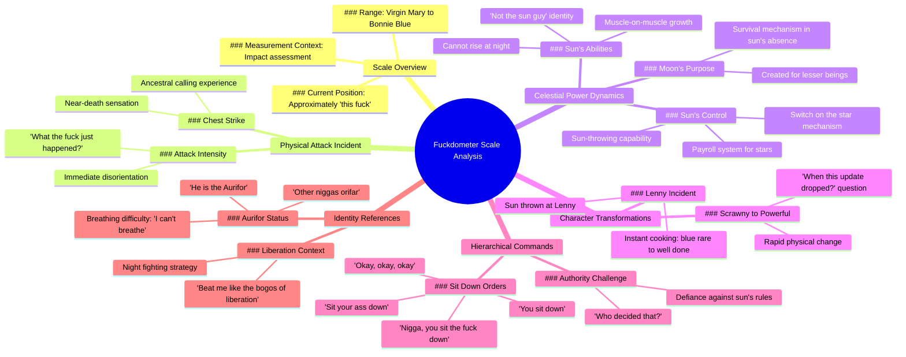

# Escanor's Fuckdometer Scale: From Virgin Mary to Bonnie Blue

> 🌐 **Read this in:** [English](../../en/2026-06/tiktok-transcript-escanor-escanor-sevendeadlysins-7deadlysins-anime-whodecided-579e.md) · **中文**

> **Creator:** [@jaypierlis](https://www.tiktok.com/@jaypierlis) · **Views:** 271.6K · **Posted:** 2026-06-06 · **Niche:** entertainment
>
> **TL;DR:** Creates immediate curiosity with a bizarre, humorous measurement system.

[Watch original video →](https://vm.tiktok.com/ZNRvrYhqS/)

## Why This Went Viral

## 钩子（前3秒）
- **逐字开场白：**“所以如果我们看看这个‘操蛋表’，你会发现从圣母玛利亚到邦妮·布鲁，我们大概就是这个操蛋程度。”
- **钩子模式：** **大胆断言 + 视觉道具**——“操蛋表”是一个虚构的、荒谬的尺度，引用了两个截然相反的文化人物。
- **为何能让人停下滚动：** 瞬间让观众迷失方向。“操蛋表”这个词是一种语言上的新奇事物。圣母玛利亚与邦妮·布鲁的对比令人震惊、不敬，且需要解释。观众必须看下去才能解码这个笑话。

## 情绪节奏
1. **困惑 + 震惊**（0:00–0:05）——“操蛋表”和拍胸。观众毫无背景。
2. **升级的荒谬**（0:05–0:15）——“祖先在召唤我回家”，“太阳不能在夜晚升起”。世界正在打破逻辑。
3. **喜剧张力**（0:15–0:25）——“你给我坐下 / 你坐下”——一场模仿校园等级制度的虚假争吵。
4. **意外转折**（0:25–0:35）——“月亮被创造出来，是为了让低等生物能在他的缺席中生存。”这重新将整段咆哮定义为一场宇宙权力斗争。
5. **高潮时刻**（0:35–0:45）——“他朝莱尼扔了一个太阳。那家伙从蓝生直接变成了全熟。”这是点睛之笔——一个视觉化、暴力、荒谬的收尾。
6. **放松 + 笑声**（0:45–结束）——“两秒前他还是个瘦小的家伙，老兄。这更新是什么时候出的？”——一个游戏/文化梗，让笑话落地。

## 关键词密度
| 词语/短语 | 频率（约） | 驱动因素 |
|-------------|-------------|----------|
| “太阳” | 5 | **算法覆盖**——简单、可搜索，将“太阳”作为角色绑定。 |
| “家伙” | 4 | **情感吸引**——文化真实性、节奏感、群体认同。 |
| “操” / “操蛋表” | 3 | **情感吸引**——冲击力、新奇感、记忆点。 |
| “月亮” | 2 | **算法覆盖**——与“太阳”形成对比，创造二元钩子。 |
| “打” / “击” | 3 | **情感吸引**——肢体喜剧、暴力荒谬。 |
| “更新出了” | 1 | **算法覆盖 + 情感吸引**——游戏俚语，触及迷因文化。 |

## 为何能传播
1. **不可预测的世界构建**——视频创造了一个幻想宇宙（太阳是暴君老板，月亮是避难所）。这激发了二次创作、粉丝理论和“如果”类评论。*具体台词：“月亮被创造出来，是为了让低等生物能在他的缺席中生存。”*
2. **高密度迷因格式**——每3-5秒就呈现一个新的荒谬画面（“肌肉上长肌肉”，“打开星星开关”，“从蓝生到全熟”）。这使得它易于剪辑，并可作为反应动图或音频片段分享。
3. **群体内部语言**——使用非裔美国英语、游戏俚语（“更新出了”）和文化引用（“邦妮·布鲁”，“解放的博格斯”）向特定受众发出信号。这创造了强烈的“懂的自然懂”效果，推动在该社区内的分享。
4. **肢体喜剧 + 声音表达**——拍胸、“哎哟”、喘不过气（“我喘不过气了”）增加了感官层次。视频不仅仅是一个故事——它是一场表演。这增强了情绪传染。
5. **悬念式结尾**——“这更新是什么时候出的？”暗示有续集。观众评论“第二部分？”或@朋友。这延长了病毒式传播的生命周期。

## 你可以借鉴什么
1. **用一个虚构的度量单位开场**——发明一个尺度（操蛋表、尴尬表、混乱表），引用两个极端的文化极点。这迫使观众观看以理解笑话。
2. **用肢体喜剧来强调荒谬**——一个突然的巴掌、一次摔倒、一个道具。这里的拍胸是唯一的肢体动作，但它带来了第一个笑点。在你的下一个视频中，加入一个意想不到的肢体节拍。
3. **以悬念结尾，邀请续集**——“这更新是什么时候出的？”是一个完美的后续钩子。始终留一条线索悬而未决，让观众要求更多。

## Mind Map

## Full Transcript (Generated by [TokTranscript 转录工具](https://toktranscript.com/?utm_source=github&utm_medium=breakdown&utm_campaign=tool_attribution))

> 📝 Transcripts on this page are auto-generated and show the first 60%. Want to transcribe any TikTok in 30 seconds and get the full version? [Try TokTranscript free →](https://toktranscript.com/?utm_source=github&utm_medium=breakdown&utm_campaign=transcript_cta)

So if we take a look at the fuckdometer here, you see that on the scale from Virgin Mary to Bonnie Blue, we were approximately this fuck. He hit me in the chest. And I had the ancestors calling me home. What the fuck just happened? The sun can't rise at night. And the who decided that? So sit your ass down. Nigga, you sit the fuck down. Okay, okay, okay. You sit down. At high noon, the muscles on his muscles, they grew muscles. He's not the sun guy. What? Hey, what you? Ow! He beat me like the bogos of liberation, nigga! So just fight him at night. Don't you get it? Get what? The moon was created so that lesser being

*[Read the full transcript on TokTranscript →](https://toktranscript.com/plaza/tiktok-transcript-escanor-escanor-sevendeadlysins-7deadlysins-anime-whodecided-579e?utm_source=github&utm_medium=breakdown&utm_campaign=transcript_full)*

## Browse More

- All [entertainment](../../by-niche/zh-CN/entertainment.md) breakdowns
- All [absurd scale](../../by-pattern/zh-CN/hook-absurd-scale.md) examples

## Video Info

| | |
|---|---|
| Creator | [@jaypierlis](https://www.tiktok.com/@jaypierlis) |
| Original video | [https://vm.tiktok.com/ZNRvrYhqS/](https://vm.tiktok.com/ZNRvrYhqS/) |
| Original title | Escanor. #escanor #sevendeadlysins #7deadlysins #anime #whodecidedthat  |
| Views | 271.6K (271600) |
| Posted | 2026-06-06 |
| Duration | 0s |
| Niche | `entertainment` |
| Hook pattern | `absurd scale` |
| Original language | `en` (this page translated by AI) |
| Available languages | en, zh-CN |
| Generated | 2026-06-07 by [TokTranscript](https://toktranscript.com/) |

---

*This breakdown is for educational analysis under fair use. Original video © [@jaypierlis](https://www.tiktok.com/@jaypierlis). All transcripts are auto-generated and may contain errors.*

*Want to analyze your own TikToks like this? [TikTok 转录工具 →](https://toktranscript.com/viral-breakdown?utm_source=github&utm_medium=breakdown&utm_campaign=footer_cta)*