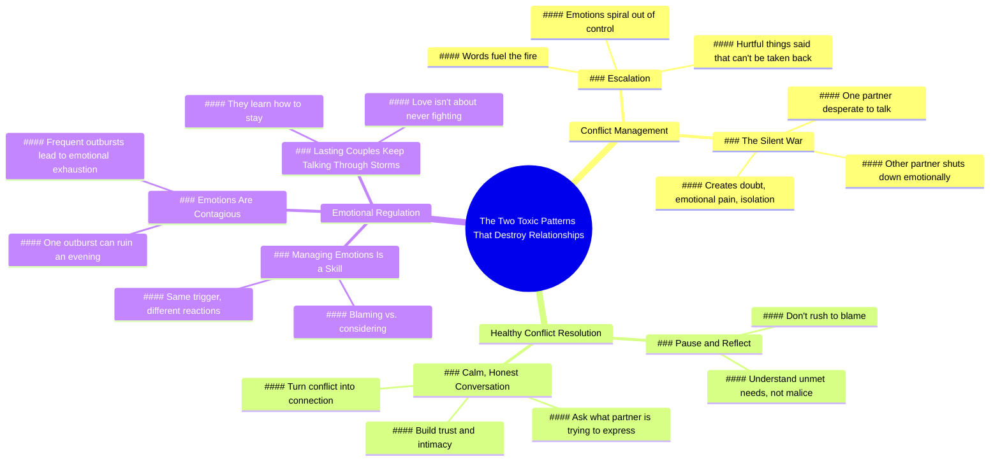

# Two Toxic Conflict Patterns That Ruin Loving Couples

> 🌐 **Read this in:** [English](../../en/2026-06/tiktok-transcript-even-the-most-loving-couples-can-t-last-if-they-fall-into-th-d3ec.md) · **中文**

> **Creator:** [@alieen5200](https://www.tiktok.com/@alieen5200) · **Views:** 5.0M · **Posted:** 2026-06-18 · **Niche:** entertainment
>
> **TL;DR:** It creates intrigue by promising a specific, negative outcome for loving couples, making viewers want to know the patterns.

[Watch original video →](https://vm.tiktok.com/ZNR3mkJys/)

## Why This Went Viral

## 钩子（前3秒）
- **逐字开场白：** "即使是最恩爱的情侣，如果陷入这两种有毒的冲突模式，也无法长久。"
- **钩子模式：** 大胆断言 + 数字（"两种有毒模式"）
- **为何能阻止滑动：** 它直接挑战了观众"有爱就足够"的信念，引入了一个隐藏的威胁（有毒模式），并承诺提供具体、可操作的见解（两种模式）。"有毒"一词触发了情感警报。

## 情感节奏
- **节拍1 – 好奇/兴趣：** "你真的想过是什么让一段关系长久吗？"（反问句，引发自我反思）
- **节拍2 – 紧张/挑战：** "但事实是，如果没有两个关键的心理特质……"（颠覆常见假设，制造紧迫感）
- **节拍3 – 紧张升级：** 描述"升级"和"无声战争"——生动的比喻（"把两支火炬扔进一池汽油"）引发内心的不适感
- **节拍4 – 解脱/希望：** "但有一种更好的方式"——转向解决方案，情感释放
- **节拍5 – 共鸣/怀旧：** "我们结婚不是为了永远痛苦"——结尾语作为普遍真理落地，带来情感上的收束
- **高潮时刻：** 盐的例子中"一个人爆发"与"一个人思考"的对比——它将整个冲突动态浓缩在一个单一、 relatable 的微观场景中

## 关键词密度
| 词语/短语 | 频率（约） | 驱动类型 |
|---|---|---|
| **冲突** | 8 | 算法驱动（高搜索量 + 关系领域） |
| **有毒** | 3 | 情感拉动（触发恐惧/回避） |
| **模式** | 3 | 算法驱动（教育/自助类别） |
| **情感** | 6 | 情感拉动（与痛点共鸣） |
| **情侣** | 6 | 算法驱动（关系内容） |
| **长久** | 4 | 情感拉动（希望/渴望） |
| **交谈/沟通** | 5 | 情感拉动（可操作的解决方案） |
| **指责** | 2 | 情感拉动（内疚/羞耻触发） |
| **管理** | 2 | 算法驱动（基于技能的搜索词） |

- **算法驱动：** "冲突"、"模式"、"情侣"、"管理"——这些是关系建议领域中高搜索量、低竞争的关键词。
- **情感拉动驱动：** "有毒"、"情感"、"长久"、"指责"——这些激活了恐惧、希望和自我认知，增加了观看时长和分享。

## 为何能传播
1. **"隐藏威胁"框架** – "即使是最恩爱的情侣，如果……也无法长久"制造了一个谜题。观众感到必须观看，以确认自己是否脆弱。这正是"稀缺/回避"病毒式传播触发器的模式。（例如："没有两个关键的心理特质，所有那些所谓的优势很容易被给予别人。"）
2. **"两种有毒模式"结构** – 视频精确指出了两种模式（升级、无声战争）。这是经典的"列表式"格式，适用于短视频。它易于记忆、易于分享（"如果你经历过这个，@你的伴侣"），并且显得权威。（例如："第一种有毒模式是升级……第二种是无声战争。"）
3. **"盐"的微观例子** – "这太咸了"与"宝贝，下次少放点盐就好"之间的对比是一个完美的5秒微故事。它如此 relatable，以至于观众立刻自我认同，创造了"那就是我！"的时刻，推动评论和分享。（例如："一个人指责，一个人思考，这个区别改变了一切。"）
4. **"希望 + 可操作解决方案"转向** – 在制造紧张之后，视频提供了一个清晰、简单的解决方案："暂停并反思"、"冷静、诚实的对话"。这防止了观众感到绝望（否则他们会滑走）。相反，他们感到被赋能，增加了保存或分享的可能性。（例如："他们冷静下来，问自己：我的伴侣想表达什么？"）
5. **结尾语作为行动号召** – "我们结婚不是为了永远痛苦"是一句普遍、充满情感力量的台词。它作为一个"可分享的引语"，观众可以截图、发布或发给伴侣。它也创造了一种社区感（"我们都在一起"）。

## 你可以借鉴什么
1. **"隐藏威胁"开场** – 以命名一个*具体、常见的信念*开始你的视频，然后立即颠覆它。例如："你以为干净的厨房能保持关系健康？实际上，恰恰相反。"这种模式适用于任何领域（健身、理财、育儿）。
2. **"微观例子"夹层** – 在你的大主张之间，插入一个5秒、超级 relatable 的例子（比如盐的场景）。它打破了教育性的语气，创造了一个情感锚点，并使概念深入人心。为你的下一个视频，挑选一个完美说明你观点的日常时刻。
3. **"两种模式"结构** – 将你自己限制在恰好两种模式、两个错误或两个解决方案。这是最易分享的数字（不多不少）。将你的脚本写成："有两种方式会出错。第一……第二……但这里有更好的方式。"然后以一句令人难忘的、感觉像要点的台词结束。

## Mind Map

## Full Transcript (Generated by [TokTranscript](https://toktranscript.com/?utm_source=github&utm_medium=breakdown&utm_campaign=tool_attribution))

> 📝 Transcripts on this page are auto-generated and show the first 60%. Want to transcribe any TikTok in 30 seconds and get the full version? [Try TokTranscript free →](https://toktranscript.com/?utm_source=github&utm_medium=breakdown&utm_campaign=transcript_cta)

Even the most loving couples can't last if they fall into these two toxic patterns of conflict. Have you ever really thought about what makes a relationship last? You might think it's generosity, spending time together, doing chores or staying loyal. But the truth is without two key psychological traits, all those so called strengths can easily be given to someone else. Most breakups don't happen because people stop loving each other. They happen because they can't keep moving forward together. Psychology shows that long lasting couples share two essential abilities. The first is conflict management. In close relationships, arguments are inevitable. The deeper the love, the more frequent the conflict. But the issue isn't whether you fight, it's how you fight. The first toxic pattern is escalation, like throwing two torches into a pool of gasoline. Each word fuels the fire. Emotions spiral out of control and hurtful things are said that can't be taken back. The second is the silent war. One partner is desperate to talk while the other shuts down emotionally. The silent one avoids while the talkative one explodes from feeling ignored. This mismatch creates doubt, emotional pain and isolation. But there is a better way, one that strong couples use when conflict arises. They don't rush to blame. They pause and reflect. They understand that most hurtful words come from unmet needs, not malice. They calm down and ask themselves, what is my partner trying to express? Attention, comfort, a sen

*[Read the full transcript on TokTranscript →](https://toktranscript.com/plaza/tiktok-transcript-even-the-most-loving-couples-can-t-last-if-they-fall-into-th-d3ec?utm_source=github&utm_medium=breakdown&utm_campaign=transcript_full)*

## Browse More

- All [entertainment](../../by-niche/zh-CN/entertainment.md) breakdowns
- All [Curiosity Gap](../../by-pattern/zh-CN/hook-curiosity-gap.md) examples

## Video Info

| | |
|---|---|
| Creator | [@alieen5200](https://www.tiktok.com/@alieen5200) |
| Original video | [https://vm.tiktok.com/ZNR3mkJys/](https://vm.tiktok.com/ZNR3mkJys/) |
| Original title | Even the most loving couples can’t last if they fall into these two t... |
| Views | 5.0M (5000000) |
| Posted | 2026-06-18 |
| Duration | 0s |
| Niche | `entertainment` |
| Hook pattern | `Curiosity Gap` |
| Original language | `en` (this page translated by AI) |
| Available languages | en, zh-CN |
| Generated | 2026-06-19 by [TokTranscript](https://toktranscript.com/) |

---

*This breakdown is for educational analysis under fair use. Original video © [@alieen5200](https://www.tiktok.com/@alieen5200). All transcripts are auto-generated and may contain errors.*

*Want to analyze your own TikToks like this? [TokTranscript →](https://toktranscript.com/viral-breakdown?utm_source=github&utm_medium=breakdown&utm_campaign=footer_cta)*