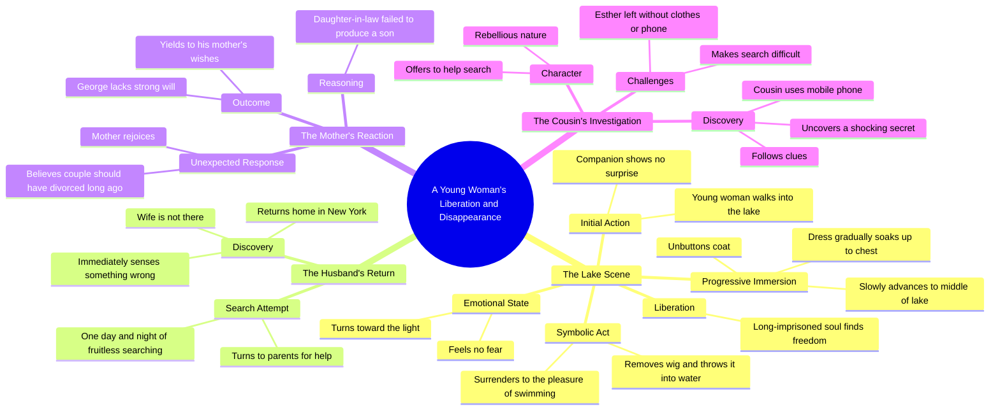

# Young Girl Walks Into Lake in Dress Without Fear

> 🌐 **Read this in:** [English](../../en/2026-06/tiktok-transcript-flim-movie-tvshow-fyp-2dc2.md) · **中文**

> **Creator:** [@mqosogr1y1](https://www.tiktok.com/@mqosogr1y1) · **Views:** 330.2K · **Posted:** 2026-06-05 · **Niche:** other
>
> **TL;DR:** A woman walking into a lake without explanation creates immediate intrigue and emotional tension.

[Watch original video →](https://www.tiktok.com/@mqosogr1y1/video/7644002596205759777?is_from_webapp=1&sender_device=pc&web_id=7639608621630375438)

## Why This Went Viral

## 钩子（前3秒）
- **原文：** "年轻女子在沙滩上缓缓走入水中，低得恰到好处，而她的同伴却毫不惊讶……"
- **钩子模式：** 场景设定/电影叙事（一个缓慢、视觉化的开场，暗示着神秘）
- **为何能阻止滑动：** 描述刻意模糊且充满感官细节（水、衣物、同伴的沉默），立刻引发好奇。观众必须看下去才能理解发生了什么以及为什么。

## 情感节奏
- **节拍1 – 好奇/神秘：** 女子走进水中，慢慢脱去衣物。没有解释。观众在问：*她为什么要这样做？*
- **节拍2 – 紧张 + 悬念：** 她摘下假发，扔进水里，开始游泳。"她长久被囚禁的灵魂终于找到了自由"这句话暗示了更深层的情感释放。
- **节拍3 – 反转 / 解脱：** 场景切换到纽约——丈夫回家，妻子不见了。观众意识到这是一场失踪，而非自杀。
- **节拍4 – 挫败 / 共鸣：** 婆婆欣喜若狂。丈夫屈服于她。这引发了愤怒和共情。
- **节拍5 – 高潮：** 表弟发现了"一个令人震惊的秘密"——一个要求下一集或重看的悬念结尾。
- **高潮时刻：** "表弟拿起手机，顺着线索发现了一个令人震惊的秘密"——最后一句话是情感巅峰。

## 关键词密度
| 关键词/短语 | 频率（约） | 算法覆盖 | 情感吸引力 |
|-------------|-----------|---------|-----------|
| "自由" | 1（但为核心） | 低 | 高——核心情感主题 |
| "丈夫" | 2 | 中 | 高——关系冲突 |
| "母亲" | 2 | 中 | 高——家庭紧张 |
| "令人震惊的秘密" | 1（结尾） | 高（标题党） | 极高——悬念结尾 |
| "假发" | 1 | 低（独特） | 高——象征性、令人难忘 |
| "调查" | 2 | 中 | 中——程序性紧张 |
| "儿子" | 1 | 低 | 高——文化压力 |
| "纽约" | 1 | 高（地点） | 中——场景对比 |
| "表弟" | 2 | 中 | 中——角色作用 |
| "游泳" | 1 | 低 | 高——感官释放 |

**算法驱动因素：** "令人震惊的秘密"、"丈夫"、"纽约"——这些触发好奇心和搜索相关性。
**情感驱动因素：** "自由"、"假发"、"儿子"——这些具有象征意义、唤起情感且承载文化内涵。

## 为何能传播
1. **悬念结尾 + 神秘结构：** 最后一句（"发现了一个令人震惊的秘密"）是经典的开放式循环。观众评论、@朋友或要求第二集。这推动了互动信号（评论、分享、收藏）。
2. **文化禁忌 + 情感释放：** 故事涉及女性逃离控制型婚姻、只重视男性继承人的婆婆以及屈服的丈夫。这引发了强烈的情感反应（愤怒、共情、认同）——正是让人愿意分享的那种。
3. **视觉 + 叙事对比：** 宁静的湖景（自由、水、摘假发）与紧张的纽约场景（失踪、家庭冲突）形成了惊人的情感冲击。这种对比极具分享性，因为它感觉像电影般且出人意料。
4. **假发作为象征：** 摘假发是一个强有力的视觉隐喻，象征着摆脱身份。它易于描述、易于想象且情感共鸣——使其成为观众在评论中重复引用的时刻。
5. **"好角色"（表弟）vs."坏家庭"：** 表弟是唯一的盟友。这创造了清晰的道德界限——观众支持表弟，反对婆婆。这种道德清晰度推动了互动（人们评论"希望表弟找到她"）。

## 你可以借鉴的
1. **用缓慢、感官化的场景开场，提出一个问题。** 不要立即解释利害关系。让观众先问"发生了什么？"然后再揭示冲突。这能为你赢得5-10秒的留存时间。
2. **每个视频都以承诺秘密或揭示的悬念结尾。** 使用像"发现了一个令人震惊的秘密"或"接下来我发现的东西改变了一切"这样的句子。这能推动收藏、分享和第二集的请求。
3. **使用一个单一、有力的象征（如假发）来代表情感核心。** 一个观众能想象和讨论的具体物体能让你的故事更易引用和分享。如果这个物体在视觉上引人注目或承载文化内涵，则效果更佳。

## Mind Map

## Full Transcript (Generated by [TokTranscript](https://toktranscript.com/?utm_source=github&utm_medium=breakdown&utm_campaign=tool_attribution))

> 📝 Transcripts on this page are auto-generated and show the first 60%. Want to transcribe any TikTok in 30 seconds and get the full version? [Try TokTranscript free →](https://toktranscript.com/?utm_source=github&utm_medium=breakdown&utm_campaign=transcript_cta)

la jeune fille haut assez bas sur la plage sans que sa compagne ne s'en étonne elle défaite ensuite les boutons de son manteau et avance lentement vers le milieu du lac elle ou imprégna progressivement sa robe puis monta jusqu'à sa poitrine et terre n'éprouvait aucune peur tourne et vers la lumière elle retire sa perruque et la jeta dans l'eau puis se laissa aller au plaisir de nager son âme longtemps emprisonnée trouva enfin la liberté à New York son mari rentra chez lui et ne trouva pas sa femme il compris aussitôt que quelque chose clochait après 1 journée et 1 nuit de recherche infructueuse il retourna demander de l'aide à ses parents contre toute attente

*[Read the full transcript on TokTranscript →](https://toktranscript.com/plaza/tiktok-transcript-flim-movie-tvshow-fyp-2dc2?utm_source=github&utm_medium=breakdown&utm_campaign=transcript_full)*

## Browse More

- All [other](../../by-niche/zh-CN/other.md) breakdowns
- All [Mysterious Action](../../by-pattern/zh-CN/hook-mysterious-action.md) examples

## Video Info

| | |
|---|---|
| Creator | [@mqosogr1y1](https://www.tiktok.com/@mqosogr1y1) |
| Original video | [https://www.tiktok.com/@mqosogr1y1/video/7644002596205759777?is_from_webapp=1&sender_device=pc&web_id=7639608621630375438](https://www.tiktok.com/@mqosogr1y1/video/7644002596205759777?is_from_webapp=1&sender_device=pc&web_id=7639608621630375438) |
| Original title | #flim #movie #tvshow #fyp  |
| Views | 330.2K (330200) |
| Posted | 2026-06-05 |
| Duration | 0s |
| Niche | `other` |
| Hook pattern | `Mysterious Action` |
| Original language | `en` (this page translated by AI) |
| Available languages | en, zh-CN |
| Generated | 2026-06-06 by [TokTranscript](https://toktranscript.com/) |

---

*This breakdown is for educational analysis under fair use. Original video © [@mqosogr1y1](https://www.tiktok.com/@mqosogr1y1). All transcripts are auto-generated and may contain errors.*

*Want to analyze your own TikToks like this? [TokTranscript 转录工具 →](https://toktranscript.com/viral-breakdown?utm_source=github&utm_medium=breakdown&utm_campaign=footer_cta)*