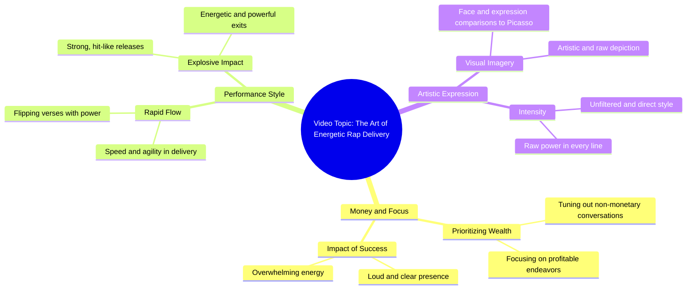

# Denim Pants Recommendation for Style and Fit

> 🌐 **Read this in:** [English](../../en/2026-06/tiktok-transcript-foryou-fyp-pants-pantsrecommendation-denimpants-1fa7.md) · **中文**

> **Creator:** [@milesmrls2](https://www.tiktok.com/@milesmrls2) · **Views:** 608.6K · **Posted:** 2026-06-20 · **Niche:** other
>
> **TL;DR:** The hook uses a conditional statement about money to immediately grab attention and set a confident, dismissive tone.

[Watch original video →](https://www.tiktok.com/@milesmrls2/video/7650604969803943188)

## Why This Went Viral

## 钩子（前3秒）
- **逐字开场白：** "是啊，如果这跟钱没关系，那谈话我就听不见"
- **钩子模式：** 对比/大胆宣言 — "如果跟钱无关，我就听不见对话"
- **为何能阻止滑动：** 瞬间传递出高风险、以金钱为中心的心态。原始自信的表达和Taglish语码转换营造出对菲律宾观众的真实感和亲切感，让他们对讲述者的成功故事产生好奇。

## 情感节奏
- **节拍1 – 好奇：** 开场白引发"这跟钱有什么关系？"的悬念。
- **节拍2 – 紧张：** "已经在赚钱了，那场面大得让你震耳欲聋" — 用响亮、侵略性的能量建立强度。
- **节拍3 – 升级：** "有种强大的气场，一出来就爆发命中" — 引入爆炸性的成功意象。
- **节拍4 – 惊喜/转折：** "脸上有冲击力，像毕加索一样狂野" — 意外的艺术引用（毕加索）将吹嘘从街头层面提升到创意天才。
- **高潮：** "只是随便说说而已" — 最后的点睛之笔以力量与淡然并存的方式落地，让观众印象深刻或忍俊不禁。

## 关键词密度
1. **"pera"（钱）** – 算法覆盖（高搜索量，财务野心）
2. **"lakas"（力量/权力）** – 情感吸引力（自信，主导力）
3. **"magtrip" / "trip"** – 情感吸引力（俏皮，不可预测的能量）
4. **"pumotok"（爆发）** – 情感吸引力（病毒式传播的隐喻）
5. **"Picasso"（毕加索）** – 算法覆盖（文化参考，可搜索的名字）
6. **"mabingi"（震聋）** – 情感吸引力（感官强度，夸张）
7. **"ganito"（像这样）** – 情感吸引力（示范性，引发模仿）

*"Pera"和"Picasso"驱动可发现性；"lakas"、"pumotok"和"mabingi"激发情感参与。*

## 为何能传播
1. **共鸣的奋斗文化：** "如果这跟钱没关系，那谈话我就听不见" — 触及菲律宾人对财务成功的普遍渴望，让观众感到被理解。
2. **意外的精致感：** 毕加索的引用（"脸上有冲击力，像毕加索一样狂野"）将街头吹嘘提升为艺术隐喻，让观众感到惊喜，并使其因"聪明炫技"而易于分享。
3. **高能量表达：** 快速连珠炮般的、近乎音乐性的节奏（"有种强大的气场，一出来就爆发命中"）模仿了病毒式说唱或节拍，鼓励反复观看和混音。
4. **夸张的感官语言：** "震耳欲聋"和"爆发命中"创造了生动、可做成表情包的意象，观众可以轻松引用或混音。
5. **文化特异性：** Taglish + 街头俚语 + 毕加索 = 一种既本土又全球的独特融合，同时吸引菲律宾侨民和嘻哈粉丝。

## 你可以借鉴什么
1. **以大胆、与金钱相关的宣言开场** — "如果跟钱无关，我就听不见你说话"瞬间吸引渴望财务成功的观众。用你的母语直接、自信地表达，以增加真实感。
2. **将街头俚语与意想不到的高雅引用混合** — 在吹嘘中插入像"毕加索"或"爱因斯坦"这样的名字，制造惊喜和智力吸引力。这让内容显得更聪明、更易分享。
3. **使用爆炸性的感官动词** — 像"爆发"、"震聋"和"命中"这样的词语创造生动的心理意象。用充满动作、近乎暴力的词语（"我炸翻了游戏"）替代通用动词（"我赚了钱"）。

## Mind Map

## Full Transcript (Generated by [我们用的转录工具](https://toktranscript.com/?utm_source=github&utm_medium=breakdown&utm_campaign=tool_attribution))

> 📝 Transcripts on this page are auto-generated and show the first 60%. Want to transcribe any TikTok in 30 seconds and get the full version? [Try TokTranscript free →](https://toktranscript.com/?utm_source=github&utm_medium=breakdown&utm_campaign=transcript_cta)

Yeah, pag hindi to ko sa pera, yung usapang ba'y di ko marinig Kumikita na sa para, ang sagaran yung lakas ka mabingi Yeah, pag hindi to ko sa pera, yung usapang ba'y di ko marinig Yung puto maboy pagspeed, ganito pa

*[Read the full transcript on TokTranscript →](https://toktranscript.com/plaza/tiktok-transcript-foryou-fyp-pants-pantsrecommendation-denimpants-1fa7?utm_source=github&utm_medium=breakdown&utm_campaign=transcript_full)*

## Browse More

- All [other](../../by-niche/zh-CN/other.md) breakdowns
- All [conditional attention grabber](../../by-pattern/zh-CN/hook-conditional-attention-grabber.md) examples

## Video Info

| | |
|---|---|
| Creator | [@milesmrls2](https://www.tiktok.com/@milesmrls2) |
| Original video | [https://www.tiktok.com/@milesmrls2/video/7650604969803943188](https://www.tiktok.com/@milesmrls2/video/7650604969803943188) |
| Original title | #foryou #fypシ #pants #pantsrecommendation #denimpants  |
| Views | 608.6K (608600) |
| Posted | 2026-06-20 |
| Duration | 0s |
| Niche | `other` |
| Hook pattern | `conditional attention grabber` |
| Original language | `en` (this page translated by AI) |
| Available languages | en, zh-CN |
| Generated | 2026-06-22 by [TokTranscript](https://toktranscript.com/) |

---

*This breakdown is for educational analysis under fair use. Original video © [@milesmrls2](https://www.tiktok.com/@milesmrls2). All transcripts are auto-generated and may contain errors.*

*Want to analyze your own TikToks like this? [免费 TikTok 文稿生成器 →](https://toktranscript.com/viral-breakdown?utm_source=github&utm_medium=breakdown&utm_campaign=footer_cta)*