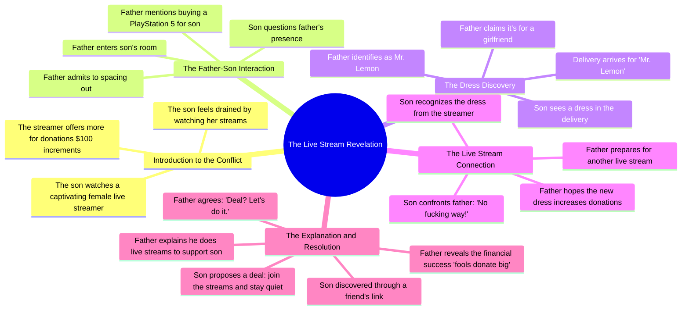

# Fruit Seller's Emotional AI Story

> 🌐 **Read this in:** [English](../../en/2026-06/tiktok-transcript-fruits-fruit-ai-aistory-emotional-emotionalstory-56ca.md) · **中文**

> **Creator:** [@newsusaword](https://www.tiktok.com/@newsusaword) · **Views:** 7.3M · **Posted:** 2026-06-25 · **Niche:** entertainment
>
> **TL;DR:** The promise of revealing more for donations hooks viewers with curiosity and a transactional tease.

[Watch original video →](https://www.tiktok.com/@newsusaword/video/7653120518261886240?is_from_webapp=1&sender_device=pc)

## Why This Went Viral

## 钩子（前3秒）
- **逐字开场白：**"哇，那个漂亮女孩让我疯狂。"
- **钩子模式：**场景 + 情感反应（偷窥式好奇）
- **为何能阻止滑动：**这句话模棱两可——这是一个男人在垂涎一个女孩吗？它立即制造了一种"我在看什么？"的紧张感，需要上下文来解答。这种直白、忏悔式的语气让人感觉像是在偷听一个私密时刻。

## 情感节奏
- **节拍1——好奇/紧张：**儿子观看一个"漂亮女孩"的直播，并承认上瘾。观众心想：*这是一个舔狗故事吗？*
- **节拍2——困惑/悬念：**爸爸走进来，儿子藏起手机。爸爸说他走神了。观众感觉有些不对劲。
- **节拍3——释然/温暖：**爸爸提供买PS5的钱。儿子欣喜若狂。紧张感下降。
- **节拍4——转折/震惊：**儿子看到那条裙子。意识到"漂亮女孩"是他爸爸。观众的心理模型崩塌。
- **节拍5——黑色幽默/共鸣：**爸爸解释他这样做是为了支持儿子。儿子说"傻瓜才会打赏大钱。"他们决定联手。高潮：揭露真相 + 相互堕落。
- **高潮时刻：**"等等，我认识那条裙子，爸！不会吧！"——观众假设被颠覆的精确瞬间。

## 关键词密度
- **"直播/直播流"**（6次）——算法钩子；平台会提升直播内容标签。
- **"打赏/捐赠"**（4次）——经济紧张感驱动情感吸引力；暗示"金钱戏码"。
- **"爸爸/父亲"**（5次）——核心关系锚点；驱动家庭+背叛的共鸣。
- **"漂亮女孩/辣妹"**（3次）——初始吸引力的诱饵；制造虚假前提。
- **"支持你/支持"**（2次）——情感回报；将爸爸的行为重新定义为牺牲。
- **"傻瓜"**（1次）——愤世嫉俗的冲击；让观众因"看穿"骗局而觉得自己聪明。

**算法覆盖驱动因素：**"直播"、"打赏"。
**情感吸引力驱动因素：**"爸爸"、"支持你"、"傻瓜"。

## 为何能传播
1. **"等等，什么？"的转折**——裙子的揭露颠覆了整个前提。观众会重看以捕捉线索（爸爸"走神"的台词、PS5的贿赂）。可分享性来自震惊值。*具体台词："等等，我认识那条裙子，爸！"*
2. **家庭背叛+救赎弧线**——儿子羞辱爸爸，然后立即加入骗局。这创造了一个"禁忌的联结"时刻，既感觉不对又温馨。*具体台词："让我加入，我就保持沉默。成交？"*
3. **男性虚荣的尴尬喜剧**——爸爸打扮成"漂亮女孩"来骗孤独男人，这很荒谬。它引发了"我不敢相信这是真的"的反应，推动评论和分享。*具体台词："我希望这条新裙子能带来更多打赏。"*
4. **为续集留下的开放循环**——儿子加入骗局，建立了"他们一起干"的动态。观众想看到下一次直播。*具体台词："我们干吧。"*
5. **算法金矿**——高留存率（转折在视频约60%处）、高情感强度（笑声+震惊）、以及清晰的"反应诱饵"结构。*具体台词："该死，那个辣妹今晚又直播了。"*

## 你可以借鉴什么
1. **"虚假前提"钩子**——从一个强烈、可共鸣的情感（欲望、挫败、上瘾）开始，观众以为是一回事，然后揭示它完全是另一回事。适用于任何领域——只需将"漂亮女孩"换成你受众表面上的欲望。
2. **"双重转折"结构**——第一个转折：爸爸是主播。第二个转折：儿子加入。这创造了两个可分享的"啊哈"时刻。规划你的视频，使第一个转折在30%处落地，第二个在70%处。
3. **"堕落作为联结"的回报**——以一个道德模糊的结局收尾，感觉令人满足但不对。观众喜欢分享让他们觉得自己"在笑话里"的内容。使用像"成交？我们干吧"这样的台词来闭合循环并邀请续集。

## Mind Map

## Full Transcript (Generated by [TokTranscript](https://toktranscript.com/?utm_source=github&utm_medium=breakdown&utm_campaign=tool_attribution))

> 📝 Transcripts on this page are auto-generated and show the first 60%. Want to transcribe any TikTok in 30 seconds and get the full version? [Try TokTranscript free →](https://toktranscript.com/?utm_source=github&utm_medium=breakdown&utm_campaign=transcript_cta)

Wow, that gorgeous girl drives me crazy. For every $100 in donations, I'll show a little more. My loves. Damn, I need to stop watching her live streams. She completely wears me out. I can't do these live streams anymore. The important thing is they're making a lot of money. What are you doing here, son? I live here, dad, are you losing your mind? Haha, I just spaced out for a second. Son, I got the money to buy the PlayStation 5 you asked for. Son. Damn, dad, you're the best! Haha, can you get the door for me? Someone's there. Delivery for Mr. Lemon. Yes, he's my father. Dad, whose dress is that? It's for a girl I've been seeing. Haha,

*[Read the full transcript on TokTranscript →](https://toktranscript.com/plaza/tiktok-transcript-fruits-fruit-ai-aistory-emotional-emotionalstory-56ca?utm_source=github&utm_medium=breakdown&utm_campaign=transcript_full)*

## Browse More

- All [entertainment](../../by-niche/zh-CN/entertainment.md) breakdowns
- All [Curiosity gap + Incentive](../../by-pattern/zh-CN/hook-curiosity-gap-incentive.md) examples

## Video Info

| | |
|---|---|
| Creator | [@newsusaword](https://www.tiktok.com/@newsusaword) |
| Original video | [https://www.tiktok.com/@newsusaword/video/7653120518261886240?is_from_webapp=1&sender_device=pc](https://www.tiktok.com/@newsusaword/video/7653120518261886240?is_from_webapp=1&sender_device=pc) |
| Original title | #fruits #fruit #ai #aistory #emotional #emotionalstory  |
| Views | 7.3M (7300000) |
| Posted | 2026-06-25 |
| Duration | 0s |
| Niche | `entertainment` |
| Hook pattern | `Curiosity gap + Incentive` |
| Original language | `en` (this page translated by AI) |
| Available languages | en, zh-CN |
| Generated | 2026-06-26 by [TokTranscript](https://toktranscript.com/) |

---

*This breakdown is for educational analysis under fair use. Original video © [@newsusaword](https://www.tiktok.com/@newsusaword). All transcripts are auto-generated and may contain errors.*

*Want to analyze your own TikToks like this? [TikTok 转录工具 →](https://toktranscript.com/viral-breakdown?utm_source=github&utm_medium=breakdown&utm_campaign=footer_cta)*