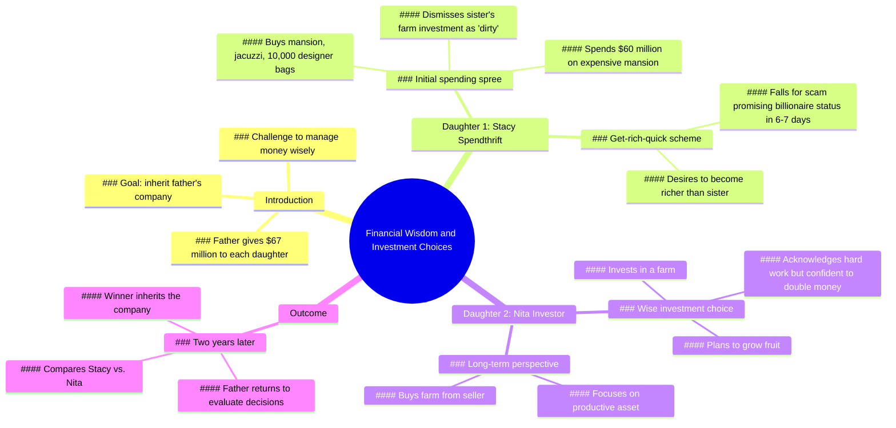

# Father Tests Daughters With $67 Million Each

> 🌐 **Read this in:** [English](../../en/2026-06/tiktok-transcript-he-gave-the-money-to-his-daughters-as-a-test-storyline-fruit-e256.md) · **中文**

> **Creator:** [@berry.boss.story](https://www.tiktok.com/@berry.boss.story) · **Views:** 2.3M · **Posted:** 2026-06-26 · **Niche:** entertainment
>
> **TL;DR:** The staggering amount of money immediately grabs attention and sets up a high-stakes scenario.

[Watch original video →](https://www.tiktok.com/@berry.boss.story/video/7655419430658198817?is_from_webapp=1&sender_device=pc)

## Why This Went Viral

## 钩子（前3秒）
- **原话开场：**“我的女儿们，每个手提箱里有6700万美元。6700万美元？”
- **钩子模式：**数字+大胆断言（具体金额立即制造悬念）
- **为何能阻止滑动：**精确且庞大的数字（6700万美元）瞬间引发好奇与怀疑。女儿的反问（“6700万美元？”）强化了荒诞感，让观众忍不住想看后续。

## 情感节奏
- **节拍1 – 好奇与悬念：**父亲给每个女儿6700万美元，设置一个考验。
- **节拍2 – 紧张（姐姐A）：**斯泰西选择挥霍（豪宅、按摩浴缸、名牌包）→ 制造尴尬/对失败的预期。
- **节拍3 – 对比（妹妹B）：**妮塔选择农场 → 出人意料的智慧，点燃希望。
- **节拍4 – 嘲讽与紧张：**斯泰西嘲笑妮塔的农场选择 → 观众同情心转移，赌注升级。
- **节拍5 – 反转与高潮：**“两年过去了” → 时间跳跃揭示结果。赢家继承公司。
- **节拍6 – 结局：**观众猜测哪位姐妹获胜，留下悬念，激发评论互动。

## 关键词密度
- **“6700万美元”**（5次）– 算法覆盖：具体数字触发高点击率和留存率。
- **“钱”/“更富有”**（6次）– 情感吸引：对财富的普遍渴望。
- **“农场”**（4次）– 情感吸引：逆袭象征（辛勤工作 vs. 奢华生活）。
- **“姐妹”**（4次）– 情感吸引：姐妹竞争引发共鸣。
- **“赢家”/“继承”**（2次）– 算法覆盖：竞争类关键词提升互动率。
- **“哈哈哈！”**（3次）– 情感吸引：笑声引导观众产生对斯泰西的优越感。

## 为何能传播
1. **高赌注对比驱动互动：**父亲的考验（挥霍 vs. 投资）映射现实中的财务辩论。观众评论“斯泰西真蠢”或“妮塔真聪明”——助长争论式病毒传播。
2. **悬念结局迫使重看和评论：**“谁赢了？”从未揭晓。观众必须评论猜测或重看寻找线索，提升留存率和算法信号。
3. **共鸣的姐妹竞争+夸张消费：**斯泰西的“1万个设计师包”荒诞具体，易于成为梗和分享。观众@朋友：“这就是我们。”
4. **时间跳跃创造叙事回报：**“两年后”是经典故事结构，奖励坚持观看的观众，增加观看时长和完成率。
5. **分层音频钩子：**每句台词后的“哈哈哈！”笑声像巴甫洛夫条件反射——观众期待下一个笑声，减少流失。

## 你可以借鉴的
1. **以具体、震撼的数字开头：**用精确的金额或统计数据（如“6700万美元”而非“很多钱”）开场，立即引发好奇，阻止滑动。
2. **使用“考验”框架，搭配两种对比结果：**设置清晰的A vs. B场景（挥霍 vs. 投资，聪明 vs. 愚蠢），激发评论区的争论——算法偏爱两极分化。
3. **以悬念结尾，不给出答案：**视频中绝不回答核心问题。迫使观众评论猜测、重看或分享以获取答案——这直接提升病毒传播指标。

## Mind Map

## Full Transcript (Generated by [拆解你自己的 TikTok](https://toktranscript.com/?utm_source=github&utm_medium=breakdown&utm_campaign=tool_attribution))

> 📝 Transcripts on this page are auto-generated and show the first 60%. Want to transcribe any TikTok in 30 seconds and get the full version? [Try TokTranscript free →](https://toktranscript.com/?utm_source=github&utm_medium=breakdown&utm_campaign=transcript_cta)

My daughters, there are $67 million in each suitcase. $67 million? Give it to me. Manage the money wisely. I want to see your results when I get back. Alright girl, what are you gonna do with the money? I will buy a mansion, a jacuzzi and 10,000 designer bags. Hahaha! Sir, I would like to invest my money in this farm. Sell it to me and I will grow plenty of fruit here. This farm is a lot of work. Young lady, are you sure about this? Yes sir. I will double my money. Alright then. You got it. I wanna buy this expensive 6 7 mansion. That would be $60 million. I don't care. I can afford everything I want. Hahaha! M

*[Read the full transcript on TokTranscript →](https://toktranscript.com/plaza/tiktok-transcript-he-gave-the-money-to-his-daughters-as-a-test-storyline-fruit-e256?utm_source=github&utm_medium=breakdown&utm_campaign=transcript_full)*

## Browse More

- All [entertainment](../../by-niche/zh-CN/entertainment.md) breakdowns
- All [Shock and Awe](../../by-pattern/zh-CN/hook-shock-and-awe.md) examples

## Video Info

| | |
|---|---|
| Creator | [@berry.boss.story](https://www.tiktok.com/@berry.boss.story) |
| Original video | [https://www.tiktok.com/@berry.boss.story/video/7655419430658198817?is_from_webapp=1&sender_device=pc](https://www.tiktok.com/@berry.boss.story/video/7655419430658198817?is_from_webapp=1&sender_device=pc) |
| Original title | he gave the money to his daughters as a test #storyline #fruit #daugh... |
| Views | 2.3M (2300000) |
| Posted | 2026-06-26 |
| Duration | 0s |
| Niche | `entertainment` |
| Hook pattern | `Shock and Awe` |
| Original language | `en` (this page translated by AI) |
| Available languages | en, zh-CN |
| Generated | 2026-06-27 by [TokTranscript](https://toktranscript.com/) |

---

*This breakdown is for educational analysis under fair use. Original video © [@berry.boss.story](https://www.tiktok.com/@berry.boss.story). All transcripts are auto-generated and may contain errors.*

*Want to analyze your own TikToks like this? [TokTranscript →](https://toktranscript.com/viral-breakdown?utm_source=github&utm_medium=breakdown&utm_campaign=footer_cta)*