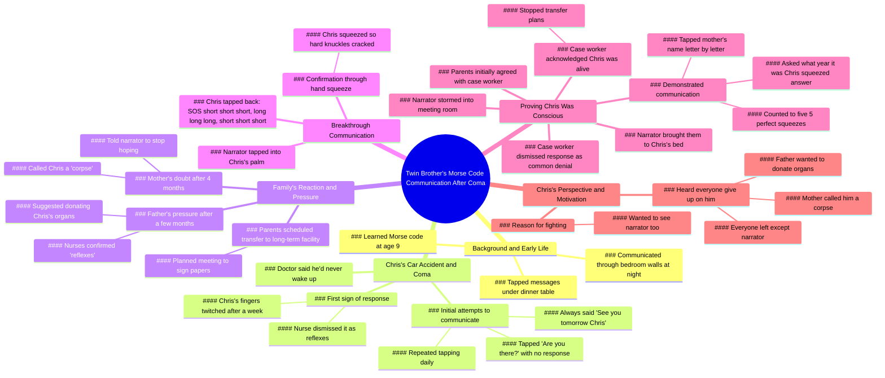

# He Tapped Back: Morse Code With Twin Brother After Accident

> 🌐 **Read this in:** [English](../../en/2026-06/tiktok-transcript-he-tapped-back-3danimation-animationart-digitalart-ed-2eee.md) · **中文**

> **Creator:** [@hisytstory](https://www.tiktok.com/@hisytstory) · **Views:** 50.6M · **Posted:** 2026-06-08 · **Niche:** entertainment
>
> **TL;DR:** Establishes an intimate, secret bond that becomes the emotional anchor for the entire story.

[Watch original video →](https://www.tiktok.com/@hisytstory/video/7628001000472775949)

## Why This Went Viral

## 钩子（前3秒）
- **逐字开场白：**"我和双胞胎兄弟克里斯9岁那年学会了摩尔斯电码"
- **钩子模式：**场景设定+好奇心缺口（作为童年秘密的摩尔斯电码）
- **为何能阻止滑动：**"双胞胎"一词瞬间引发好奇，"摩尔斯电码"预示着独特而私密的故事。钩子构建了一种共享的暗语，让观众忍不住想一探究竟。

## 情感节奏
1. **怀旧/温暖**（童年时在桌下玩摩尔斯电码游戏）
2. **恐惧/紧张**（车祸，医生说再也醒不过来）
3. **绝望/希望**（敲击"你在吗"→沉默）
4. **韧性**（每日敲击，"明天见"的仪式）
5. **虚假希望/心理操控**（护士、妈妈、爸爸将反应斥为"尸体反射"）
6. **高潮/解脱**（SOS敲击回应→指关节咔咔作响的紧握）
7. **平反**（冲进会议室，证明克里斯还活着）
8. **情感回报**（克里斯透露他听到所有人都放弃了，唯独叙述者没有）
- **高潮时刻：**"短短短长长长短短短 SOS"——数周怀疑后的第一次真实回应。

## 关键词密度
- **"敲击"**（12次以上）——驱动算法：动作动词，有节奏感，易于配字幕。
- **"克里斯"**（10次以上）——个人锚点，情感牵引。
- **"摩尔斯电码"**（6次）——独特、可搜索、激发好奇心。
- **"反射"**（4次）——制造紧张感，与真实回应形成对比。
- **"尸体"**（2次）——震撼、高情感词汇，触发分享欲。
- **"紧握"**（4次）——触觉、本能，强化联系。
- **"捐献"**（3次）——风险、道德困境，让观众保持关注。

**算法触达驱动：**"摩尔斯电码"、"双胞胎"、"SOS"、"车祸"——均为可搜索、高点击率关键词。
**情感牵引驱动：**"尸体"、"反射"、"紧握"、"明天见"——创造本能、值得分享的瞬间。

## 传播原因
1. **不可能的几率+情感回报：**医生、护士、父母都说"反射"——观众本能地期待反抗权威。当克里斯敲出SOS时，解脱感令人畅快。*文字记录："短短短长长长短短短 SOS"*
2. **高风险下的逆袭叙事：**一个9岁男孩对抗整个医疗系统+自己的家人。*台词："你们别想捐献我兄弟的器官"*——展现观众喜爱的反抗精神。
3. **悬念结构：**每段结尾都有小钩子（"什么都没有"、"反射"、"尸体"），迫使观众继续观看。*台词："我不在乎护士怎么说"*——制造紧张感。
4. **结尾情感反转：**克里斯透露他听到所有人都放弃了，唯独叙述者没有——这重新定义了整个故事，成为忠诚的爱情故事。*台词："听到所有人都离开了，只有你还在"*——催泪并引发分享。
5. **可共鸣的暗语：**摩尔斯电码是隐秘联系的普遍象征。观众分享是因为这让他们感觉自己参与了一种特殊纽带。*台词："在餐桌下敲击信息"*——怀旧、令人向往。

## 可借鉴之处
1. **以"暗语"钩子开场：**用独特、私密的细节（密码、仪式、共享的笑话）开始视频，让观众瞬间有"圈内人"的感觉。
2. **用"他们说"制造紧张感：**重复权威人物的轻蔑话语（"反射"、"尸体"），让最终的胜利更加甜蜜。每次重复都提升风险。
3. **以角色的情感揭示结尾：**让"受害者"在高潮后发言——克里斯的最后几句台词将整个故事重新定义为忠诚的见证。这创造了可分享、催泪的点睛之笔。

## Mind Map

## Full Transcript (Generated by [TokTranscript](https://toktranscript.com/?utm_source=github&utm_medium=breakdown&utm_campaign=tool_attribution))

> 📝 Transcripts on this page are auto-generated and show the first 60%. Want to transcribe any TikTok in 30 seconds and get the full version? [Try TokTranscript free →](https://toktranscript.com/?utm_source=github&utm_medium=breakdown&utm_campaign=transcript_cta)

my twin brother Chris and I were 9 when we Learned Morse code we tapped messages under the dinner table when mom told us to stop talking and tapped through the wall between our bedrooms every night when Chris got into a car accident and the doctor said he'd never wake up I pulled up a chair next to his bed took his hand and tapped are you there nothing but I came back the next afternoon and tapped again before I left I always said the same thing see you tomorrow Chris a week later Chris's fingers twitched against mine and I almost fell out of my chair I grabbed a nurse and she barely looked up their reflexes it doesn't mean anything I bought a notebook the next day and started writing down every single one 4 months in mom watched me scribbling and said how long are you gonna keep doing this until he taps back he's not gonna tap back you're talking to a corpse dad lasted a few more months before he pulled me into the hallway we need to talk about donating your brother's organs his fingers move every time I hold his hand dad the nurses said those are reflexes stop getting your hopes up son I don't care what the nurses say you're not donating my brother's organs but a week later my parents called to have Chris transferred to a long term facility to die and scheduled a meeting to sign the papers the afternoon before the meeting I tapped into his palm like always but this time 

*[Read the full transcript on TokTranscript →](https://toktranscript.com/plaza/tiktok-transcript-he-tapped-back-3danimation-animationart-digitalart-ed-2eee?utm_source=github&utm_medium=breakdown&utm_campaign=transcript_full)*

## Browse More

- All [entertainment](../../by-niche/zh-CN/entertainment.md) breakdowns
- All [Childhood secret code setup](../../by-pattern/zh-CN/hook-childhood-secret-code-setup.md) examples

## Video Info

| | |
|---|---|
| Creator | [@hisytstory](https://www.tiktok.com/@hisytstory) |
| Original video | [https://www.tiktok.com/@hisytstory/video/7628001000472775949](https://www.tiktok.com/@hisytstory/video/7628001000472775949) |
| Original title | He Tapped Back 💔 . 
 
 #3danimation, #animationart,
 #digitalart, #ed... |
| Views | 50.6M (50600000) |
| Posted | 2026-06-08 |
| Duration | 0s |
| Niche | `entertainment` |
| Hook pattern | `Childhood secret code setup` |
| Original language | `en` (this page translated by AI) |
| Available languages | en, zh-CN |
| Generated | 2026-06-09 by [TokTranscript](https://toktranscript.com/) |

---

*This breakdown is for educational analysis under fair use. Original video © [@hisytstory](https://www.tiktok.com/@hisytstory). All transcripts are auto-generated and may contain errors.*

*Want to analyze your own TikToks like this? [TikTok 转录工具 →](https://toktranscript.com/viral-breakdown?utm_source=github&utm_medium=breakdown&utm_campaign=footer_cta)*