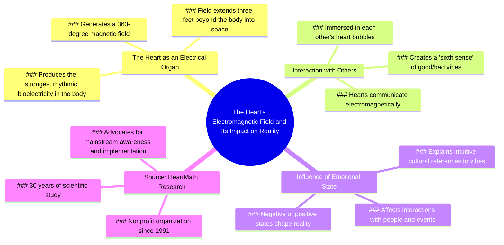

# Heart's Electrical Energy Explained

> 🌐 **Read this in:** [English](../../en/2026-06/tiktok-transcript-heart-heartmath-fyp-mindblown-energy-loveislove-greenscreenv-cfb4.md) · **中文**

> **Creator:** [@citizenscientist](https://www.tiktok.com/@citizenscientist) · **Views:** 7.7M · **Posted:** 2026-06-29 · **Niche:** other
>
> **TL;DR:** Opens with disbelief and repeated amazement to create an irresistible curiosity gap.

[Watch original video →](https://vm.tiktok.com/ZNRwm9e2c/)

## Why This Went Viral

## 钩子（前3秒）
- **逐字开场白：** "我真的不明白这怎么就不是家喻户晓的常识。"
- **钩子模式：** 大胆断言 + 情绪化的难以置信（"我真的不明白"）
- **为何能阻止用户划走：** 这句话暗示讲述者偶然发现了某个*明显*重要、但其他人都忽略的东西。它触发了错失恐惧症和求知欲——观众会想："有什么我应该知道却不知道的事？"

## 情绪节奏
- **节拍1 – 好奇 + 怀疑：** "我真的不明白……"——观众被讲述者的挫败感和紧迫感吸引。
- **节拍2 – 铺垫 + 张力：** "看着吧。这里还有一个有趣的科学事实。"——承诺揭示真相。
- **节拍3 – 敬畏 + 惊叹：** "你的心脏产生的电能足以形成一个磁场……延伸到皮肤之外，进入太空。"——核心的"哇"时刻。
- **节拍4 – 共鸣 + 代入感：** "这就是为什么我们的文化……会提到好气场和坏气场。"——将科学与日常语言连接，创造认知上的轻松感。
- **节拍5 – 连接 + 归属感：** "我们沉浸在彼此心脏的360度球形气泡中。"——唤起亲密感和共享体验。
- **节拍6 – 紧迫感 + 行动号召：** "我们现在比以往任何时候都更需要它。"——情感高潮，将信息定义为改变人生的内容。
- **高潮时刻：** 磁场延伸到"太空"——一个单一、直观的画面，重塑观众对自我的认知。

## 关键词密度
| 词语/短语 | 频率 | 作用 |
|---|---|---|
| 心脏 | 5 | 情感吸引——触及爱、生命、连接等普世象征 |
| 能量 / 电 / 磁 / 生物电 | 6 | 算法覆盖——高搜索量的科学关键词（HeartMath，生物电） |
| 360度 / 球体 / 气泡 | 3 | 视觉锚点——创造令人难忘的心理图像 |
| 好气场 / 坏气场 | 2 | 情感吸引——让科学变得亲切的日常用语 |
| 辐射 / 延伸 / 进入太空 | 3 | 算法 + 情感——"太空"引发好奇；"辐射"富有诗意 |
| HeartMath | 2 | 算法覆盖——品牌名称驱动搜索和可信度 |
| 我们 / 我们的 / 彼此 | 5 | 情感吸引——代词创造包容感和社区感 |

**算法驱动因素：** "心脏"、"能量"、"磁"、"HeartMath"——这些都是高搜索量的词汇，能提升可发现性。  
**情感驱动因素：** "好气场"、"坏气场"、"我们"、"气泡"——这些让科学变得个人化且易于分享。

## 传播原因
1. **"脑洞大开"框架** — 讲述者以"我的大脑一次又一次被震撼"开场，为观众预设了多巴胺冲击。承诺一个*讲述者自己*都觉得惊人的启示，让内容显得独家且紧迫。  
   *字幕原文：* "就像，每次我回顾这些信息，我的大脑都会一次又一次被震撼。"

2. **"隐藏知识"叙事** — 通过将科学描述为"不是家喻户晓的常识"，视频创造了内群体与外群体的动态。分享它的观众会觉得自己在传递秘密的、宝贵的智慧。  
   *字幕原文：* "我真的不明白这怎么就不是家喻户晓的常识。"

3. **"科学与灵性交汇"桥梁** — 视频将硬科学（电器官、磁场）与日常直觉（"好气场"、"第六感"）连接起来。这同时吸引逻辑驱动和情感驱动的观众，扩大了潜在的分享圈。  
   *字幕原文：* "我们已经能感受到第六感。就像字面意义上的电磁感应，我们所有的心脏都在彼此对话。"

4. **"你并不孤单"效应** — "360度球形气泡"和"沉浸在彼此的心脏气泡中"的画面创造了集体连接感。在孤独的时代，这一信息极具分享价值——它提供了归属感。  
   *字幕原文：* "我们一直沉浸在彼此心脏的360度球形气泡中。"

5. **可信度锚点** — 提及"HeartMath"，一个拥有30年研究历史的非营利组织，增加了权威性。这减少了怀疑，让观众更愿意分享而无需核实事实。  
   *字幕原文：* "这是HeartMath完成的工作。他们是一个自1991年以来已经做了30年的非营利组织。"

## 你可以借鉴的
1. **以"这应该是显而易见的"断言开场** — 以表达对某事不是常识的难以置信开始你的视频。这能立即引发好奇，并将你定位为隐藏真相的揭示者。  
   *示例：* "我真的不明白为什么没人谈论这个——看着。"

2. **将抽象科学转化为日常语言** — 选取一个复杂概念（例如生物电），立即将其转化为观众已经使用的短语（"好气场"）。这降低了理解门槛，让内容感觉直观。  
   *示例：* "你的大脑产生电信号——这就是为什么我们说某人'能量很好'。"

3. **以集体性的"我们"行动号召结尾** — 不要用泛泛的"点赞订阅"，而是将结论包装成共同使命："我们现在比以往任何时候都更需要它。"这能将被动观众转变为主动的信徒，让他们想要传播这一信息。  
   *示例：* "这改变了我们看待彼此的方式——而我们现在比以往任何时候都更需要这一点。"

## Mind Map

## Full Transcript (Generated by [免费 TikTok 文稿生成器](https://toktranscript.com/?utm_source=github&utm_medium=breakdown&utm_campaign=tool_attribution))

> 📝 Transcripts on this page are auto-generated and show the first 60%. Want to transcribe any TikTok in 30 seconds and get the full version? [Try TokTranscript free →](https://toktranscript.com/?utm_source=github&utm_medium=breakdown&utm_campaign=transcript_cta)

I literally do not understand how this is not mainstream household information. Like, every time I review this information, like, my mind is just blown over and over again. Just watch. Here's another interesting scientific fact. The heart is an electrical organ, producing by far the strongest source of rhythmic bioelectricity. This energy goes to every cell in your body. Your heart produces enough electrical energy to create a magnetic field surrounding your body in 360 degrees, extending beyond the skin out into space. Measurable about three feet outside your body. So the moral of the story is our heart radiates out. Like this is why our culture constantly, naturally, intuitively refers to having good vibes and bad vibes. We already can feel the sixth sense. Like literally electromagnetically, all 

*[Read the full transcript on TokTranscript →](https://toktranscript.com/plaza/tiktok-transcript-heart-heartmath-fyp-mindblown-energy-loveislove-greenscreenv-cfb4?utm_source=github&utm_medium=breakdown&utm_campaign=transcript_full)*

## Browse More

- All [other](../../by-niche/zh-CN/other.md) breakdowns
- All [Curiosity gap + personal astonishment](../../by-pattern/zh-CN/hook-curiosity-gap-personal-astonishment.md) examples

## Video Info

| | |
|---|---|
| Creator | [@citizenscientist](https://www.tiktok.com/@citizenscientist) |
| Original video | [https://vm.tiktok.com/ZNRwm9e2c/](https://vm.tiktok.com/ZNRwm9e2c/) |
| Original title | #Heart #Heartmath #fyp #mindblown #energy #loveislove #greenscreenvid... |
| Views | 7.7M (7700000) |
| Posted | 2026-06-29 |
| Duration | 0s |
| Niche | `other` |
| Hook pattern | `Curiosity gap + personal astonishment` |
| Original language | `en` (this page translated by AI) |
| Available languages | en, zh-CN |
| Generated | 2026-06-30 by [TokTranscript](https://toktranscript.com/) |

---

*This breakdown is for educational analysis under fair use. Original video © [@citizenscientist](https://www.tiktok.com/@citizenscientist). All transcripts are auto-generated and may contain errors.*

*Want to analyze your own TikToks like this? [TokTranscript 转录工具 →](https://toktranscript.com/viral-breakdown?utm_source=github&utm_medium=breakdown&utm_campaign=footer_cta)*