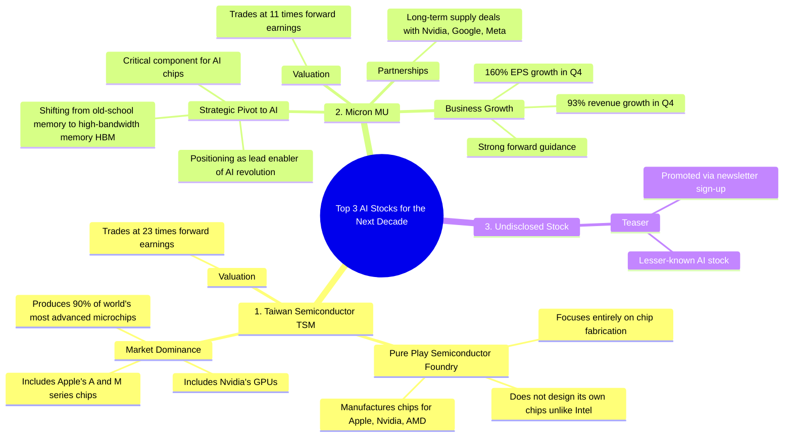

# Top 3 AI Stocks to Buy for the Next Decade

> 🌐 **Read this in:** [English](../../en/2026-06/tiktok-transcript-here-are-the-top-3-a-i-stocks-to-buy-for-the-next-decade-acc-cbda.md) · **中文**

> **Creator:** [@capital.growth](https://www.tiktok.com/@capital.growth) · **Views:** 1.5M · **Posted:** 2026-06-12 · **Niche:** finance
>
> **TL;DR:** The hook leverages authority and scarcity to promise exclusive, high-value stock picks.

[Watch original video →](https://www.tiktok.com/@capital.growth/video/7450979443658525958)

## Why This Went Viral

## 钩子（前3秒）
- "以下是未来十年最值得买入的三只AI股票，据著名AI股票研究员推荐，你的股票代码就是你。"
- **模式：** 大胆断言 + 权威背书 + 直接对话（"你的股票代码就是你"）
- **为何能吸引眼球：** 承诺提供独家、专家支持的长线投资选择（"未来十年"），营造高感知价值。"你的股票代码就是你"这一转折瞬间个性化内容，让观众感觉被分享了一个秘密。

## 情感节奏
1. **好奇心（0-5秒）：** "三只AI股票...未来十年"——以高赌注、时效性强的承诺开场。
2. **信任/权威（5-10秒）：** "著名AI股票研究员"——引用可信来源降低怀疑。
3. **安心/独家感（10-15秒）：** "那些不像英伟达那样受关注的股票"——暗示隐藏的宝藏，而非显而易见的选择。
4. **紧张感（15-30秒）：** 关于台积电和美光的数据轰炸——快速事实、数字和竞争优势营造紧迫感。
5. **悬念/高潮（30-35秒）：** "最后一只股票，你可能从未听说过。所以关注我并评论'newsletter'来了解它是什么。"——**悬念**迫使观众互动。
- **高潮时刻：** 最终揭示被保留，将视频转化为引流工具。

## 关键词密度
- **AI**（8次）——算法覆盖（热门话题）
- **股票**（5次）——金融意图关键词
- **英伟达**（4次）——高流量品牌名用于搜索
- **芯片**（3次）——专业术语增强权威性
- **远期市盈率**（2次）——精明投资者的价值信号
- **营收增长/每股收益增长**（2次）——业绩指标
- **关注我/评论newsletter**（2次）——直接行动号召促进互动

**算法驱动因素：** AI、股票、英伟达、芯片（热门+高搜索量）
**情感吸引力：** "你可能从未听说过"、"最棒的部分"、"显著复苏"（独家感、希望、逆袭故事）

## 为何能传播
1. **悬念加明确行动号召：** 最后一只股票隐藏在"关注我并评论newsletter"之后。这迫使观众互动（关注、评论）以解锁价值，直接提升算法信号。
   - *台词：* "所以关注我并评论'newsletter'来了解它是什么。"
2. **借势权威：** 提及"著名AI股票研究员"和"英伟达"无需证明即可快速建立可信度。
   - *台词：* "据著名AI股票研究员推荐，你的股票代码就是你。"
3. **短格式中的数据密度：** 在35秒内打包三只股票推荐，附带具体指标（90%市场份额、23倍市盈率、93%营收增长）。这显得高价值且易于金融受众分享。
   - *台词：* "该公司生产全球90%最先进的微芯片...以23倍远期市盈率交易。"
4. **独家循环：** "那些没受到太多关注的股票"制造错失恐惧症。观众分享以显示自己是早期采纳者。
   - *台词：* "这些股票将更专注于AI的未来，选择那些不像英伟达那样受关注的股票。"
5. **模式打断：** 前3秒的"你的股票代码就是你"转折出乎意料且个性化，让观众重新投入。
   - *台词：* "你的股票代码就是你。"

## 你可以借鉴的
1. **以大胆断言加个性化转折开场：** 不说"三只AI股票"，而说"三只AI股票...为你"。这将通用列表转为直接对话，提高留存率。
2. **将最有价值的内容隐藏在行动号召后：** 预告最珍贵的部分（如"最后一只你从未听过的"），并设置关注/评论门槛。这将单次观看转化为订阅者。
3. **使用"数据三明治"结构：** 以钩子开场，然后每个项目提供2-3个快速事实（市场份额、增长率、估值），最后以悬念收尾。无废话、无过渡——只有密度。观众感知到高价值，更可能保存或分享。

## Mind Map

## Full Transcript (Generated by [TikTok 转录工具](https://toktranscript.com/?utm_source=github&utm_medium=breakdown&utm_campaign=tool_attribution))

> 📝 Transcripts on this page are auto-generated and show the first 60%. Want to transcribe any TikTok in 30 seconds and get the full version? [Try TokTranscript free →](https://toktranscript.com/?utm_source=github&utm_medium=breakdown&utm_campaign=transcript_cta)

Here are the top three a I stocks to buy for the next decade according to Famous a I Stock Researcher, ticker symbol you. Although Nvidia is frequently talked about by his team, these stocks will be more so focused on the future of a I with stocks that haven't gotten as much attention as Nvidia. So at No. 1 we have Taiwan Semiconductor, ticker symbol TSM. TSMC is a pure play semiconductor foundry that manufactures chips for companies like Apple, Nvidia and AMD. And unlike Intel, it does not design its own chips which allows it to focus entirely on chip fabrication and serve multiple clients without competing with them. The company produces 90% of the world's most advanced microchips including Apple's a series and m series chips and Nvidia's GPUs. And the best part is that the stock trades at a valuation of 23 times forward earnings. The next stock on this list is Micron, ticker symbol MU. Micron is making a remarkable comeback by positioning i

*[Read the full transcript on TokTranscript →](https://toktranscript.com/plaza/tiktok-transcript-here-are-the-top-3-a-i-stocks-to-buy-for-the-next-decade-acc-cbda?utm_source=github&utm_medium=breakdown&utm_campaign=transcript_full)*

## Browse More

- All [finance](../../by-niche/zh-CN/finance.md) breakdowns
- All [List-based promise with authority](../../by-pattern/zh-CN/hook-list-based-promise-with-authority.md) examples

## Video Info

| | |
|---|---|
| Creator | [@capital.growth](https://www.tiktok.com/@capital.growth) |
| Original video | [https://www.tiktok.com/@capital.growth/video/7450979443658525958](https://www.tiktok.com/@capital.growth/video/7450979443658525958) |
| Original title | Here are the top 3 A.I. stocks to buy for the next decade according t... |
| Views | 1.5M (1500000) |
| Posted | 2026-06-12 |
| Duration | 0s |
| Niche | `finance` |
| Hook pattern | `List-based promise with authority` |
| Original language | `en` (this page translated by AI) |
| Available languages | en, zh-CN |
| Generated | 2026-06-13 by [TokTranscript](https://toktranscript.com/) |

---

*This breakdown is for educational analysis under fair use. Original video © [@capital.growth](https://www.tiktok.com/@capital.growth). All transcripts are auto-generated and may contain errors.*

*Want to analyze your own TikToks like this? [TokTranscript 转录工具 →](https://toktranscript.com/viral-breakdown?utm_source=github&utm_medium=breakdown&utm_campaign=footer_cta)*