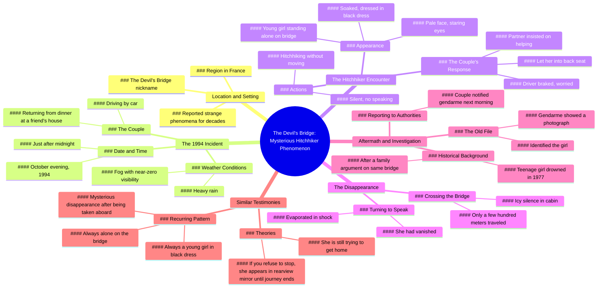

# The Devil's Bridge: Strange Phenomena in France Since 1994

> 🌐 **Read this in:** [English](../../en/2026-06/tiktok-transcript-horreurtiktok-horreur-histoire-histoirevrai-urbanlegends-fyp-a88e.md) · **中文**

> **Creator:** [@murmuresdelarealite](https://www.tiktok.com/@murmuresdelarealite) · **Views:** 804.4K · **Posted:** 2026-06-11 · **Niche:** entertainment
>
> **TL;DR:** Opens with a cryptic location and supernatural claim to immediately hook curiosity.

[Watch original video →](https://www.tiktok.com/@murmuresdelarealite/video/7533949785363991830?lang=fr)

## Why This Went Viral

## 钩子（前3秒）
- **逐字开场白：** "你知道吗，在法国的一个地区，有一座古老的桥梁，被戏称为魔鬼桥，几十年来一直有奇怪的现象被报告。"
- **钩子模式：** 提问 + 场景设定（具体地点 + 令人毛骨悚然的绰号）
- **为何能阻止滑动：** "魔鬼桥"这个短语立即引发好奇，并承诺超自然内容。"你知道吗"这个问题触发好奇心缺口——观众需要知道接下来会发生什么。

## 情感节奏
- **节拍1——好奇：** "你知道吗……"打开了一个知识缺口。
- **节拍2——紧张：** "奇怪的现象……"营造期待。
- **节拍3——悬念：** 那对夫妇在雨/雾中开车，能见度为零。
- **节拍4——震惊：** "她消失了，仿佛蒸发了一样。"
- **节拍5——恐怖转折：** 宪兵展示了一张17年前溺亡女孩的照片。
- **节拍6——挥之不去的恐惧：** "有人说她仍在寻找回家的路……如果你拒绝，你会在后视镜里看到她。"
- **高潮：** 照片揭示——"就是她。"

## 关键词密度
| 重复最多的词语/短语 | 为何重要 |
|----------------------|----------|
| 桥 / 魔鬼桥 | 算法覆盖（地点 + 超自然细分领域） |
| 年轻女孩 / 黑色连衣裙 | 情感吸引力（脆弱性 + 视觉意象） |
| 消失 / 蒸发 | 高情感共鸣（神秘 + 恐惧） |
| 宪兵 / 档案 / 照片 | 权威 + 可信度提升 |
| 搭便车 / 后视镜 | 可关联的恐怖套路（独自夜间驾驶） |
| 十月 / 午夜 / 雾 | 感官触发（时间 + 天气 = 高紧张感） |

## 为何能传播
1. **普遍恐惧钩子** —— "消失的搭便车者"是跨文化都市传说。具体的法国地点让它感觉真实，但又不局限于任何单一观众。
2. **视觉悬念** —— "后视镜"结局是一个完美的可分享画面。观众会发短信给朋友："在法国永远不要载搭便车的人。"
3. **权威转折** —— 宪兵拿出旧档案增加了可信度。它将篝火故事转变为"真实犯罪"案件。
4. **情感过山车** —— 视频将好奇 → 紧张 → 震惊 → 恐惧压缩在90秒内。高留存率 = 算法助推。
5. **开放式威胁** —— "如果你拒绝，你会在后视镜里看到她"创造了一个挥之不去的心理画面。观众会重新分享以警告他人。

## 你可以借鉴什么
1. **以提问+地点开头** —— "你知道吗，在[具体地点]……"立即建立信任和好奇。避免模糊的开场。
2. **使用感官天气细节** —— "雨下得很大，雾使能见度几乎为零。"具体的天气 = 沉浸感。在任何恐怖/神秘视频中复制这一点。
3. **以"如果你不这样做会发生什么"的威胁结尾** —— "如果你拒绝，你会在后视镜里看到她。"这创造了可分享的恐惧。始终让观众在故事中有个人利害关系。

## Mind Map

## Full Transcript (Generated by [TokTranscript](https://toktranscript.com/?utm_source=github&utm_medium=breakdown&utm_campaign=tool_attribution))

> 📝 Transcripts on this page are auto-generated and show the first 60%. Want to transcribe any TikTok in 30 seconds and get the full version? [Try TokTranscript free →](https://toktranscript.com/?utm_source=github&utm_medium=breakdown&utm_campaign=transcript_cta)

Did you know that in France, in the region of, there is an old bridge, nicknamed the bridge of the devil, where strange phenomena have been reported for decades. It is said that one evening in October mille-neuf-cent-quatre-vingt-quatorze, a couple was crossing this bridge by car after having dinner at a friend's house. It was a little over midnight, the rain was falling hard and the fog made visibility almost zero. As they moved slowly, they saw a young girl standing alone on the bridge, soaked, dressed in a black dress. She was hitchhiking without moving. The driver braked, worried. His partner told him, we can't leave her like that. They got him in the back. She was not saying anything, the pale face, the eyes staring at the darkness. There was an icy silence in the cabin. After crossing the bridge just a few hundred meters away, they turned around to talk to him. She had disappeared, as if it had evaporated in shock. They died th

*[Read the full transcript on TokTranscript →](https://toktranscript.com/plaza/tiktok-transcript-horreurtiktok-horreur-histoire-histoirevrai-urbanlegends-fyp-a88e?utm_source=github&utm_medium=breakdown&utm_campaign=transcript_full)*

## Browse More

- All [entertainment](../../by-niche/zh-CN/entertainment.md) breakdowns
- All [Mystery/Curiosity Gap](../../by-pattern/zh-CN/hook-mystery-curiosity-gap.md) examples

## Video Info

| | |
|---|---|
| Creator | [@murmuresdelarealite](https://www.tiktok.com/@murmuresdelarealite) |
| Original video | [https://www.tiktok.com/@murmuresdelarealite/video/7533949785363991830?lang=fr](https://www.tiktok.com/@murmuresdelarealite/video/7533949785363991830?lang=fr) |
| Original title | #horreurtiktok #horreur #histoire #histoirevrai #urbanlegends #fyp #p... |
| Views | 804.4K (804400) |
| Posted | 2026-06-11 |
| Duration | 0s |
| Niche | `entertainment` |
| Hook pattern | `Mystery/Curiosity Gap` |
| Original language | `en` (this page translated by AI) |
| Available languages | en, zh-CN |
| Generated | 2026-06-12 by [TokTranscript](https://toktranscript.com/) |

---

*This breakdown is for educational analysis under fair use. Original video © [@murmuresdelarealite](https://www.tiktok.com/@murmuresdelarealite). All transcripts are auto-generated and may contain errors.*

*Want to analyze your own TikToks like this? [拆解你自己的 TikTok →](https://toktranscript.com/viral-breakdown?utm_source=github&utm_medium=breakdown&utm_campaign=footer_cta)*