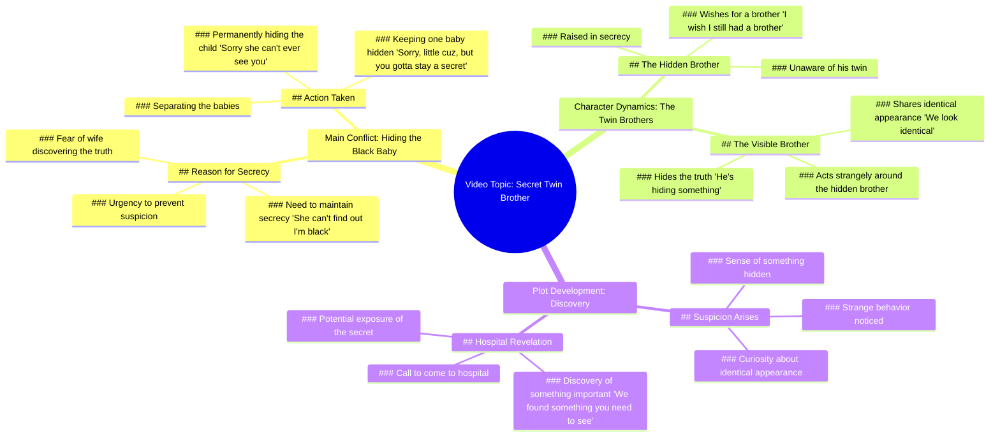

# Hiding Baby Secret From Wife

> 🌐 **Read this in:** [English](../../en/2026-06/tiktok-transcript-how-long-can-he-keep-little-cuh-a-secret-fruitstory-aistory-ee2e.md) · **中文**

> **Creator:** [@aihoodfruit](https://www.tiktok.com/@aihoodfruit) · **Views:** 1.1M · **Posted:** 2026-06-26 · **Niche:** entertainment
>
> **TL;DR:** The hook immediately creates intrigue and humor by suggesting a secret identity, drawing viewers in.

[Watch original video →](https://www.tiktok.com/@aihoodfruit/video/7654821998513736991?is_from_webapp=1&sender_device=pc)

## Why This Went Viral

## 钩子（前3秒）
- **逐字开场白：**“我得快点。她不能发现我是黑人，CUH。”
- **钩子模式：**大胆声明 + 对比（黑人 vs. 暗示的非黑人）+ 俚语（“CUH”作为反复出现的身份标识）
- **为何能阻止滑动：**这句话立刻让人困惑——一个匆忙的角色，一个关于种族的秘密，以及一个既亲密又带有编码感的俚语。矛盾（黑人 vs. “她不能发现”）瞬间引发好奇：*为什么这是个秘密？*

## 情感节奏
- **节拍1（0–3秒）：好奇 + 紧张**——“我得快点。她不能发现我是黑人。”观众被抛入一个高风险秘密中。
- **节拍2（3–8秒）：困惑 + 悬念**——“我老婆在哪？她刚生了孩子。为什么有个婴儿是黑人？”转折出现：一个非黑人夫妇生下了黑人婴儿。观众凑近屏幕。
- **节拍3（8–15秒）：情感跌落（共鸣）**——“对不起，小表弟，但你得保密。”秘密令人心碎——一个被藏起来的婴儿。
- **节拍4（15–22秒）：转折 + 虚假解脱**——“生日快乐，小CUH。真希望我还有个兄弟。”愿望将秘密重新定义为失去的兄弟姐妹。观众感到心头一击。
- **节拍5（22–30秒）：悬念再次升级**——“他在隐瞒什么。我能感觉到。”兄弟角色开始怀疑，提高了风险。
- **节拍6（22–30秒）：高潮**——“你得来医院。我们发现了些东西，你得看看。”开放式悬念——观众留下未解之谜。
- **高潮时刻：**30秒时的医院电话。它将整个故事重新定义为医学/基因揭示，而不仅仅是社会秘密。

## 关键词密度
| 关键词/短语 | 频率 | 作用 |
|----------------|-----------|------|
| “CUH” / “cuh” / “kuh” | 8 | **情感吸引力**——俚语创造群体认同感和节奏钩子。推动可分享性（人们重复它）。 |
| “黑人” | 3 | **算法覆盖**——种族相关内容引发高互动（既有正面也有争议）。同时具有情感吸引力（身份认同）。 |
| “秘密” / “隐藏” / “隐瞒” | 3 | **情感吸引力**——普遍的紧张驱动因素。让观众感到共谋。 |
| “兄弟” | 3 | **情感吸引力**——家庭纽带、失去、渴望。 |
| “希望” | 2 | **情感吸引力**——希望 + 悲剧（愿望是关于一个已经死去/被隐藏的兄弟）。 |
| “医院” | 2 | **算法覆盖**——医学/基因转折引发好奇和“接下来会发生什么”的点击。 |
| “一模一样” | 1 | **算法覆盖**——触发“双胞胎”和“DNA”搜索查询。 |

**为何有效：**“CUH”是病毒式传播的粘合剂——它是一个独特、可重复的声音，成为迷因。“黑人”+“秘密”+“兄弟”+“医院”创造了一个高紧张、高好奇的混合体，算法（争议 + 医学剧）和人类心理（神秘 + 家庭）都会奖励它。

## 为何能传播
1. **“CUH”口头禅是可分享的声音。** 每行都以“cuh”或“kuh”结尾，使其易于引用、混音或恶搞。观众在评论中重复它，从而提升算法信号。
2. **基于种族的秘密是高互动触发点。** “她不能发现我是黑人”这句话具有挑衅性但不过分冒犯——它引发辩论（“这是玩笑？戏剧？讽刺？”）而不带仇恨。这种模糊性推动评论和分享。
3. **转折（隐藏的兄弟 → 医院电话）制造悬念。** 视频没有结局就结束。观众被迫评论“第二部？”或“医院里有什么？”这提升了下一视频的观看时长和完成率。
4. **情感过山车被压缩到35秒内。** 好奇 → 困惑 → 悲伤 → 希望 → 悬念 → 悬念。每个节拍足够短以保持高留存率，但又足够多样以感觉像一部迷你电影。
5. **26秒时的“一模一样”是后期钩子。** “我们看起来一模一样”重新定义了整个故事——现在关于双胞胎，而不仅仅是黑人婴儿。这迫使重看和重新评估，从而增加总观看时长。

## 你可以借鉴什么
1. **在前3秒内构建一个标志性口头禅。** “CUH”不仅仅是俚语——它是一个品牌化的声音。选择一个独特、可重复且能在每行中使用的词或短语。它成为视频的“洗脑神曲”。
2. **使用“虚假解决”来重置紧张感。** 生日愿望（“真希望我还有个兄弟”）感觉像悲伤的结局，但随后怀疑和医院电话重新打开了故事。不要让情感高峰成为结尾——留下一个未解的线索。
3. **以迫使评论的问题或悬念结尾。** 医院电话是一个完美例子：它直接邀请观众问“他们发现了什么？”或“他是双胞胎吗？”始终以一个只有下一视频（或评论回复）才能关闭的开放循环结尾。

## Mind Map

## Full Transcript (Generated by [TikTok 转录工具](https://toktranscript.com/?utm_source=github&utm_medium=breakdown&utm_campaign=tool_attribution))

> 📝 Transcripts on this page are auto-generated and show the first 60%. Want to transcribe any TikTok in 30 seconds and get the full version? [Try TokTranscript free →](https://toktranscript.com/?utm_source=github&utm_medium=breakdown&utm_campaign=transcript_cta)

I have to hurry. She can't find out I'm black, CUH. I need to get there before she notices and gets suspicious, CUH. Where my wife at, CUH? She just gave birth. Why is one baby black, cuz? I gotta take care of this. Sorry she can't ever see you, little cuz. Sorry, little cuz, but you gotta stay a secret. Happy birthday, little cuh. Make a big wish. What do you wish for? I wish. I wish I still had a brother. What a strange little wish. You don't have a brother. Uh, uh. I go

*[Read the full transcript on TokTranscript →](https://toktranscript.com/plaza/tiktok-transcript-how-long-can-he-keep-little-cuh-a-secret-fruitstory-aistory-ee2e?utm_source=github&utm_medium=breakdown&utm_campaign=transcript_full)*

## Browse More

- All [entertainment](../../by-niche/zh-CN/entertainment.md) breakdowns
- All [Misdirection / Unexpected Reveal](../../by-pattern/zh-CN/hook-misdirection-unexpected-reveal.md) examples

## Video Info

| | |
|---|---|
| Creator | [@aihoodfruit](https://www.tiktok.com/@aihoodfruit) |
| Original video | [https://www.tiktok.com/@aihoodfruit/video/7654821998513736991?is_from_webapp=1&sender_device=pc](https://www.tiktok.com/@aihoodfruit/video/7654821998513736991?is_from_webapp=1&sender_device=pc) |
| Original title | how long can he keep little cuh a secret #fruitstory #aistory #aifrui... |
| Views | 1.1M (1100000) |
| Posted | 2026-06-26 |
| Duration | 0s |
| Niche | `entertainment` |
| Hook pattern | `Misdirection / Unexpected Reveal` |
| Original language | `en` (this page translated by AI) |
| Available languages | en, zh-CN |
| Generated | 2026-06-27 by [TokTranscript](https://toktranscript.com/) |

---

*This breakdown is for educational analysis under fair use. Original video © [@aihoodfruit](https://www.tiktok.com/@aihoodfruit). All transcripts are auto-generated and may contain errors.*

*Want to analyze your own TikToks like this? [TokTranscript →](https://toktranscript.com/viral-breakdown?utm_source=github&utm_medium=breakdown&utm_campaign=footer_cta)*