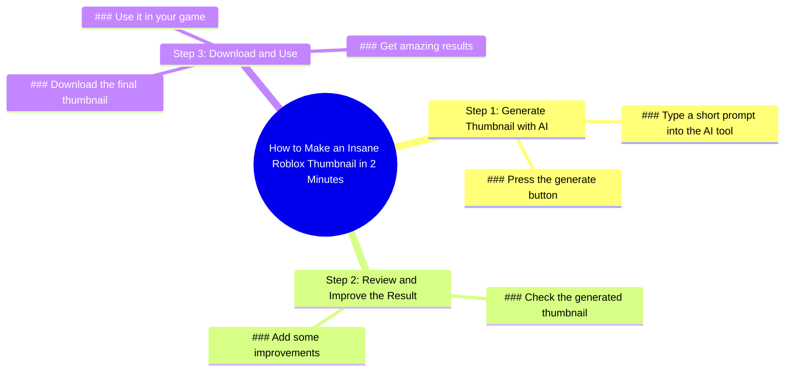

# How to Make Roblox Thumbnails for Your Game Easily

> 🌐 **Read this in:** [English](../../en/2026-06/tiktok-transcript-how-to-make-roblox-thumbnails-for-your-game-easily-robloxdev-1a53.md) · **中文**

> **Creator:** [@dminer_rbx](https://www.tiktok.com/@dminer_rbx) · **Views:** 124.1K · **Posted:** 2026-06-07 · **Niche:** other
>
> **TL;DR:** Promises a fast, impressive result to hook viewers interested in Roblox content creation.

[Watch original video →](https://vt.tiktok.com/ZSQjXQHtR/)

## Why This Went Viral

## 钩子（前3秒）
- **逐字开场白：**"这就是我如何在2分钟内制作出这张疯狂的Roblox缩略图"
- **钩子模式：**大胆声明 + 数字 + 场景（展示缩略图）
- **为何能阻止滑动：**"疯狂"一词立即引发好奇，2分钟的时间承诺迎合效率需求，而具体的Roblox语境精准锁定高度活跃的细分受众。在声明尚未说完时，缩略图本身便作为概念验证。

## 情绪节奏
1. **好奇**（0–3秒）——"这就是我如何在2分钟内制作出这张疯狂的Roblox缩略图"触发"这怎么可能？"
2. **期待**（3–6秒）——"向这个AI工具输入简短提示"逐步构建预期
3. **满足**（6–9秒）——"按下生成按钮/查看结果"带来回报
4. **共鸣**（9–12秒）——"添加一些改进"承认受众对个性化的渴望
5. **向往**（12–15秒）——"下载它用于你的游戏并获得惊人效果"创造未来自我愿景

**高潮时刻：**"查看结果"——AI输出揭晓的瞬间，满足钩子中建立的好奇心。

## 关键词密度
- **"Roblox"**（2次）——算法覆盖：瞄准庞大的Roblox创作者社区
- **"缩略图"**（2次）——算法+情感：创作者的高搜索量术语
- **"AI工具"**（1次）——算法：热门科技关键词
- **"2分钟"**（1次）——情感：速度承诺触发紧迫感
- **"疯狂"**（1次）——情感：夸张手法制造好奇缺口
- **"惊人效果"**（1次）——情感：向往的回报
- **"你的游戏"**（1次）——情感：个性化钩子

**算法驱动因素：**Roblox、缩略图、AI工具——这些是高搜索量、细分领域特定的术语，能喂养YouTube/TikTok推荐算法。

**情感吸引力：**疯狂、惊人、你的游戏——这些在Roblox创作者社区中创造欲望、个性化和身份信号。

## 为何能传播
1. **速度到价值的承诺**——"2分钟"具体且可信。创作者知道手动制作缩略图需要20分钟以上。这种90%的时间缩减立即引发分享冲动。*文字证据："在2分钟内"*

2. **零技能门槛**——"向这个AI工具输入简短提示并按下生成按钮"消除了所有技术障碍。任何Roblox创作者都能复制，使其在朋友群体中高度可分享。*文字证据："输入简短提示"*

3. **即时视觉证明**——缩略图在第一帧中展示。观众无需想象结果——他们亲眼看到。这立即建立可信度并减少怀疑。*文字证据："这张疯狂的Roblox缩略图"（说话时展示）*

4. **定制化层**——"添加一些改进"表明AI输出并非最终版本。这解决了AI看起来千篇一律的常见担忧，使工作流程显得真实且可调整。*文字证据："添加一些改进"*

5. **直接实用号召**——"下载它用于你的游戏"创建了清晰的下一步。视频不仅有趣——而且立即可操作。*文字证据："下载它用于你的游戏"*

## 你可以借鉴什么
1. **"速度+具体性"钩子公式**——以具体时间（2分钟）+ 有形结果（Roblox缩略图）开场。避免模糊承诺如"快速赚钱"。使用具体数字和细分领域特定对象。

2. **3步零摩擦工作流程**——将教程结构化为：输入 → 行动 → 结果。无废话、无设置、无背景故事。"输入提示 → 按下按钮 → 查看结果"是适用于任何AI工具的模式。

3. **"个性化通用内容"的转折**——展示AI输出后，添加一句关于定制化的话（"添加一些改进"）。这表明你不仅仅是粘贴提示词——你是创造附加价值的创作者。将此应用于任何自动化内容。

## Mind Map

## Full Transcript (Generated by [拆解你自己的 TikTok](https://toktranscript.com/?utm_source=github&utm_medium=breakdown&utm_campaign=tool_attribution))

> 📝 Transcripts on this page are auto-generated and show the first 60%. Want to transcribe any TikTok in 30 seconds and get the full version? [Try TokTranscript free →](https://toktranscript.com/?utm_source=github&utm_medium=breakdown&utm_campaign=transcript_cta)

here's how I made this insane Roblox thumbnail in 2 minutes type short prompt into this AI tool and press generate button check the 

*[Read the full transcript on TokTranscript →](https://toktranscript.com/plaza/tiktok-transcript-how-to-make-roblox-thumbnails-for-your-game-easily-robloxdev-1a53?utm_source=github&utm_medium=breakdown&utm_campaign=transcript_full)*

## Browse More

- All [other](../../by-niche/zh-CN/other.md) breakdowns
- All [Speed/Result Promise](../../by-pattern/zh-CN/hook-speed-result-promise.md) examples

## Video Info

| | |
|---|---|
| Creator | [@dminer_rbx](https://www.tiktok.com/@dminer_rbx) |
| Original video | [https://vt.tiktok.com/ZSQjXQHtR/](https://vt.tiktok.com/ZSQjXQHtR/) |
| Original title | How to make roblox thumbnails for your game easily #robloxdeveloper #... |
| Views | 124.1K (124100) |
| Posted | 2026-06-07 |
| Duration | 0s |
| Niche | `other` |
| Hook pattern | `Speed/Result Promise` |
| Original language | `en` (this page translated by AI) |
| Available languages | en, zh-CN |
| Generated | 2026-06-08 by [TokTranscript](https://toktranscript.com/) |

---

*This breakdown is for educational analysis under fair use. Original video © [@dminer_rbx](https://www.tiktok.com/@dminer_rbx). All transcripts are auto-generated and may contain errors.*

*Want to analyze your own TikToks like this? [免费 TikTok 文稿生成器 →](https://toktranscript.com/viral-breakdown?utm_source=github&utm_medium=breakdown&utm_campaign=footer_cta)*