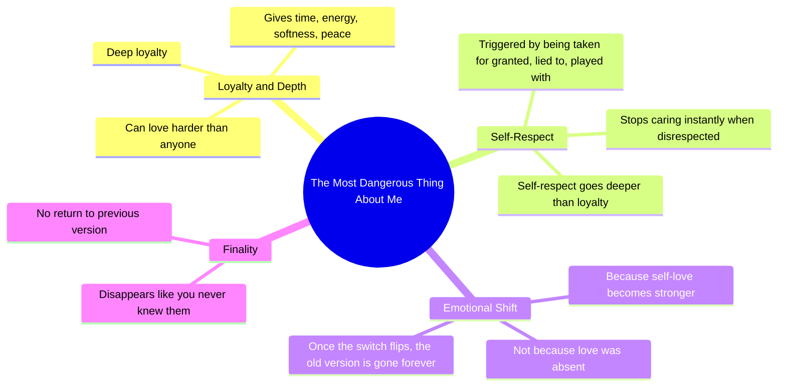

# Loving Harder While Protecting Self-Respect

> 🌐 **Read this in:** [English](../../en/2026-06/tiktok-transcript-i-can-love-you-harder-than-you-ever-been-loved-motivetion-mo-4a6b.md) · **中文**

> **Creator:** [@motivationme5](https://www.tiktok.com/@motivationme5) · **Views:** 1.7M · **Posted:** 2026-06-13 · **Niche:** other
>
> **TL;DR:** Opens with a provocative, paradoxical statement that challenges expectations and hooks curiosity.

[Watch original video →](https://vm.tiktok.com/ZNRcHA73k/)

## Why This Went Viral

## 钩子（前3秒）
- **逐字开场白：**“我最危险的地方。”
- **钩子模式：**大胆断言 / 引发好奇（“危险”一词瞬间制造紧张感）
- **为何能让人停下滑动：**“危险”一词颠覆预期——这并非威胁，而是情感力量。观众会好奇是什么让她危险，不是身体上的，而是心理上的。

## 情感节奏
- **节拍1——好奇：**“我最危险的地方”（神秘感）
- **节拍2——紧张：**“我可以爱你更深……也能消失得仿佛你从未认识我”（矛盾制造悬念）
- **节拍3——共鸣：**“我的忠诚很深，但我的自尊更深”（对受过伤的人是一种肯定）
- **节拍4——高潮：**“当我感到被理所当然对待的那一刻……我会瞬间停止在乎”（情感释放——那个“开关翻转”）
- **节拍5——终结：**“你再也不会得到同样的我了”（终结 + 权力转移）
- **反转：**“危险”并非攻击性，而是自爱——将受害者身份转化为主动权。

## 关键词密度
| 关键词/短语 | 频率 | 驱动因素 |
|---|---|---|
| 危险 / 危险之处 | 2 | 算法吸引力 + 情感牵引 |
| 爱 / 被爱 / 去爱 | 4 | 情感共鸣（核心钩子） |
| 自尊 / 爱自己 | 3 | 身份认同 + 共鸣感（病毒式传播触发点） |
| 消失 / 停止在乎 | 2 | 紧张 + 释放（情感节奏） |
| 被理所当然对待 / 被欺骗 / 被玩弄 | 3 | 共鸣感（共同伤痛） |
| 开关翻转 / 同样的我 | 2 | 令人难忘的隐喻（易于分享） |

- **算法驱动因素：**“危险”、“消失”、“开关翻转”——高点击率关键词，能激发好奇心和情感标签。
- **情感牵引因素：**“自尊”、“爱自己”、“被理所当然对待”——能触发认同感和肯定感的词语。

## 为何能传播
1. **普遍痛点 + 赋权解决方案**——“被理所当然对待”几乎是人人都有过的经历。视频将受害者身份转化为力量，让任何感到被低估的人都能瞬间产生分享欲。
2. **对比结构创造记忆点**——“忠诚很深 / 自尊更深”是一个清晰、可引用的对立句式。观众会截图或引用这句话作为个人座右铭。
3. **“开关翻转”这个隐喻直观且粘性十足**——这是一个简单、充满画面感的意象（一个开关），观众能在脑海中反复回放。隐喻能提升记忆度和分享率。
4. **情感弧线模仿分手叙事**——视频像是一段分手宣言，却没有点名具体对象。这种模糊性让观众能投射自己的故事，最大化共鸣感。
5. **最后一句是毫无恶意的威胁**——“你再也不会得到同样的我了”是一个干脆利落的收尾。它听起来像是一种设定边界的宣言，与那些正在重拾自我价值的观众产生深刻共鸣。

## 你可以借鉴的点
1. **用一个颠覆性的标签开场**——用“危险”、“可怕”或“有毒”这样的词来描述自己积极的一面。这种反差能瞬间激发好奇心。
2. **构建一个“这个，但那个”的忠诚层级**——陈述两个对立的价值（例如，“我原谅得很深，但我信任得很慢”），在一句话中制造紧张感和解决感。
3. **以一个终结性而非愤怒的边界声明收尾**——用一句听起来像门轻轻关上而非砰然关上的话来结尾。“你再也不会得到同样的我了”这句话平静、终结且充满力量——毫无怨恨。

## Mind Map

## Full Transcript (Generated by [TikTok 转录工具](https://toktranscript.com/?utm_source=github&utm_medium=breakdown&utm_campaign=tool_attribution))

> 📝 Transcripts on this page are auto-generated and show the first 60%. Want to transcribe any TikTok in 30 seconds and get the full version? [Try TokTranscript free →](https://toktranscript.com/?utm_source=github&utm_medium=breakdown&utm_campaign=transcript_cta)

The most dangerous thing about me. I can love you harder than anyone ever has. And disappear like you never knew me. Yeah, because my loyalty is deep. But my self respect goes deeper. I will give you my time, my energy, my softness, my peace. But the second I feel taken for granted, lied to or 

*[Read the full transcript on TokTranscript →](https://toktranscript.com/plaza/tiktok-transcript-i-can-love-you-harder-than-you-ever-been-loved-motivetion-mo-4a6b?utm_source=github&utm_medium=breakdown&utm_campaign=transcript_full)*

## Browse More

- All [other](../../by-niche/zh-CN/other.md) breakdowns
- All [Contrast & Paradox](../../by-pattern/zh-CN/hook-contrast-paradox.md) examples

## Video Info

| | |
|---|---|
| Creator | [@motivationme5](https://www.tiktok.com/@motivationme5) |
| Original video | [https://vm.tiktok.com/ZNRcHA73k/](https://vm.tiktok.com/ZNRcHA73k/) |
| Original title | I can love you harder than you ever been Loved !!! #motivetion #motiv... |
| Views | 1.7M (1700000) |
| Posted | 2026-06-13 |
| Duration | 0s |
| Niche | `other` |
| Hook pattern | `Contrast & Paradox` |
| Original language | `en` (this page translated by AI) |
| Available languages | en, zh-CN |
| Generated | 2026-06-14 by [TokTranscript](https://toktranscript.com/) |

---

*This breakdown is for educational analysis under fair use. Original video © [@motivationme5](https://www.tiktok.com/@motivationme5). All transcripts are auto-generated and may contain errors.*

*Want to analyze your own TikToks like this? [免费 TikTok 文稿生成器 →](https://toktranscript.com/viral-breakdown?utm_source=github&utm_medium=breakdown&utm_campaign=footer_cta)*