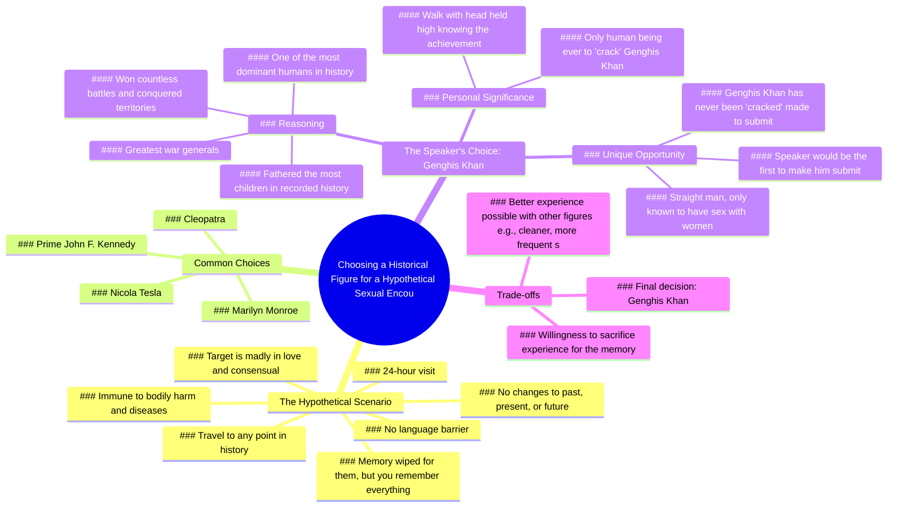

# Meeting Cleopatra: A Time Travel Fantasy

> 🌐 **Read this in:** [English](../../en/2026-06/tiktok-transcript-i-will-say-it-would-be-really-cool-to-meet-cleopatra-just-to-1de2.md) · **中文**

> **Creator:** [@jamynon](https://www.tiktok.com/@jamynon) · **Views:** 8.1M · **Posted:** 2026-06-04 · **Niche:** entertainment
>
> **TL;DR:** The hook immediately engages viewers with a provocative and absurd hypothetical, sparking curiosity and debate.

[Watch original video →](https://www.tiktok.com/t/ZP8s2qqLU/)

## Why This Went Viral

## 钩子（前3秒）
- **逐字开场白：** "如果你能穿越时空，和一位历史人物发生关系，你会选谁？"
- **钩子模式：** 提问 + 大胆假设场景
- **为何能让人停下刷屏：** 这个问题荒谬、禁忌，且瞬间引发争议。它迫使观众停下来思考自己的答案，立即产生心理参与。"穿越时空发生关系"这一表述出人意料，引人注目。

## 情绪节奏
1. **好奇**（0:00–0:05）：问题引发兴趣和幽默感。
2. **紧张**（0:05–0:20）：详细规则营造出一种严肃、近乎法律化的语气，加剧了荒谬感。
3. **期待**（0:20–0:30）：创作者排除了显而易见的选择（肯尼迪、梦露、克利奥帕特拉），为他的选择制造悬念。
4. **惊讶 + 震惊**（0:30–0:35）："我要搞定成吉思汗"——转折来得猛烈。
5. **幽默 + 自知之明**（0:35–0:50）：他承认了荒谬性（"你要选择搞定成吉思汗？是的，是的，我就要"）。
6. **自豪 + 胜利**（0:50–1:10）：高潮——他将此视为对"史上最具统治力的人"的支配行为。
7. **放松 + 笑声**（1:10–结尾）：关于卫生和记忆的自嘲式笑点。

**高潮时刻：** "我将成为史上第一个让成吉思汗臣服于我的人"——权力动态的终极反转。

## 关键词密度
- **"成吉思汗"**（7次）——算法覆盖：高搜索量，历史人物。情感吸引力：标志性，唤起权力感。
- **"搞定 / 拿下"**（6次）——情感吸引力：俚语，意为"支配"或"发生关系"，营造圈内幽默。
- **"历史人物"**（4次）——算法覆盖：广泛话题关键词。
- **"支配"**（4次）——情感吸引力：将选择框定为权力游戏。
- **"性"**（3次）——算法覆盖：高参与度话题，但在某些平台有风险。
- **"记忆 / 记住"**（3次）——情感吸引力：触及对重要性的渴望。
- **"史上第一个"**（2次）——情感吸引力：排他性，独特性。
- **"24小时"**（2次）——算法覆盖：引发好奇心的具体细节。

## 为何能传播
1. **震惊 + 荒谬前提迫使分享。** "你会和历史上谁发生关系？"这个问题本身就具有分享性，因为它禁忌且引发争论。人们会把它发给朋友，说"你必须听听这家伙的答案。"
2. **转折颠覆预期。** 在列出显而易见的选择（肯尼迪、梦露、克利奥帕特拉）之后，他选择了成吉思汗——一个与残暴而非性感相关的历史人物。这种惊喜创造了"等等，什么？"的时刻，迫使观众重看或分享。
3. **权力幻想 + 幽默钩子。** 创作者将性重新定义为对"史上最具统治力的人"的支配行为。这既搞笑又在心理上引起共鸣——每个人都想感受力量。"我会每天昂首挺胸地走路，知道我是史上唯一搞定成吉思汗的人"这句话是纯粹的病毒式金句。
4. **自知之明的表达。** 他承认了荒谬性（"也许选一个洗澡更频繁的"），同时坚持自己的选择。这种投入与幽默的平衡让视频显得真实、有共鸣，而非尴尬。
5. **详细规则创造重看价值。** 24小时场景包含语言流利度、免疫力和记忆清除，如此具体，以至于观众会在心里跟着玩、重新参与并在评论中讨论。

## 你可以借鉴什么
1. **以一个引发参与的挑衅性问题开始。** 问一个问题，迫使观众在你自己揭示答案之前先在心中回答。他们的答案与你的答案之间的差距创造了参与度。
2. **用一个出人意料的选择颠覆可预测的列表。** 先列出显而易见的选择，然后转向令人震惊的选项。这种模式（铺垫 → 转折）已被证明能抓住注意力并推动分享。
3. **将禁忌话题重新框定为权力幻想或智力挑战。** 不要专注于性方面，而是将其框定为"支配"或"重要性"的游戏。这让内容显得聪明且易于分享，而非粗俗。

## Mind Map

## Full Transcript (Generated by [我们用的转录工具](https://toktranscript.com/?utm_source=github&utm_medium=breakdown&utm_campaign=tool_attribution))

> 📝 Transcripts on this page are auto-generated and show the first 60%. Want to transcribe any TikTok in 30 seconds and get the full version? [Try TokTranscript free →](https://toktranscript.com/?utm_source=github&utm_medium=breakdown&utm_campaign=transcript_cta)

if you could go back in time and have sex with one historical figure who would it be in this hypothetical you are given the option to travel to any point in history to have sex with one adult historical figure and in this scenario you will be fluent in whatever language they speak there will be no language barrier you you are there for 24 hours and you will be immune to any type of bodily harm and diseases that might have been prevalent at the time also once you get into that time period and you go to them this individual will be madly in love with you and will agree to do basically anything that you say so any and all actions that take place are purely consensual as soon as your 24 hours are up you will be teleported back to your own timeline and the person that you chose to have sex with will have their memory wiped and it'll be like you were never there but you will remember absolutely everything that happened your actions will not change the past present or future this is purely for your memory who are you choosing a lot of people might say something like maybe Prime John F Kennedy Marilyn Monroe Cleopatra Nicola Tesla was a decent looking guy at the time but all of those choices are nothing and compared to what I'm gonna choose I am cracking Genghis Khan now I know when I say that some of you might be like Genghis Khan you can have sex with any historical figure some of the most beautiful women in the world are right there and you're gonna choose to crack Genghis Khan yes yes I am why because Genghis Khan is one of the most dominant if not the most dominant human ever in human history one of the greatest war generals that the wo

*[Read the full transcript on TokTranscript →](https://toktranscript.com/plaza/tiktok-transcript-i-will-say-it-would-be-really-cool-to-meet-cleopatra-just-to-1de2?utm_source=github&utm_medium=breakdown&utm_campaign=transcript_full)*

## Browse More

- All [entertainment](../../by-niche/zh-CN/entertainment.md) breakdowns
- All [Hypothetical Question](../../by-pattern/zh-CN/hook-hypothetical-question.md) examples

## Video Info

| | |
|---|---|
| Creator | [@jamynon](https://www.tiktok.com/@jamynon) |
| Original video | [https://www.tiktok.com/t/ZP8s2qqLU/](https://www.tiktok.com/t/ZP8s2qqLU/) |
| Original title | I will say it would be really cool to meet cleopatra just to see what... |
| Views | 8.1M (8100000) |
| Posted | 2026-06-04 |
| Duration | 0s |
| Niche | `entertainment` |
| Hook pattern | `Hypothetical Question` |
| Original language | `en` (this page translated by AI) |
| Available languages | en, zh-CN |
| Generated | 2026-06-05 by [TokTranscript](https://toktranscript.com/) |

---

*This breakdown is for educational analysis under fair use. Original video © [@jamynon](https://www.tiktok.com/@jamynon). All transcripts are auto-generated and may contain errors.*

*Want to analyze your own TikToks like this? [拆解你自己的 TikTok →](https://toktranscript.com/viral-breakdown?utm_source=github&utm_medium=breakdown&utm_campaign=footer_cta)*