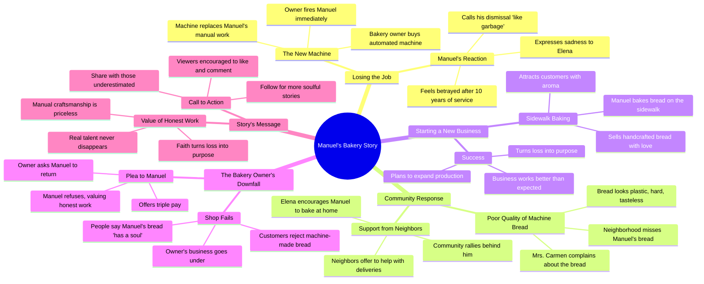

# Bakery Owner Replaced by Machine

> 🌐 **Read this in:** [English](../../en/2026-06/tiktok-transcript-if-you-enjoyed-this-story-leave-a-like-and-a-comment-emotion-bb14.md) · **中文**

> **Creator:** [@healthcare448](https://www.tiktok.com/@healthcare448) · **Views:** 886.8K · **Posted:** 2026-06-27 · **Niche:** other
>
> **TL;DR:** Immediately creates conflict and sympathy by showing a loyal worker being replaced without warning.

[Watch original video →](https://vt.tiktok.com/ZSCrA4SkJ/)

## Why This Went Viral

## 钩子（前3秒）
- **逐字台词：** "曼努埃尔先生，我给面包房买了台新机器。从今以后，这里不再需要你了。"
- **模式：** 场景 + 大胆断言（老板在对话中途解雇面包师）
- **为何能阻止滑动：** 即时冲突与不公。观众实时听到一个人被机器取代——这触发了本能的不公平感，迫使人们寻求解决。

## 情感节奏
- **节拍1（0-5秒）：** 震惊 + 不公（老板冷酷地解雇曼努埃尔）
- **节拍2（5-10秒）：** 绝望（曼努埃尔告诉埃琳娜自己被像垃圾一样扔掉）
- **节拍3（10-15秒）：** 愤怒 + 团结（邻居们拒绝机器面包，聚集支持曼努埃尔）
- **节拍4（15-20秒）：** 胜利（曼努埃尔在人行道上开始烘焙，人群欢呼）
- **节拍5（20-25秒）：** 反转（老板恳求曼努埃尔回来，提供三倍工资）
- **节拍6（25-30秒）：** 道德高潮（"灵魂无价"）
- **高潮时刻：** "灵魂无价。我的面包是为那些珍视人的劳动的人准备的。"

## 关键词密度
| 关键词/短语 | 情感吸引力 | 算法覆盖范围 |
|---|---|---|
| "机器" | 被取代的恐惧、冷漠 | 高（热门话题：人工智能/自动化） |
| "面包" | 温暖、传统、手艺 | 中（美食内容） |
| "灵魂" | 情感共鸣、人性 | 低流量，高互动 |
| "解雇" | 不公、失业 | 高（热门话题：裁员） |
| "真实" | 真实 vs. 虚假 | 中（价值观驱动） |
| "排队" | 社会认同、稀缺性 | 高（错失恐惧症触发分享） |
| "社区" | 社群、归属感 | 低流量，高情感吸引力 |
| "傲慢" | 反派塑造 | 低流量，高互动 |

**为何有效：** "机器"和"解雇"触及当前对自动化的恐惧，而"灵魂"和"真实"创造情感对比，推动评论和分享。

## 为何能传播
1. **底层叙事与明确反派。** 老板（"傲慢的人"）是完美的对手。观众立即站在曼努埃尔一边。
2. **权力反转。** 高潮（"灵魂无价"）扭转局面——被解雇的工人现在掌握了主动权。这创造了令人满意的情感回报，观众愿意分享。
3. **社区团结时刻。** 像"我帮你送货"和"排队了，排队了"这样的台词展示了社会认同的实际效果。观众感觉自己是运动的一部分。
4. **故事中嵌入行动号召。** 结尾（"如果这个故事让你有所感触，点个赞……分享给那些曾被低估的人"）直接将情感转化为互动。
5. **普遍恐惧 + 希望。** 自动化取代人类是全球焦虑。曼努埃尔的胜利提供了一个幻想解决方案——技能和灵魂战胜技术。

## 你可以借鉴什么
1. **以解雇或拒绝场景开场。** 这是创造共情最快的方式。以某人失去不公平的东西开始你的视频。
2. **在中间构建人群反应。** 展示人们实际排队或欢呼。这种视觉社会认同让观众想加入运动。
3. **以可引用的价值陈述结尾。** "灵魂无价"作为独立台词具有分享性。构思一句观众愿意转发的道德金句。

## Mind Map

## Full Transcript (Generated by [TokTranscript](https://toktranscript.com/?utm_source=github&utm_medium=breakdown&utm_campaign=tool_attribution))

> 📝 Transcripts on this page are auto-generated and show the first 60%. Want to transcribe any TikTok in 30 seconds and get the full version? [Try TokTranscript free →](https://toktranscript.com/?utm_source=github&utm_medium=breakdown&utm_campaign=transcript_cta)

Mr. Manuel, I've bought a new machine for the bakery. From now on, I won't need you here anymore. It does everything on its own. All you have to do is press a button. What used to take you hours, this machine does in minutes. So take off your apron, grab your things and leave. Pipe now! Manuel! So early? What happened, my dear? They replaced me with a machine. Elena. 10 years giving this town its best bread, and they throw me out like garbage. I went to the bakery and the bread looked like plastic, hard and tasteless. I'm not there anymore, Mrs. Carmen. I was fired for a machine. I don't want machine bread, I want your bread! Elena. If they don't want my hands, this neighborhood does. I'm going to bake right here! That's the spirit, Manuel! Yeah, I'll help you with deliveries. Yeah, we're going to show that arrogant man who the master really is! Look at this cake, mihra. Made by hand, with love. A master baker selling on the sidewalk. What a shame! Give me 3. Haha, that smell is a blessing. I haven't eaten real bread in weeks. It worked! It turned out even better 

*[Read the full transcript on TokTranscript →](https://toktranscript.com/plaza/tiktok-transcript-if-you-enjoyed-this-story-leave-a-like-and-a-comment-emotion-bb14?utm_source=github&utm_medium=breakdown&utm_campaign=transcript_full)*

## Browse More

- All [other](../../by-niche/zh-CN/other.md) breakdowns
- All [Unexpected dismissal](../../by-pattern/zh-CN/hook-unexpected-dismissal.md) examples

## Video Info

| | |
|---|---|
| Creator | [@healthcare448](https://www.tiktok.com/@healthcare448) |
| Original video | [https://vt.tiktok.com/ZSCrA4SkJ/](https://vt.tiktok.com/ZSCrA4SkJ/) |
| Original title | If you enjoyed this story, leave a like and a comment.#emotionalstory... |
| Views | 886.8K (886800) |
| Posted | 2026-06-27 |
| Duration | 0s |
| Niche | `other` |
| Hook pattern | `Unexpected dismissal` |
| Original language | `en` (this page translated by AI) |
| Available languages | en, zh-CN |
| Generated | 2026-06-27 by [TokTranscript](https://toktranscript.com/) |

---

*This breakdown is for educational analysis under fair use. Original video © [@healthcare448](https://www.tiktok.com/@healthcare448). All transcripts are auto-generated and may contain errors.*

*Want to analyze your own TikToks like this? [我们用的转录工具 →](https://toktranscript.com/viral-breakdown?utm_source=github&utm_medium=breakdown&utm_campaign=footer_cta)*