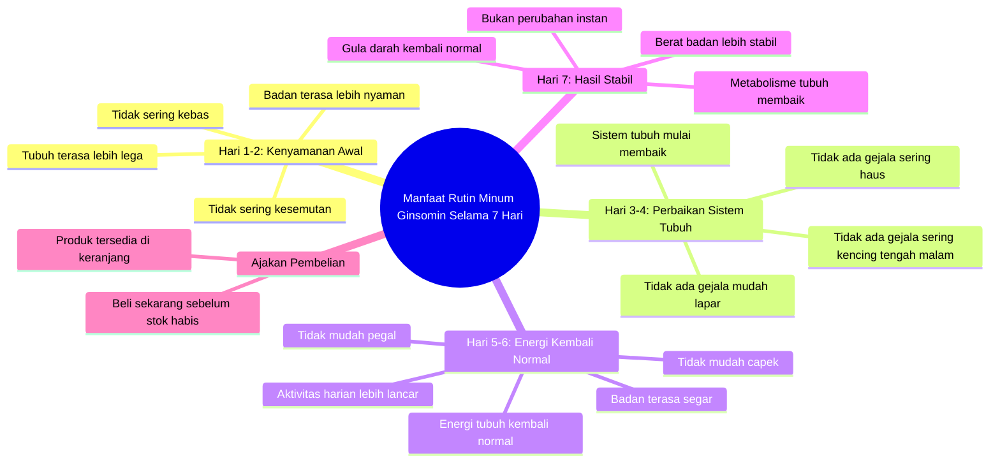

# What Happens If You Drink Ginsomin for 7 Days

> 🌐 **Read this in:** [English](../../en/2026-06/tiktok-transcript-ini-yang-terjadi-jika-kamu-minum-ginsomin-selama-7-hari-diab-750e.md) · **中文**

> **Creator:** [@anuu_ikoo](https://www.tiktok.com/@anuu_ikoo) · **Views:** 320.0K · **Posted:** 2026-06-22 · **Niche:** other
>
> **TL;DR:** Poses a specific, time-bound question that triggers curiosity about the outcome.

[Watch original video →](https://vt.tiktok.com/ZSCJDnRwe/)

## Why This Went Viral

## 钩子（前3秒）
- **原文：** "如果你每天坚持喝人参饮，连续7天，会发生什么？"
- **钩子模式：** 直接提问 + 效果承诺（7天）
- **为何能让人停止滑动：** 问题具有个人针对性（"你"），并承诺快速转变（7天），激发对具体结果的好奇心。

## 情绪节奏
- **好奇心** → "会发生什么？"
- **期待** → "身体开始感觉更舒适"（第1-2天）
- **信任** → "症状全部消失"（第3-4天）→ 具体解决方案
- **满足感** → "身体能量恢复正常"（第5-6天）→ 积极情绪高峰
- **高潮** → "体重更稳定，血糖恢复正常"（第7天）→ 强有力的最终结果
- **紧迫感** → "现在购买，库存有限" → 行动驱动

## 关键词密度
1. **人参饮**（4次）→ 产品关键词，算法识别品牌
2. **天**（7次）→ 叙事结构，激发每日好奇心
3. **身体**（4次）→ 聚焦身体益处，情感吸引力
4. **正常**（3次）→ 稳定性承诺，令人安心的词汇
5. **稳定**（1次）→ 期望的最终结果，算法偏好"稳定"一词
6. **能量**（1次）→ 积极词汇，吸引注意力
7. **症状**（2次）→ 触及常见问题（麻木、刺痛、口渴、饥饿）
8. **现在**（1次）→ 紧迫感，算法偏好行动号召词汇

## 为何能广泛传播
1. **清晰的7天结构** → 易于记忆和分享（人们喜欢挑战或快速转变）。
2. **触及常见问题** → "麻木、刺痛、经常口渴、半夜频繁上厕所" → 对许多人（尤其是30岁以上人群）有共鸣。
3. **结尾的紧迫感** → "现在购买，库存有限" → 激发错失恐惧症（FOMO）。
4. **具体效果承诺** → "体重稳定，血糖正常" → 许多人寻求的解决方案（健康）。
5. **简单语言，情感画面** → "身体感觉更轻松，不易疲劳" → 易于理解和感受。

## 可借鉴之处
1. **使用"第X天..."结构** → 构建易于跟随的渐进式转变叙事（例如：第1-3天，第4-7天）。
2. **提及具体且能引发共鸣的问题** → 不要泛泛而谈，要详细描述如"麻木、刺痛、半夜频繁上厕所"，让观众感觉"这说的就是我"。
3. **以简单紧迫感结尾** → "现在购买，库存有限"或"别错过机会" → 不过度施压，但依然有效。

## Mind Map

## Full Transcript (Generated by [我们用的转录工具](https://toktranscript.com/?utm_source=github&utm_medium=breakdown&utm_campaign=tool_attribution))

> 📝 Transcripts on this page are auto-generated and show the first 60%. Want to transcribe any TikTok in 30 seconds and get the full version? [Try TokTranscript free →](https://toktranscript.com/?utm_source=github&utm_medium=breakdown&utm_campaign=transcript_cta)

Kalau kamu rutin minum ginsomin tiap hari, selama 7 hari, apa yang bakalan terjadi? Hari pertama dan kedua, badan mulai terasa lebih nyaman. Nggak sering kesemutan, nggak sering kebas, tubuh terasa lebih lega. Hari ketiga dan keempat, tidak ada lagi gejala seperti sering haus, sering kencing tengah malam, dan mudah lapar. Sistem tubuhmu mulai membaik. Hari kelima dan keenam, energi tubuh kembali normal. Badan makin terasa segar, nggak gampang pegal, nggak g

*[Read the full transcript on TokTranscript →](https://toktranscript.com/plaza/tiktok-transcript-ini-yang-terjadi-jika-kamu-minum-ginsomin-selama-7-hari-diab-750e?utm_source=github&utm_medium=breakdown&utm_campaign=transcript_full)*

## Browse More

- All [other](../../by-niche/zh-CN/other.md) breakdowns
- All [Curiosity Gap](../../by-pattern/zh-CN/hook-curiosity-gap.md) examples

## Video Info

| | |
|---|---|
| Creator | [@anuu_ikoo](https://www.tiktok.com/@anuu_ikoo) |
| Original video | [https://vt.tiktok.com/ZSCJDnRwe/](https://vt.tiktok.com/ZSCJDnRwe/) |
| Original title | Ini yang terjadi jika kamu minum ginsomin selama 7 hari 
#diabetes #g... |
| Views | 320.0K (320000) |
| Posted | 2026-06-22 |
| Duration | 0s |
| Niche | `other` |
| Hook pattern | `Curiosity Gap` |
| Original language | `id` (this page translated by AI) |
| Available languages | en, zh-CN |
| Generated | 2026-06-23 by [TokTranscript](https://toktranscript.com/) |

---

*This breakdown is for educational analysis under fair use. Original video © [@anuu_ikoo](https://www.tiktok.com/@anuu_ikoo). All transcripts are auto-generated and may contain errors.*

*Want to analyze your own TikToks like this? [TokTranscript 转录工具 →](https://toktranscript.com/viral-breakdown?utm_source=github&utm_medium=breakdown&utm_campaign=footer_cta)*