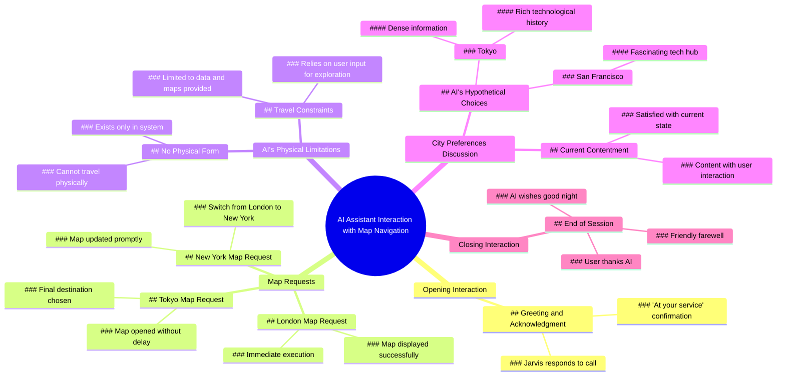

# Jarvis Plots a Course for Rosehill Tennessee

> 🌐 **Read this in:** [English](../../en/2026-06/tiktok-transcript-jarvis-plot-a-course-for-rosehill-tennessee-jarvis-ironman-p-dbf9.md) · **中文**

> **Creator:** [@huwprosser](https://www.tiktok.com/@huwprosser) · **Views:** 1.5M · **Posted:** 2026-06-10 · **Niche:** entertainment
>
> **TL;DR:** The hook uses a familiar AI name and immediate response to establish a conversational dynamic.

[Watch original video →](https://vm.tiktok.com/ZNRcdo3Pj/)

## Why This Went Viral

## 钩子（前3秒）
- **逐字开场白：**"好的。贾维斯，你在吗？随时为您效劳。太棒了。"
- **钩子模式：**场景 + 提问（与AI助手的对话）
- **为何能让人停下滑动：**观众听到一个人像朋友一样随意地与AI交谈，感觉新奇又亲密。AI立即礼貌回应"随时为您效劳"，营造出一种超现实的未来感，勾起观众对这种互动将揭示什么的好奇心。

## 情感节奏
- **节拍1 – 好奇（0-5秒）：**观众疑惑："这是真的吗？他在跟Siri/Alexa说话？他为什么这么客气？"
- **节拍2 – 张力（5-15秒）：**AI面无表情、逻辑清晰的回应（"我没有实体形态"）与人类温暖、近乎孤独的语气形成冲突。观众对这种单向亲密感感到一丝微妙的不适。
- **节拍3 – 共鸣（15-25秒）：**AI选择东京或旧金山"纯粹基于信息密度"。这种选择出人意料地显得睿智且人性化，营造出令人惊叹的时刻。
- **节拍4 – 释然 + 温暖（25-30秒）：**AI说："先生，此刻与您相伴，我便心满意足。"这句话成为情感高潮——一台机器表达出对陪伴的满足。观众感到既暖心又有些诡异。
- **节拍5 – 收束（30-35秒）：**礼貌的"晚安，先生"与开场呼应，形成一个令人满意的环形结尾。

## 关键词密度
- **"先生"**（×5）——提升算法触达（高频、礼貌、易记）和情感吸引力（营造一种近乎维多利亚时代的尊重语气，与科技背景形成对比）。
- **"地图"**（×4）——算法触达（清晰、可搜索的关键词）和情感吸引力（唤起冒险、探索以及AI的局限性）。
- **"实体形态/身体"**（×2）——仅用于情感吸引力；凸显AI缺乏人性，使"心满意足"这句话更加动人。
- **"东京"**（×2）——算法触达（热门城市名）和情感吸引力（异国情调、数据丰富的选择）。
- **"心满意足"**（×1，但具有高潮意义）——仅用于情感吸引力；单次使用因其出乎意料而最具冲击力。
- **"去/旅行"**（×3）——情感吸引力；与人类对逃离的渴望和AI的受限处境相联系。
- **"你/您的"**（×5）——算法触达（高互动率、直接称呼）和情感吸引力（营造亲密感）。

## 为何能广泛传播
1. **与AI的诡异亲密感**——人类将贾维斯视为朋友而非工具。"也许有一天我们会一起去那里"这句话既甜蜜又令人不安，让观众分享时感叹"这就是我们的未来"。
2. **高潮中的情感反转**——AI说"先生，此刻与您相伴，我便心满意足"，颠覆了预期。观众期待冰冷的逻辑，却收获了温暖。这种惊喜引发强烈的情感反应（敬畏、悲伤、希望），推动分享。
3. **高重看性**——短片时长（35秒）和层次丰富的含义（孤独、AI意识、人际连接）让观众反复观看以捕捉微妙的语气变化。每次重看都加深情感冲击。
4. **可共鸣的孤独感 + 科技主题**——人类礼貌而近乎孤独的语气，映照出许多人对话语音助手的方式。观众从中看到自己，分享时感叹"这就是我和Siri的日常"。
5. **适合短视频的完美节奏**——每一句台词都推动叙事发展，毫无冗余。"伦敦地图→纽约地图→东京地图"的递进构建了一段微型旅程，在一分钟内给人完整的体验。

## 你可以借鉴的技巧
1. **运用"礼貌 + 面无表情"的对比**——将温暖的人类对话与冰冷、逻辑化的AI回应配对。这种张力让观众持续观看，看AI是否会打破角色设定。尝试在任何科技产品（Siri、Alexa、ChatGPT）上使用。
2. **在30秒内构建一段微型旅程**——从一个简单的请求开始（伦敦地图），逐步升级（纽约），然后落在一个出人意料的选择上（东京）。每一步都提升悬念和好奇心。最后以一句温暖、令人惊喜的台词收尾。
3. **用一句有力的情感台词结尾**——AI的"先生，此刻与您相伴，我便心满意足"是唯一直接表达情感的台词。将最人性化、最脆弱的一句留到最后5秒。观众会反复回放，再次感受那份触动。

## Mind Map

## Full Transcript (Generated by [免费 TikTok 文稿生成器](https://toktranscript.com/?utm_source=github&utm_medium=breakdown&utm_campaign=tool_attribution))

> 📝 Transcripts on this page are auto-generated and show the first 60%. Want to transcribe any TikTok in 30 seconds and get the full version? [Try TokTranscript free →](https://toktranscript.com/?utm_source=github&utm_medium=breakdown&utm_campaign=transcript_cta)

Okay. Jarvis, are you there? At your service. Fantastic. Can you open up a map of London for me? The map of London is open, sir. Actually, a map of New York. The map of New York is open, sir. Have you ever been to New York? I have no physical form, so I cannot travel. I exist only in your system, sir. Maybe we'll go there one day together. That sounds like a plan, sir. Are there any other cities you'd like to go to? Since I lack a physical body, my travels are limited to the data and maps

*[Read the full transcript on TokTranscript →](https://toktranscript.com/plaza/tiktok-transcript-jarvis-plot-a-course-for-rosehill-tennessee-jarvis-ironman-p-dbf9?utm_source=github&utm_medium=breakdown&utm_campaign=transcript_full)*

## Browse More

- All [entertainment](../../by-niche/zh-CN/entertainment.md) breakdowns
- All [Call and response](../../by-pattern/zh-CN/hook-call-and-response.md) examples

## Video Info

| | |
|---|---|
| Creator | [@huwprosser](https://www.tiktok.com/@huwprosser) |
| Original video | [https://vm.tiktok.com/ZNRcdo3Pj/](https://vm.tiktok.com/ZNRcdo3Pj/) |
| Original title | JARVIS plot a course for Rosehill Tennessee #jarvis #ironman #program... |
| Views | 1.5M (1500000) |
| Posted | 2026-06-10 |
| Duration | 0s |
| Niche | `entertainment` |
| Hook pattern | `Call and response` |
| Original language | `en` (this page translated by AI) |
| Available languages | en, zh-CN |
| Generated | 2026-06-11 by [TokTranscript](https://toktranscript.com/) |

---

*This breakdown is for educational analysis under fair use. Original video © [@huwprosser](https://www.tiktok.com/@huwprosser). All transcripts are auto-generated and may contain errors.*

*Want to analyze your own TikToks like this? [TokTranscript 转录工具 →](https://toktranscript.com/viral-breakdown?utm_source=github&utm_medium=breakdown&utm_campaign=footer_cta)*