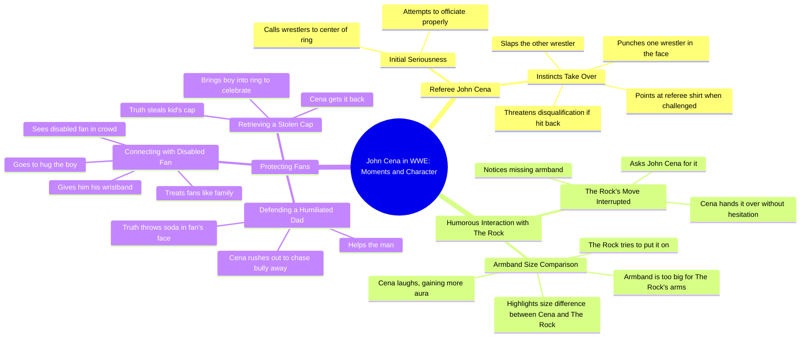

# John Cena Becomes a Wild WWE Referee

> 🌐 **Read this in:** [English](../../en/2026-06/tiktok-transcript-john-cena-is-the-worst-referee-wwe-wrestling-fighting-champi-7449.md) · **中文**

> **Creator:** [@waynewrestle0](https://www.tiktok.com/@waynewrestle0) · **Views:** 1.5M · **Posted:** 2026-06-29 · **Niche:** entertainment
>
> **TL;DR:** Sets up a familiar scenario then subverts it with danger.

[Watch original video →](https://www.tiktok.com/t/ZP8GYQf6D/)

## Why This Went Viral

## 钩子（前3秒）
- **原文：** "当约翰·塞纳在WWE中担任裁判时，周围没人安全"
- **钩子模式：** 大胆断言 + 场景设定（出人意料的角色反转）
- **为何能让人停下滑动：** 它承诺了一个涉及大牌明星的特定、高风险、不可预测的时刻。"周围没人安全"这句话立刻引发好奇，让人期待混乱场面。

## 情绪节奏
1. **好奇** – "当约翰·塞纳成为裁判"（不寻常的前提）
2. **紧张** – "起初他确实认真对待这份工作"（虚假的平静）
3. **惊讶** – "塞纳突然转身，一拳打在其中一名摔角手脸上"
4. **幽默** – "我是这里的裁判，打我你就被取消资格"（聪明的漏洞）
5. **满足** – 塞纳也扇了另一个人（回报）
6. **好笑** – 洛克试戴塞纳的臂章，露出小胳膊（喜剧性羞辱）
7. **温暖/敬意** – 塞纳保护粉丝、维护残疾男孩、拥抱粉丝（情感高潮）
8. **行动号召** – "如果你尊重约翰·塞纳就订阅"（忠诚触发）

**高潮时刻：** 臂章揭晓——"证明他的胳膊和塞纳相比有多小"——融合了幽默、地位和共鸣感。

## 关键词密度
| 词/短语 | 频率 | 目的 |
|---------|------|------|
| "约翰·塞纳" | 7 | 算法覆盖（名人姓名） |
| "粉丝" | 4 | 情感吸引（社群） |
| "裁判" | 3 | 情境钩子（角色反转） |
| "打"/"扇"/"拳击" | 4 | 动作/暴力（互动） |
| "臂章" | 3 | 视觉道具（难忘细节） |
| "订阅" | 2 | 直接行动号召（转化） |
| "保护"/"维护" | 2 | 情感共鸣（英雄原型） |

**算法驱动因素：** "约翰·塞纳"（搜索量）、"订阅"（留存指标）
**情感驱动因素：** "粉丝"、"保护"、"臂章"（共鸣感、弱者故事）

## 为何能传播
1. **出人意料的角色反转** – "约翰·塞纳成为裁判"打破了预期的英雄/反派动态，让观众想"我必须看看这个。"
2. **喜剧性羞辱钩子** – 洛克的臂章时刻（"证明他的胳膊有多小"）是一个普遍好笑、可分享的视觉画面，可独立作为片段传播。
3. **英雄叙事弧线** – 视频从混乱的裁判滑稽行为转向"塞纳保护粉丝"，创造完整的情感旅程：笑 → 尊重 → 感觉良好。
4. **低投入、高回报的行动号召** – "如果你尊重约翰·塞纳就订阅"将行动与身份（尊重）绑定，而不仅仅是兴趣。这是一个忠诚测试，而非请求。
5. **节奏与对比** – 快速动作（拳击、扇耳光）→ 慢节奏喜剧（臂章）→ 感人时刻（残疾粉丝）。这种节奏防止观众流失，最大化留存率。

## 你可以借鉴什么
1. **"出人意料角色"钩子** – 从一个角色做不该做的事开始（例如："当裁判反击时"）。这立刻传达出新奇感。
2. **"羞辱 → 救赎"结构** – 用一个有趣、尴尬的时刻（臂章）建立互动，然后转向温暖人心的回报（保护粉丝）。这能让观众看完整个视频。
3. **基于身份的行动号召** – 将"订阅获取更多"替换为"如果你[价值观/特质]就订阅"（例如："如果你尊重忠诚就订阅"）。它能转化那些想表明自己身份的观众。

## Mind Map

## Full Transcript (Generated by [TokTranscript 转录工具](https://toktranscript.com/?utm_source=github&utm_medium=breakdown&utm_campaign=tool_attribution))

> 📝 Transcripts on this page are auto-generated and show the first 60%. Want to transcribe any TikTok in 30 seconds and get the full version? [Try TokTranscript free →](https://toktranscript.com/?utm_source=github&utm_medium=breakdown&utm_campaign=transcript_cta)

when John Cena becomes a referee in WWE nobody around is safe at first he actually takes the job seriously and calls the two wrestlers into the middle of the ring just a few seconds later his fighting instincts completely take over out of nowhere Cena turns around and punches one of the wrestlers right in the face and when the furious wrestler steps up to fight back Cena points at his referee shirt saying I'm the ref here hit me and you're disqualified the opponent is forced to stop so Cena takes his chance and slaps the other guy too subscribe if you miss John Cena the was about to finish his move but he noticed something was missing so he asked John Cena for his armband and Cena handed it over without hesitation the crowd got hyped up expecting something crazy to happen but the rock didn't realize that John's armband was way too when he tried to put it on it 

*[Read the full transcript on TokTranscript →](https://toktranscript.com/plaza/tiktok-transcript-john-cena-is-the-worst-referee-wwe-wrestling-fighting-champi-7449?utm_source=github&utm_medium=breakdown&utm_campaign=transcript_full)*

## Browse More

- All [entertainment](../../by-niche/zh-CN/entertainment.md) breakdowns
- All [Unexpected Twist](../../by-pattern/zh-CN/hook-unexpected-twist.md) examples

## Video Info

| | |
|---|---|
| Creator | [@waynewrestle0](https://www.tiktok.com/@waynewrestle0) |
| Original video | [https://www.tiktok.com/t/ZP8GYQf6D/](https://www.tiktok.com/t/ZP8GYQf6D/) |
| Original title | John Cena is the WORST Referee_ 😂(#wwe #wrestling #fighting #champion... |
| Views | 1.5M (1500000) |
| Posted | 2026-06-29 |
| Duration | 0s |
| Niche | `entertainment` |
| Hook pattern | `Unexpected Twist` |
| Original language | `en` (this page translated by AI) |
| Available languages | en, zh-CN |
| Generated | 2026-07-01 by [TokTranscript](https://toktranscript.com/) |

---

*This breakdown is for educational analysis under fair use. Original video © [@waynewrestle0](https://www.tiktok.com/@waynewrestle0). All transcripts are auto-generated and may contain errors.*

*Want to analyze your own TikToks like this? [TikTok 转录工具 →](https://toktranscript.com/viral-breakdown?utm_source=github&utm_medium=breakdown&utm_campaign=footer_cta)*